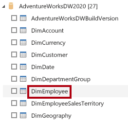
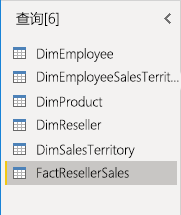
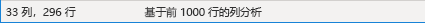
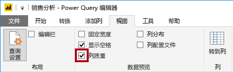
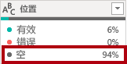
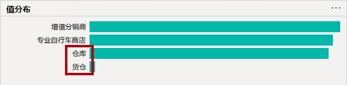
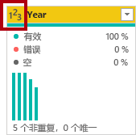
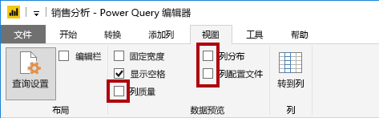

---
lab:
  title: 在 Power BI Desktop 中准备数据
  module: 2 - Get Data in Power BI
---

# 在 Power BI Desktop 中准备数据

完成本实验室预计需要 30 分钟。

此实验室是一系列实验室中的一个，它被设计成一个从准备数据到发布为报表和仪表板的完整场景。 你可以按任意顺序完成实验室。 但是，如果你打算逐步完成多个实验室，建议你按以下顺序进行：

1. 在 Power BI Desktop 中准备数据
1. 在 Power BI Desktop 中加载数据
1. 在 Power BI 中设计数据模型
1. 在 Power BI Desktop 中创建 DAX 计算
1. 在 Power BI Desktop 中创建高级 DAX 计算
1. 在 Power BI Desktop 中设计报表
1. 在 Power BI Desktop 中增强报表
1. 在 Power BI 中执行数据分析
1. 创建 Power BI 面板
1. 强制执行行级别安全性

## **实验室场景**

本实验室旨在介绍 Power BI Desktop 应用程序以及如何连接到数据，以及如何使用数据预览技术了解源数据的特征和质量。 学习目标为：

- 打开 Power BI Desktop
- 连接到源数据
- 预览源数据
- 使用数据配置文件工具

## **练习 1：** 准备数据

在本练习中，创建 8 个 Power BI Desktop 查询。 6 个查询从 SQL Server 中获取数据，2 个查询从 CSV 文件获取。

### **任务 1：开始使用 Power BI Desktop**

在此任务中，首先打开一个 Power BI 入门文件 (.pbix)。 入门文件不包含任何数据，但经过专门配置，可帮助完成实验室。 入门文件中禁用了以下报表级设置：

- 数据加载 > 首次加载时从数据源导入关系
- 数据加载 > 加载数据后自动检测新关系

注意：虽然在开发数据模型时启用这两个选项可能会有所帮助，但你之前禁用了它们来支持实验室体验。在“在 Power BI Desktop 中加载数据”实验室中创建关系时，可了解添加每个关系的原因。**

 

1. 打开 Power BI Desktop。

    

    提示：默认情况下，“入门”对话框在 Power BI Desktop 前面打开。可以选择登录，然后关闭弹出窗口。

1. 要打开 Power BI Desktop 入门文件，请选择“文件”>“打开报表”>“浏览报表”。

1. 在“打开”窗口中，导航到 D:\PL300\Labs\01-prepare-data-with-power-query-in-power-bi-desktop\Starter 文件夹 。

1. 选择“销售分析”文件。

1. 通过“另存为”将文件副本保存到 D:\PL300\MySolution 文件夹 。

### **任务 2：从 SQL Server 获取数据**

此任务介绍如何连接到 SQL Server 数据库并导入表，这会在 Power Query 中创建查询。

1. 在“主页”功能区选项卡上的“数据”组中，选择“SQL Server”。

     

1. 在“SQL Server 数据库”窗口的“服务器”框中，输入“localhost”，然后选择“确定”   。
    
    注意：在此实验室中，使用 localhost 连接到 SQL Server 数据库，因为网关数据源无法解析 localhost。不建议在创建自己的解决方案时这样做 。

1. 如果系统提示输入凭据，请在“SQL Server 数据库”窗口中，选择“使用我的当前凭据”，然后选择“连接”  。

1. 在“导航器”窗口的左侧，展开“AdventureWorksDW2020”数据库。
    
    注意：AdventureWorksDW2020 数据库基于 AdventureWorksDW2017 示例数据库。已对其进行修改，以支持课程实验室的学习目标。 

1. 选择但不要选中 DimEmployee 表

     

1. 请注意右侧窗格中表数据的预览。 可以通过预览数据来查看列和行示例。

1. 若要创建查询，请选中下面 6 个表旁边的复选框：

    - DimEmployee
    - DimEmployeeSalesTerritory
    - DimProduct
    - DimReseller
    - DimSalesTerritory
    - FactResellerSales

1. 单击“转换数据”完成此任务，这会打开 Power Query 编辑器。
    1. 此实验室仅用于连接和分析数据，但不转换数据。

### **任务 3：在 Power Query 编辑器中预览数据**

此任务介绍 Power Query 编辑器，并允许查看和分析数据。 这有助于确定之后如何清理和转换数据。

1. 请注意“Power Query 编辑器”窗口左侧的“查询”窗格。 “查询”窗格包含一个针对每个所选表的查询。

     

1. 选择第一个查询 -“DimEmployee”。

    SQL Server 数据库的 DimEmployee 表中每个员工占一行。此表中的行子集表示销售人员，与要开发的模型相关。

1. 状态栏的左下角提供了一些表统计信息 - 该表包含 33 列和 296 行。

     

1. 在“数据预览”窗格中，水平滚动以查看所有列。 请注意，最后五列包含表或值链接。
    
    这五列表示与数据库中其他表的关系，可用于将表联接在一起。联接表的操作在“在 Power BI Desktop 中加载数据”实验室中完成。

1. 要评估列质量，请在“视图”功能区选项卡的“数据预览”组中，勾选“列质量”。 通过列质量功能，可以轻松确定列中的有效值、错误值或空值的百分比。

     

1. 请注意，Position 列 94% 的行都为空 (null)。

     

1. 若要评估列分步，请在“视图”功能区选项卡的“数据预览”组中，选中“列分步”。

1. 再次查看 Position 列，请注意有四个非重复值和一个唯一值。

1. 查看 EmployeeKey 列的列分布，其中包含 296 个非重复值和 296 个唯一值。
    
    当非重复值和唯一值的计数相同时，这表示列包含唯一值。在建模时，某些模型表必须具有唯一的列。这些唯一列可用于创建一对多关系，此操作在“在 Power BI Desktop 中为数据建模”实验室中进行。

     

1. 在“查询”窗格中，选择 DimEmployeeSalesTerritory 查询。
    
    DimEmployeeSalesTerritory 表中每个员工及其管理的销售区域占一行。该表支持将多个区域与单个员工关联。某些员工管理一个、两个或可能更多区域。为这些数据建模时需要定义多对多关系。

1. 在“查询”窗格中，选择 DimProduct 查询。 DimProduct 表包含的每个行表示公司已销售的每个产品。

1. 水平滚动以显示最后面的列。 请注意 DimProductSubcategory 列。
    
    在“在 Power BI Desktop 中加载数据”实验室中向此查询添加转换时，使用“DimProductSubcategory”列联接表。 

1. 在“查询”窗格中，选择 DimReseller 查询。
    
    在 DimReseller 表中，每个经销商占一行。经销商对 Adventure Works 的产品进行销售、分销或增值。

1. 若要查看列值，请在“视图”功能区选项卡的“数据预览”组中，选中“列配置文件”。

1. 选择“BusinessType”列标题，并注意“数据预览”窗格下面的新窗格。

1. 在“数据预览”窗格中查看列统计信息和值分布情况。
    
    请注意以下数据质量问题：有两个表示 warehouse 的标签（“Warehouse”以及拼写错误的“Ware House”） 。

     

1. 将光标悬停在“Ware House”栏上，请注意有 5 个行包含此值。
    
    “在 Power BI Desktop 中加载数据”实验室中将应用转换来重新标记这五行。

1. 在“查询”窗格中，选择 DimSalesTerritory 查询。  
    
    在 DimSalesTerritory 表中，每个销售区域占一行，包括 Corporate HQ（总部）。区域会分配到国家/地区，国家/地区会分配到组。“Power BI Desktop 中为数据建模”实验室中会创建一个层次结构，用来支持在区域、国家/地区或组级别进行分析。  

1. 在“查询”窗格中，选择 FactResellerSales 查询。
    
    在 FactResellerSales 表中，每个销售订单行占一行 - 一个销售订单包含一个或多个行项。

1. 查看 TotalProductCost 列的列质量，请注意 8% 的行都为空。
    
    缺少 TotalProductCost 列值是数据质量问题。为了解决此问题，请在“在 Power BI Desktop 中加载数据”实验室中，使用存储在相关 DimProduct 表中的产品标准成本来应用转换以填充缺少的值。  

### **任务 4：从 CSV 文件获取数据**

在此任务中，基于 CSV 文件创建新查询。

1. 若要添加新查询，请在“Power Query 编辑器”窗口的“主页”功能区选项卡上的“新建查询”组中，选择“新建源”向下箭头，然后选择“文本/CSV”。

1. 在“打开”窗口中，导航到“D:\PL300\Resources”文件夹，然后选择“ResellerSalesTargets.csv”文件  。 选择“打开”  。

1. 在“ResellerSalesTargets.csv”窗口中，查看预览数据。 选择“确定”。

1. 在“查询”窗格中，请注意添加了 ResellerSalesTargets 查询。
    
    在 ResellerSalesTargets CSV 文件中，每个年度的每个销售人员占一行。每行记录 12 个月度销售目标（以千为单位）。Adventure Works 公司的业务年度从 7 月 1 日开始。

1. 请注意，没有列包含空值。  如果没有月度销售目标，则改为存储一个连字符。

1. 在列名左侧的各个列标题中查看图标。 这些图标表示列数据类型。 123 是整数，ABC 是文本。

     

1. 基于 D:\PL300\Resources\ColorFormats.csv 文件重复这些步骤，以创建查询。
    
    在 ColorFormats CSV 文件中，每个产品颜色占一行。每行都记录十六进制代码以设置背景和字体颜色的格式。

现在应该有两个新查询：ResellerSalesTargets 和 ColorFormats。 

 

### **任务 5：完成**

在此任务中，你将完成此实验室。

1. 在“视图”功能区选项卡上，从“数据预览”组中，取消选中此实验室中先前启用的三个数据预览选项：

    - 列质量
    - 列分发
    - 列配置文件

     

1. 保存 Power BI Desktop 文件。 当系统提示应用挂起的更改时，选择“稍后应用”。
    
    提示：应用查询会将其数据加载到数据模型。尚未准备好执行此操作，因为必须首先应用众多转换。
