---
lab:
  title: 在 Power BI Desktop 中准备数据
  module: Module 2 - Get Data in Power BI
---

# 在 Power BI Desktop 中准备数据

**预估完成本实验室需要 45 分钟**

In this lab you commence the development of a Power BI Desktop solution for the Adventure Works company. It involves connecting to source data, previewing the data, and using data preview techniques to understand the characteristics and quality of the source data.

本实验室介绍如何完成以下操作：

- 打开 Power BI Desktop

- 设置 Power BI Desktop 选项

- 连接到源数据

- 预览源数据

- 使用数据预览技术深入了解数据

### **实验室场景**

This lab is one of many in a series of labs that was designed as a complete story from data preparation to publication as reports and dashboards. You can complete the labs in any order. However, if you intend to work through multiple labs, for the first 10 labs, we suggest you do them in the following order:

1. 在 Power BI Desktop 中准备数据

2. 在 Power BI Desktop 中加载数据

3. 在 Power BI Desktop 中对数据建模

5. 在 Power BI Desktop 中创建 DAX 计算，第 1 部分

6. 在 Power BI Desktop 中创建 DAX 计算，第 2 部分

7. 在 Power BI Desktop 中设计报表，第 1 部分

8. 在 Power BI Desktop 中设计报表，第 2 部分

9. 创建 Power BI 仪表板

10. 在 Power BI Desktop 中执行数据分析

11. 强制执行行级别安全性

## **练习 1：** 准备数据

In this exercise you will create eight Power BI Desktop queries. Six queries will source data from SQL Server, and two from CSV files.

### **任务 1：保存 Power BI Desktop 文件**

在此任务中，你将首先保存 Power BI Desktop 文件。

1. 若要打开 Power BI Desktop，请在任务栏上单击“Microsoft Power BI Desktop”快捷方式。

    

1. 要关闭开始窗口，请单击窗口右上角的“X”。

    

1. 要保存文件，请单击“文件”功能区选项卡以打开 backstage 视图。

1. 选择“保存”  。

    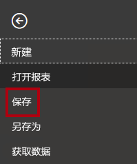

1. 在“另存为”窗口中，导航到“D:\PL300\MySolution”文件夹 。

1. 在“文件名”框中，输入“Sales Analysis”。

    

1. 单击“保存” 。

    

    提示：还可以通过单击左上角的“保存”图标来保存文件。

    

### **任务 2：设置 Power BI Desktop 选项**

在此任务中，你将设置 Power BI Desktop 选项。

1. 在 Power BI Desktop 中，单击“文件”功能区选项卡，以打开 backstage 视图。

1. 在左侧，选择“选项和设置”，然后选择“选项”。

    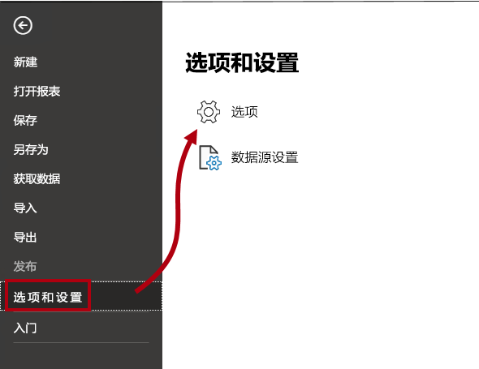

1. 在“选项”窗口左侧的“当前文件”组中，选择“数据负载”。

    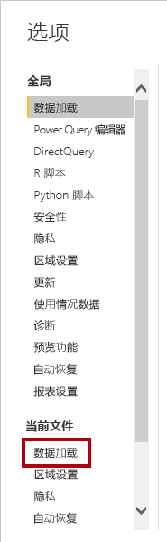

    通过当前文件的“数据加载”设置，可以设置选项来确定建模时的默认行为。

1. 在“关系”组中，取消选中已选中的两个选项。

    

    While having these two options enabled can be helpful when developing a data model, you disabled them earlier to support the lab experience. When you create relationships in the <bpt id="p1">**</bpt>Load Data in Power BI Desktop<ept id="p1">**</ept> lab, you’ll learn why you are adding each one.

1. 单击 **“确定”** 。

    

1. 保存 Power BI Desktop 文件。

### **任务 3：从 SQL Server 获取数据**

在此任务中，你将基于 SQL Server 表创建查询。

1. 在“主页”功能区选项卡上的“数据”组中，单击“SQL Server”。

    

2. 在“SQL Server 数据库”窗口的“服务器”框中，输入“localhost”。

    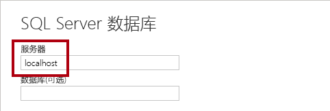

    在本实验室中，你将开始为 Adventure Works 公司开发 Power BI Desktop 解决方案。

3. 单击“确定”。

    

4. 在“导航器”窗口的左侧，展开“AdventureWorksDW2020”数据库。

    这涉及到连接到源数据、预览数据，以及使用数据预览技术来了解源数据的特性和质量。

    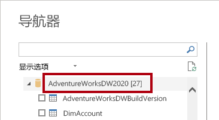

5. 选择“DimEmployee”表，但不选中它。

    

6. 请注意右侧窗格中表数据的预览。

    可以通过预览数据来确定列和行示例。

7. 若要创建查询，请选中下面 6 个表旁边的复选框：

    - DimEmployee

    - DimEmployeeSalesTerritory

    - DimProduct

    - DimReseller

    - DimSalesTerritory

    - FactResellerSales

8. 若要向所选表的数据应用转换，请单击“转换数据”。

    You won’t be transforming the data in this lab. The objectives of this lab focus on exploring and profiling the data in the <bpt id="p1">**</bpt>Power Query Editor<ept id="p1">**</ept> window.

    

### **任务 4：预览 SQL Server 查询**

In this task you will preview the data of the SQL Server queries. First, you will learn relevant information about the data. You will also use column quality, column distribution, and column profile tools to understand the data and to assess data quality.

1. 请注意“Power Query 编辑器”窗口左侧的“查询”窗格。

    

    “查询”窗格包含一个针对每个所选表的查询。

2. 选择第一个查询 -“DimEmployee”。

    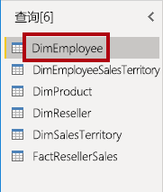

    The <bpt id="p1">**</bpt>DimEmployee<ept id="p1">**</ept> table in the SQL Server database stores one row for each employee. A subset of the rows from this table represents the salespeople, which will be relevant to the model you’ll develop.

3. 注意左下角状态栏的表统计信息 - 该表有 33 列和 296 行。

    

4. 在“数据预览”窗格中，水平滚动以查看所有列。

5. 请注意，最后五列包含表或值链接。

    These five columns represent relationships to other tables in the database. They can be used to join tables together. You’ll join tables in the <bpt id="p1">**</bpt>Load Data in Power BI Desktop<ept id="p1">**</ept> lab.

6. 要评估列质量，请在“视图”功能区选项卡的“数据预览”组中，勾选“列质量”。

    

    通过列质量功能，可以轻松确定列中的有效值、错误值或空值的百分比。

7. 对于 Position 列（倒数第六列），请注意，94% 的行都为空 (null)。

    

8. 若要评估列分发，请在“视图”功能区选项卡的“数据预览”组中，选中“列分发”。

    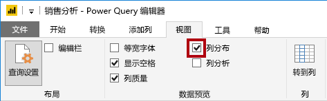

9. 再次查看 Position 列，请注意有四个非重复值和一个唯一值。

10. 查看 EmployeeKey（第一）列的列分发，其中包含 296 个非重复值和 296 个唯一值。

    

    When the distinct and unique counts are the same, it means the column contains unique values. When modeling, it’s important that some model tables have unique columns. These unique columns can be used to create one-to-many relationships, which you will do in the <bpt id="p1">**</bpt>Model Data in Power BI Desktop, Part 1<ept id="p1">**</ept> lab.

11. 在“查询”窗格中，选择 DimEmployeeSalesTerritory 查询。

    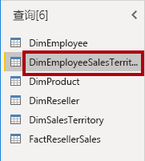

    The <bpt id="p1">**</bpt>DimEmployeeSalesTerritory<ept id="p1">**</ept> table stores one row for each employee and the sales territory regions they manage. The table supports relating many regions to a single employee. Some employees manage one, two, or possibly more regions. When you model this data, you’ll need to define a many-to-many relationship, which you’ll do in the <bpt id="p1">**</bpt>Model Data in Power BI Desktop, Part 2<ept id="p1">**</ept> lab.

12. 在“查询”窗格中，选择 DimProduct 查询。

    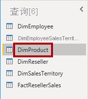

    DimProduct 表包含的每个行表示公司已销售的每个产品。

13. 水平滚动以显示最后面的列。

14. 请注意 DimProductSubcategory 列。

    当在“在 Power BI Desktop 中加载数据”实验室中向此查询添加转换时，将使用“DimProductSubcategory”列联接表。

15. 在“查询”窗格中，选择 DimReseller 查询。

    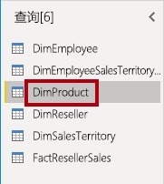

    The <bpt id="p1">**</bpt>DimReseller<ept id="p1">**</ept> table contains one row per reseller. Resellers sell, distribute, or value add to the Adventure Works products.

16. 若要查看列值，请在“视图”功能区选项卡的“数据预览”组中，选中“列配置文件”。

    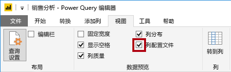

17. 选择“BusinessType”列标题。

18. 注意“数据预览”窗格下面的新窗格。

19. 在“数据预览”窗格中查看列统计信息和值分布情况。

20. 请注意以下数据质量问题：有两个表示 warehouse 的标签（“Warehouse”以及拼写错误的“Ware House”）。

    

21. 将光标悬停在“Ware House”栏上，请注意有 5 个行包含此值。

    “在 Power BI Desktop 中加载数据”实验室中将应用转换来重新标记这 5 个行。

22. 在“查询”窗格中，选择 DimSalesTerritory 查询。

    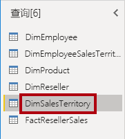

    The <bpt id="p1">**</bpt>DimSalesTerritory<ept id="p1">**</ept> table contains one row per sales region, including <bpt id="p2">**</bpt>Corporate HQ<ept id="p2">**</ept> (headquarters). Regions are assigned to a country, and countries are assigned to groups. In the <bpt id="p1">**</bpt>Model Data in Power BI Desktop, Part 1<ept id="p1">**</ept> lab, you’ll create a hierarchy to support analysis at region, country, or group level.

23. 在“查询”窗格中，选择 FactResellerSales 查询。

    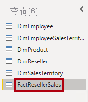

    “FactResellerSales”表中每个销售订单行包含一行 - 一个销售订单包含一个或多个行项。

24. 查看 TotalProductCost 列的列质量，请注意 8% 的行都为空。

    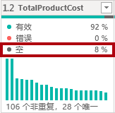

    此实验室是一系列实验室中的一个，它被设计成一个从准备数据到发布为报表和仪表板的完整场景。

### **任务 5：从 CSV 文件获取数据**

在此任务中，你将基于 CSV 文件创建查询。

1. 要添加新查询，请在“Power Query 编辑器”窗口的“主页”功能区选项卡上，在“新建查询”组中，单击“新建源”向下箭头，然后选择“文本/CSV”。

    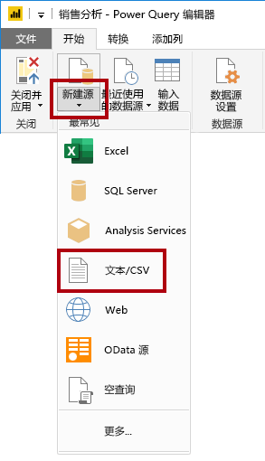

2. 在“打开”窗口中，导航到“D:\PL300\Resources”文件夹，然后选择“ResellerSalesTargets.csv”文件  。

3. 单击 **“打开”** 。

4. 在“ResellerSalesTargets.csv”窗口中，查看预览数据。

5. 单击 **“确定”** 。

    

  
‎ 

6. 在“查询”窗格中，请注意添加了 ResellerSalesTargets 查询。

    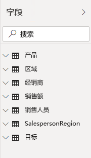

    你可以按任意顺序完成实验室。

7. 请注意，没有列包含空值。

    如果没有月度销售目标，则改为存储一个连字符。

8. 在列名左侧的各个列标题中查看图标。

    

    但是，如果你打算逐步完成多个实验室，那么对于前 10 个实验室，建议你按以下顺序进行：

    “在 Power BI Desktop 中加载数据”实验室中将应用许多转换以获得不同形状的结果，该结果仅由 3 个列组成：“Date”、“EmployeeKey”和“TargetAmount”。

### **任务 6：从 CSV 文件中获取其他数据**

在此任务中，你将基于其他 CSV 文件创建其他查询。

1. 使用上一个任务中的步骤，基于 D:\PL300\Resources\ColorFormats.csv 文件创建查询。

    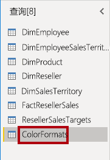

    The <bpt id="p1">**</bpt>ColorFormats<ept id="p1">**</ept> CSV file contains one row per product color. Each row records the HEX codes to format background and font colors. You’ll integrate this data with the <bpt id="p1">**</bpt>DimProduct<ept id="p1">**</ept> query data in the <bpt id="p2">**</bpt>Load Data in Power BI Desktop<ept id="p2">**</ept> lab.

### **任务 7：完成**

在此任务中，你将完成本实验室。

1. 在“视图”功能区选项卡上，从“数据预览”组中，取消选中此实验室中先前启用的三个数据预览选项：

    - 列质量

    - 列分发

    - 列配置文件

    

2. 要保存 Power BI Desktop 文件，请在“Power Query 编辑器”窗口的“文件”backstage 视图中，选择“保存”。

    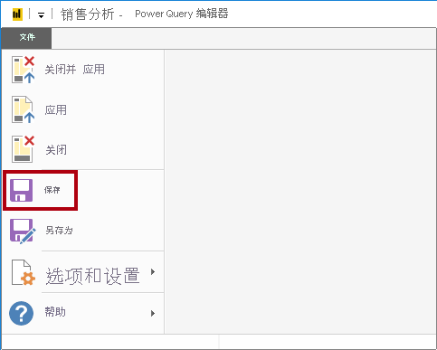

3. 当系统提示应用查询时，单击“稍后应用”。

    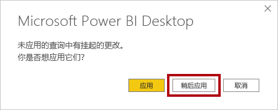

    Applying the queries will load their data to the data model. You’re not ready to do that, as there are many transformations that must be applied first.

4. 如果你打算开始下一个实验室，请让 Power BI Desktop 保持打开状态。

    在“在 Power BI Desktop 中加载数据”实验室中，你将对查询应用各种转换，然后应用查询将其加载到数据模型。
