---
lab:
  title: 在 Power BI Desktop 中加载数据
  module: '3 - Clean, Transform, and Load Data in Power BI'
---

# 在 Power BI Desktop 中加载数据

**预估完成本实验室需要 45 分钟。**

在本实验室中，你将开始对上一个实验室中创建的每个查询应用转换。 随后，你将应用查询将每一查询作为表加载到数据模型。

本实验室介绍如何完成以下操作：

- 应用各种转换

- 应用查询以将它们加载到数据模型

## **实验室场景**

此实验室是一系列实验室中的一个，它被设计成一个从准备数据到发布为报表和仪表板的完整场景。 你可以按任意顺序完成实验室。 但是，如果你打算逐步完成多个实验室，建议你按以下顺序进行：

1. 在 Power BI Desktop 中准备数据

2. **在 Power BI Desktop 中加载数据**

3. 在 Power BI 中设计数据模型

4. 在 Power BI Desktop 中创建 DAX 计算，第 1 部分

5. 在 Power BI Desktop 中创建 DAX 计算，第 2 部分

6. 在 Power BI Desktop 中设计报表，第 1 部分

7. 在 Power BI Desktop 中设计报表，第 2 部分

8. 使用 AI 视觉对象分析数据

9. 创建 Power BI 面板

10. 强制执行行级别安全性

## **练习 1：加载数据**

在本练习中，你将对上一个实验室中创建的每个查询应用转换。

### **任务 1：入门**

在此任务中，你将设置实验室环境。

*重要说明：如果你是继续上一个实验室（并且已经成功完成了该实验室），请不要完成此任务，而是继续下一个任务。*

1. 若要打开 Power BI Desktop，请在任务栏上单击“Microsoft Power BI Desktop”快捷方式。

    

1. 要关闭开始窗口，请单击窗口左上角的“X”。

    

1. 要打开入门 Power BI Desktop 文件，请单击“文件”功能区选项卡以打开 Backstage 视图。

1. 选择“打开报表”。

    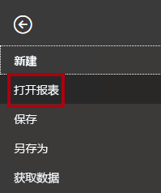

1. 单击“浏览报表”。

    

1. 在“打开”窗口中，导航到 D:\PL300\Labs\02-load-data-with-power-query-in-power-bi-desktop\Starter 文件夹 。

1. 选择“销售分析”文件。

1. 单击 **“打开”** 。

    

1. 关闭任何可能打开的信息窗口。

1. 请注意功能区下方的黄色警告消息。

    该消息将提醒你：尚未将查询应用到负载作为模型表。稍后将在此实验室中应用查询。

1. 要关闭警告消息，请在黄色警告消息的左侧单击“X”。

    

1. 要创建该文件的副本，请单击“文件”功能区选项卡以打开 Bckstage 视图。

1. 选择“另存为”。

    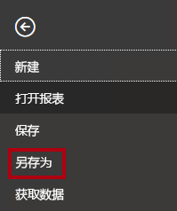

1. 如果提示应用更改，请单击“稍后应用”。

    

1. 在“另存为”窗口中，导航到“D:\PL300\MySolution”文件夹 。

1. 单击“保存” 。

    

1. 若要打开“Power Query 编辑器”窗口，请在“主页”功能区选项卡上的“查询”组内，单击“转换数据”图标   。

    

### **任务 2：配置 Salesperson 查询**

在此任务中，你将配置“Salesperson”查询。

1. 在“Power Query 编辑器”窗口的“查询”窗格中，选择“DimEmployee”查询  。

    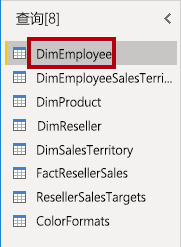

2. 若要重命名查询，请在“查询设置”窗格（位于右侧）的“名称”框中，将文本替换为 Salesperson，然后按 Enter 键。

    查询名称将确定模型表名称。建议定义简明且友好的名称。

3. 在“查询”窗格中，确认查询名称已更新。

    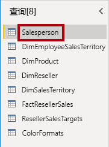

    现在，你将筛选查询行以仅检索职位是销售人员的员工。

4. 若要查找特定列，请在“主页”功能区选项卡上，单击“管理列”向下箭头，再单击“选择列”向下箭头，然后选择“转到列”   。

    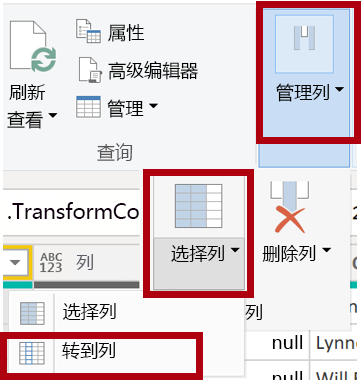

    *提示：当查询包含许多列时，此技巧非常有用。* 如果列数不多，只需水平滚动即可找到感兴趣的列。

5. 在“转到列”窗口中，若要按列名对列表进行排序，请单击“AZ”排序按钮，然后选择“名称”。

    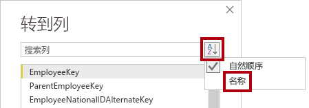

6. 选择 SalesPersonFlag 列，然后单击“确定”。

7. 若要筛选查询，请在 SalesPersonFlag 列标头中，单击向下箭头，然后取消选中“FALSE”。

    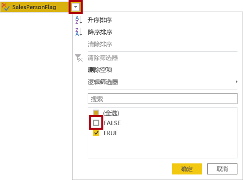

8. 单击 **“确定”** 。

    

9. 查询设置”窗格中，可以注意到“应用的步骤”列表中添加了“筛选的行”步骤。

    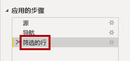

    你创建的每一转换会生成其他的步骤逻辑。*可以编辑或删除步骤。在查询转换阶段，还可以选择一个步骤来预览查询结果。*

10. 若要删除列，请在“主页”功能区选项卡上，单击“管理列”组，然后单击“选择列”图标  。

    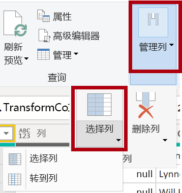

11. 在“选择列”窗口中，要取消选中所有列，请取消选中“(选择所有列)”项 。

    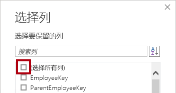

12. 若要包含列，请检查以下六列：

    - EmployeeKey

    - EmployeeNationalIDAlternateKey

    - FirstName

    - LastName

    - Title

    - EmailAddress

13. 单击“确定”。

    

14. 在“应用的步骤”列表中，请注意添加了另一个查询步骤。

    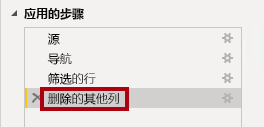

15. 若要创建单一名称列，请首先选择 FirstName 列标头。

16. 在按住 Ctrl 键的同时选择 LastName 列。

    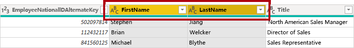

17. 右键单击任一所选列标题，然后在上下文菜单中选择“合并列”。

    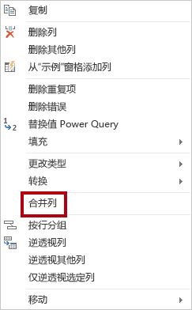

    可以通过以下方式应用许多常见的转换：右键单击列标头，然后从上下文菜单中进行选择。但是请注意，功能区中还有更多转换可用。

18. 在“合并列”窗口中的“分隔符”下拉列表中，选择“空格”。

19. 在“新列名”框中，将文本替换为“Salesperson”。

    

20. 单击 **“确定”** 。

    

21. 若要重命名“EmployeeNationalIDAlternateKey”列，双击“EmployeeNationalIDAlternateKey”列标题。

22. 将文本替换为 EmployeeID，然后按 Enter 键。

    *重要说明：* 当收到指示对列进行重命名时，请务必按照所述内容对它们准确进行重命名。

23. 使用前面的步骤将“EmailAddress”列重命名为“UPN”。

    *UPN 是用户主体名称的缩写。*

24. 在状态栏的左下角，验证查询是否具有 5 列和 18 行。

    

    *重要说明：如果查询未生成正确的结果，请不要继续，否则无法完成后面的实验室，这一点很重要。* 如果查询列或行不匹配，请回顾此任务中的步骤来解决问题。

### **任务 3：配置 SalespersonRegion 查询**

在此任务中，你将配置“SalespersonRegion”查询。

1. 在“查询”窗格中，选择 DimEmployeeSalesTerritory 查询。

    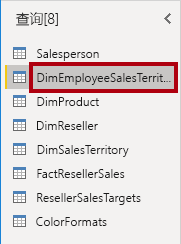

2. 在“查询设置”窗格中，将查询重命名为“SalespersonRegion”。

3. 若要删除最后两列，请首先选择 DimEmployee 列标头。

4. 在按住 Ctrl 键的同时选择 DimSalesTerritory 列标头。

5. 右键单击任一选择列标题，然后在上下文菜单中选择“删除列”。

    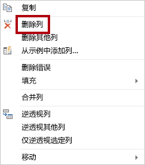

6. 在状态栏中，验证查询是否具有 2 列和 39 行。

    

### **任务 4：配置 Product 查询**

在此任务中，你将配置“Product”查询。

*重要说明：由于已提供了详细说明，因此，实验室步骤现将提供更简洁的说明。* 如果你需要详细说明，可以回顾先前任务的步骤。

1. 选择 DimProduct 查询。

    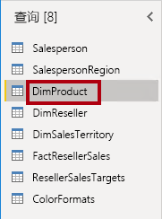

2. 将查询重命名为 Product。

3. 找到“FinishedGoodsFlag”列，然后筛选该列以检索制成品的产品（即 TRUE）。

4. 删除除了以下列之外的所有列：

    - ProductKey

    - EnglishProductName

    - StandardCost

    - Color

    - DimProductSubcategory

5. 请注意“DimProductSubcategory”列代表相关表（它包含“值”链接）。

6. 在“DimProductSubcategory”列标题中，在列名称右侧，单击展开按钮。

    

7. 若要取消选中所有列，请取消选中“(选择所有列)”项。

8. 选中“EnglishProductSubcategoryName”和“DimProductCategory”列。

    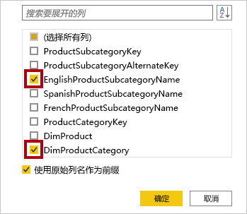

    通过选择这两个列，将应用转换以联接到 DimProductSubcategory 表，将这些列包含在内***。** 事实上，“DimProductCategory”列是数据源中的另一个相关表。*

9. 取消选中“使用原始列名作为前缀”复选框。

    

    查询列名称必须始终是唯一的。*选中后，此复选框将为每个列添加扩展列名作为前缀（在本例中为“DimProductSubcategory”）。因为已知所选列名不会与“Product”查询中的列名冲突，可以取消选择此选项。*

10. 单击 **“确定”** 。

    

11. 请注意，该转换的结果是添加了两列，并且删除了“DimProductSubcategory”列。

12. 展开“DimProductCategory”列，然后仅引入“EnglishProductCategoryName”列。

13. 对以下四列进行重命名：

    - 将 EnglishProductName 重命名为 Product

    - 将 StandardCost 重命名为 Standard Cost（包含一个空格）

    - 将 EnglishProductSubcategoryName 重命名为 Subcategory

    - 将 EnglishProductCategoryName 重命名为 Category

14. 在状态栏中，验证查询是否具有 6 列和 397 行。

    

### **任务 5：配置 Reseller 查询**

在此任务中，你将配置“Reseller”查询。

1. 选择 DimReseller 查询。

    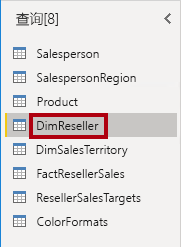

2. 将查询重命名为 Reseller。

3. 删除除了以下列之外的所有列：

    - ResellerKey

    - BusinessType

    - ResellerName

    - DimGeography

4. 展开 DimGeography 列以仅包含以下三列：

    - City

    - StateProvinceName

    - EnglishCountryRegionName

    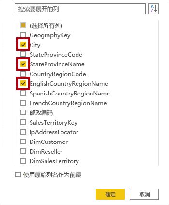

5. 在“Business Type”列标题中，单击向下箭头，然后查看各个列的值，并注意 warehouse 是否存在拼写错误。

    

  

6. 右键单击“Business Type”列标题，然后选择“替换值”。

    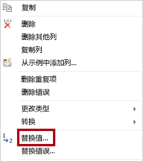

7. 在“替换值”窗口中，配置以下各值：

    - 在“要查找的值”框中，输入“Ware House”

    - 在“替换为”框中，输入“Warehouse”

    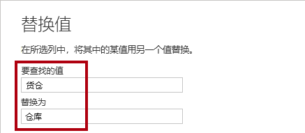

8. 单击 **“确定”** 。

    

9. 对以下四列进行重命名：

    - 将 BusinessType 重命名为 Business Type（包含一个空格）

    - 将 ResellerName 重命名为 Reseller

    - 将 StateProvinceName 重命名为 State-Province

    - 将 EnglishCountryRegionName 重命名为 Country-Region

10. 在状态栏中，确认查询具有 6 列和 701 行。

    

### **任务 6：配置 Region 查询**

在此任务中，你将配置“Region”查询。

1. 选择 DimSalesTerritory 查询。

    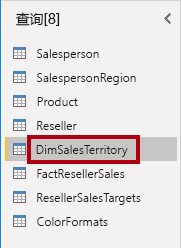

2. 将查询重命名为 Region。

3. 删除除了以下列之外的所有列：

    - SalesTerritoryKey

    - SalesTerritoryRegion

    - SalesTerritoryCountry

    - SalesTerritoryGroup

4. 对以下三列进行重命名：

    - 将 SalesTerritoryRegion 重命名为 Region

    - 将 SalesTerritoryCountry 重命名为 Country

    - 将 SalesTerritoryGroup 重命名为 Group

5. 在状态栏中，验证查询是否具有 4 列和 10 行。

    

### **任务 7：配置 Sales 查询**

在此任务中，你将配置“Sales”查询。

1. 选择 FactResellerSales 查询。

    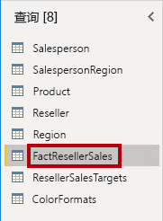

2. 将查询重命名为 Sales。

3. 删除除了以下列之外的所有列：

    - SalesOrderNumber

    - OrderDate

    - ProductKey

    - ResellerKey

    - EmployeeKey

    - SalesTerritoryKey

    - OrderQuantity

    - UnitPrice

    - TotalProductCost

    - SalesAmount

    - DimProduct

    你可能还记得，“在 Power BI Desktop 中准备数据”实验室中有一小部分“FactResellerSales”行缺少“TotalProductCost”值。*  为了修复缺少的值，已将“DimProduct”列包含在内，用于检索产品标准成本。*

4. 展开“DimProduct”列，取消选中所有列，然后仅包括“StandardCost”列。

5. 要创建自定义列，请在“添加列”功能区选项卡上的“常规”组中，单击“自定义列”。

    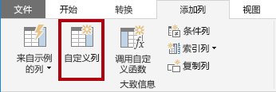

6. 在“自定义列”窗口的“新列名”框中，将文本替换为“Cost”。

    

7. 在“自定义列公式”框中，输入以下表达式（等号后面的文本）：

   `
   if [TotalProductCost] = null then [OrderQuantity] * [StandardCost] else [TotalProductCost]
   `

此表达式测试是否缺失 TotalProductCost 值。*如果缺失，则通过将“OrderQuantity”值乘以“StandardCost”值来生成一个值；否则，它使用现有的“TotalProductCost”值。  *

为方便使用，可从 D:\PL300\Labs\02-load-data-with-power-query-in-power-bi-desktop\Assets\Snippets.txt 文件中复制表达式。

8. 单击 **“确定”** 。

    

9. 删除以下两列：

    - TotalProductCost

    - StandardCost

10. 对以下三列进行重命名：

    - 将 OrderQuantity 重命名为 Quantity

    - 将 UnitPrice 重命名为 Unit Price（包含一个空格）

    - 将 SalesAmount 重命名为 Sales

11. 要修改列数据类型，请在“Quantity”列标题（位于列名称的左侧）中单击“1.2”图标，然后选择“整数”。

    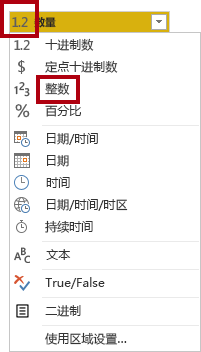

    配置正确数据类型是非常重要的。当列包含数值时，如果想执行数学计算，也务必要选择正确的类型。

12. 将以下三列数据类型修改为“定点小数”。

    - Unit Price

    - Sales

    - Cost

    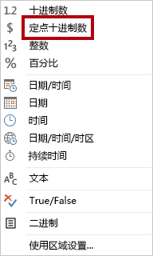

    “定点十进制数”数据类型存储完全精度的值，因此需要比小数更多的存储空间。务必为财务值或费率（例如汇率）使用定点十进制数类型。

13. 在状态栏中，确认查询具有 10 列和超过 999 行。

    

    *对于每一查询，最多将加载 1000 行作为预览数据。*

### **任务 8：配置 Targets 查询**

在此任务中，你将配置“Targets”查询。

1. 选择 ResellerSalesTargets 查询。

    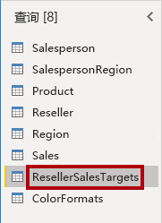

2. 将查询重命名为 Targets。

3. 若要对 12 个月的列进行逆透视（M01-M12），首先，选择多个 Year 和 EmployeeID 列标头   。

    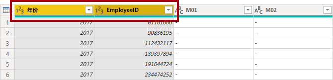

4. 右键单击任一选择列标题，然后在上下文菜单中选择“逆透视其他列”。

    

5. 请注意，列名称现在显示在“Attribute”列中，而值显示在“Value”列中 。

6. 将筛选器应用于 Value 列以删除连字符 (-) 值。

    *你可能还记得，在源 CSV 文件中使用连字符来表示零 (0)。*

7. 重命名以下两列：

    - 将“Attribute”重命名为“MonthNumber”（两个词之间没有空格，稍后会将其删除）

    - 将 Value 重命名为 Target

    现在，你将应用转换来生成一个日期列。*日期将派生自 Year 和 MonthNumber 列 。* 你将使用“示例中的列”功能来创建列。

8. 要准备“MonthNumber”列值，请右键单击“MonthNumber”列标题，然后选择“替换值”。

    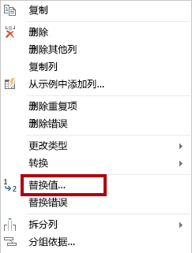

9. 在“替换值”窗口的“要查找的值”框中，输入“M”  。

    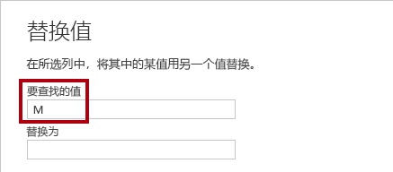

10. 单击 **“确定”** 。

11. 将 MonthNumber 列数据类型修改为“整数”。

    

12. 在“添加列”功能区选项卡上，从“常规”组内，单击“示例中的列”图标。

    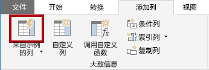

13. 请注意，第一行对应年份“2017”和月份“7”。

14. 在“Column1”列的第一个网格单元中，开始输入“07/01/2017”，然后按 Enter  。

    由于虚拟机使用美国区域设置，因此此日期实际上将显示为 July 1, 2017。

15. 请注意，网格单元格将更新为预测值。

    该功能已准确预测你正在合并“Year”和“MonthNumber”列中的值。* *

16. 另请注意查询网格上方显示的公式。

    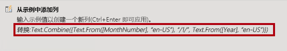

17. 若要重命名新列，请双击“已合并”列标头。

18. 将列重命名为 TargetMonth。

    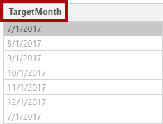

19. 若要添加新列，请单击“确定”。

    

20. 删除以下列：

    - Year

    - MonthNumber

21. 修改以下列数据类型：

    - 将 Target 的数据类型修改为定点十进制数

    - 将 TargetMonth 的数据类型修改为日期

22. 要将“Target”值乘以 1000，请选择“Target”列标题，然后在“转换”功能区选项卡上的“数字列”组内，单击“标准”，然后选择“乘”。

    *你可能还记得，目标值是以千为单位存储的。*

    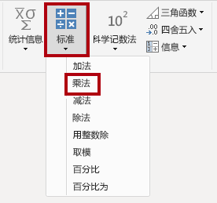

23. 在“乘”窗口的“值”框中，输入 1000。

    

24. 单击 **“确定”** 。

    

25. 在状态栏中，验证查询是否具有 3 列和 809 行。

    

### **任务 9：配置 ColorFormats 查询**

在此任务中，你将配置“ColorFormats”查询。

1. 选择 ColorFormats 查询。

    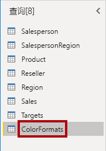

2. 请注意，第一行包含列名。

3. 在“主页”功能区选项卡中，单击“转换”组内的“将第一行用作标题”。

    

4. 在状态栏中，验证查询是否具有 3 列和 10 行。

    

### **任务 10：更新 Product 查询**

在此任务中，你将通过合并“ColorFormats”查询来更新“Product”查询。

1. 选择 Product 查询。

    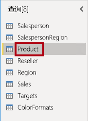

2. 若要合并 ColorFormats 查询，请在“主页”功能区选项卡上，单击“合并”向下箭头，然后单击“合并查询”   。

    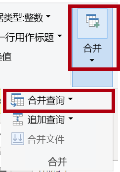

    合并查询能够实现集成数据，在本例中，这些数据来自不同的数据源（SQL Server 和 CSV 文件）。

3. 在“合并”窗口的“Product”查询网格中，选择“Color”列标题。

    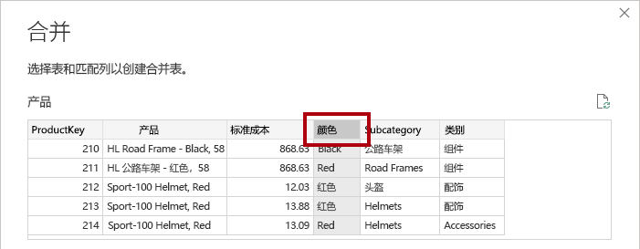

4. 在“产品”查询网格下方的下拉列表中，选择“ColorFormats”查询 。

    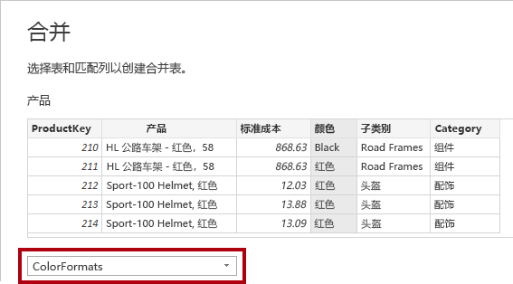

5. 在“ColorFormats”查询网格中，选择“Color”列标题。

6. 当“隐私级别”窗口打开时，对于两个数据源中的每一个，在相应的下拉列表中，选择“组织”。

    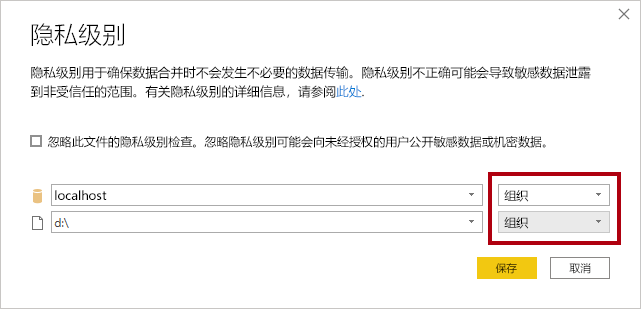

    可以为数据源配置隐私级别来确定数据是否可以在源之间共享。*将每个数据源设置为“组织”以使它们能够共享数据（如有必要）。请注意，私有数据源永远不能与其他数据源共享。* 这并不意味着私有数据不能共享，这只是表示 Power Query 引擎无法在源之间共享数据。

7. 单击“保存” 。

    

8. 在“合并”窗口中，使用默认的联接类型保持左外选择，然后单击“确定”  。

    

9. 展开“ColorFormats”列以包括以下两列：

    - 背景色格式

    - 字体颜色格式

    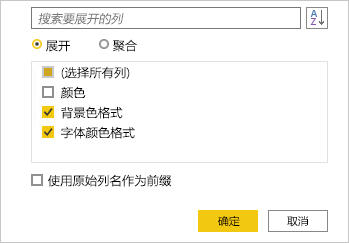

10. 在状态栏中，确认查询现在具有 8 列和 397 行。

    

### **任务 11：更新 ColorFormats 查询**

在此任务中，你将更新“ColorFormats”以禁用其负载。

1. 选择 ColorFormats 查询。

    

2. 在“查询设置”窗格中，单击“所有属性”链接。

    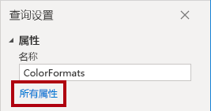

3. 在“查询属性”窗口中，取消选中“启用加载到报表”复选框。

    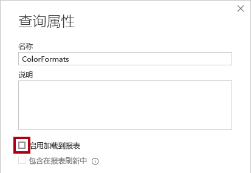

    禁用加载意味着它将不会作为表加载到数据模型。 这样做是因为查询已经与已启用的“Product”查询合并，以便加载到数据模型。

4. 单击 **“确定”** 。

    

### **任务 12：完成**

在此任务中，你将完成本实验室。

1. 验证你是否有已按如下正确命名的 8 个查询：

    - Salesperson

    - SalespersonRegion

    - Product

    - Reseller

    - Region

    - Sales

    - Targets

    - ColorFormats（不会加载到数据模型中）

2. 若要加载数据模型，请在“文件”后台视图中选择“关闭并应用”。 

    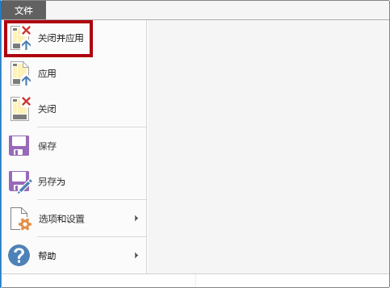

    *所有已启用加载的查询现已加载到数据模型。*

3. 在“字段”窗格（位于右侧）中，请注意已加载到数据模型的七个表。

    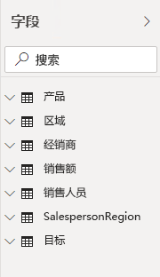

4. 保存 Power BI Desktop 文件。

5. 如果你打算开始下一个实验室，请让 Power BI Desktop 保持打开状态。

    在“在 Power BI Desktop 中为数据建模”实验室中，你将配置数据模型表和关系。**
