---
lab:
  title: 在 Power BI 中设计数据模型
  module: 4 - Design a Data Model in Power BI
---

# 在 Power BI 中设计数据模型

**预估完成本实验室需要 45 分钟。**

在本实验室中，你将开始开发数据模型。 它将涉及在表之间创建关系，然后配置表和列属性以提高数据模型的友好性和可用性。 你还将创建层次结构并创建快速度量值。

本实验室介绍如何完成以下操作：

- 创建模型关系

- 配置表和列属性

- 创建层次结构

### **实验室场景**

此实验室是一系列实验室中的一个，它被设计成一个从准备数据到发布为报表和仪表板的完整场景。 你可以按任意顺序完成实验室。 但是，如果你打算逐步完成多个实验室，建议你按以下顺序进行：

1. 在 Power BI Desktop 中准备数据

2. 在 Power BI Desktop 中加载数据

3. **在 Power BI 中设计数据模型**

4. 在 Power BI Desktop 中创建 DAX 计算，第 1 部分

5. 在 Power BI Desktop 中创建 DAX 计算，第 2 部分

6. 在 Power BI Desktop 中设计报表，第 1 部分

7. 在 Power BI Desktop 中设计报表，第 2 部分

8. 使用 AI 视觉对象分析数据

9. 创建 Power BI 面板

10. 强制执行行级别安全性

## **练习 1：创建模型关系**

在本练习中，你将创建模型关系。

### **任务 1：入门**

在此任务中，你将设置实验室环境。

*重要说明：如果你是继续上一个实验室（并且已经成功完成了该实验室），请不要完成此任务，而是继续下一个任务。*

1. 若要打开 Power BI Desktop，请在任务栏上单击“Microsoft Power BI Desktop”快捷方式。

    

1. 要关闭开始窗口，请单击窗口左上角的“X”。

    

1. 要打开入门 Power BI Desktop 文件，请单击“文件”功能区选项卡以打开 Backstage 视图。

1. 选择“打开报表”。

    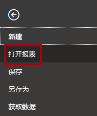

1. 单击“浏览报表”。

    

1. 在“打开”窗口中，导航到“D:\PL300\Labs\03-configure-data-model-in-power-bi-desktop\Starter”文件夹。

1. 选择“销售分析”文件。

1. 单击 **“打开”** 。

    

1. 关闭任何可能打开的信息窗口。

1. 要创建该文件的副本，请单击“文件”功能区选项卡以打开 Bckstage 视图。

1. 选择“另存为”。

    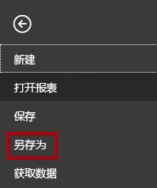

1. 如果系统提示应用更改，请单击“应用”。

    

1. 在“另存为”窗口中，导航到“D:\PL300\MySolution”文件夹 。

1. 单击“保存” 。

    

### **任务 2：创建模型关系**

在此任务中，你将创建模型关系。

1. 在 Power BI Desktop 的左侧，单击“模型”视图图标。

    

2. 如果看不到全部七个表，请向右水平滚动，然后将表更紧密地拖放在一起，以便可以同时看到它们。

    *提示：* 也可以使用窗口底部的缩放控件。

    在“模型”视图中，可以查看每个表和关系（表之间的连接器）。*目前还不存在任何关系，因为“在 Power BI Desktop 中准备数据”实验室中禁用了“数据加载关系”选项。*

3. 若要返回“报表”视图，请单击左侧的“报表”视图图标。

    

4. 若要查看所有表字段，请在“字段”窗格中，右键单击空白区域，然后选择“全部展开”。

    

5. 若要创建表视觉对象，请在“字段”窗格的“Product”表内部，选中“Category”字段。

    

    *实验室使用速记表示法引用字段。它将如下所示：Product \| Category。在此示例中，Product 是表名称，Category 是字段名称 。*

6. 若要在表中添加更多列，请在“字段”窗格中，选中“Sales \| Sales”字段。

7. 请注意，表视觉对象列出了四个产品类别，每个类别的销售额值相同，且总额相同。

    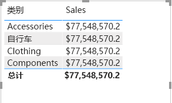

    问题在于该表基于来自不同表的字段。预期每个产品类别都显示该类别的销售额。但是，由于这些表之间没有模型关系，“Sales”表未经过筛选。现在，你将添加一个关系用于在表之间传播筛选器。

8. 在“建模”功能区选项卡上，从“关系”组内部，单击“管理关系”。

    

9. 在“管理关系”窗口中，请注意尚未定义任何关系。

10. 若要创建关系，请单击“新建”。

    

11. 在“创建关系”窗口的第一个下拉列表中，选择“Product”表。

    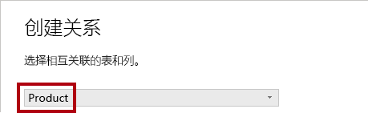

12. 在第二个下拉列表中（位于“Product”表网格下方），选择“Sales”表。

    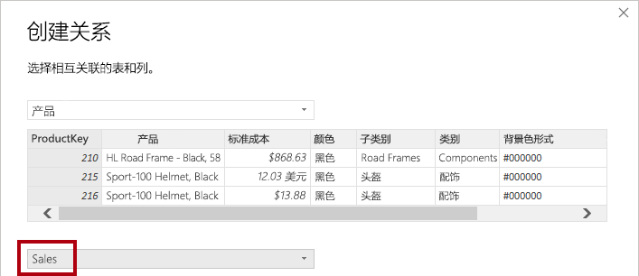

13. 注意，每个表中的“ProductKey”列均处于选中状态。

    由于这些列具有相同名称和数据类型，因此自动将其选中。

14. 在“基数”下拉列表中，请注意，选择了“一对多(1:*)”。

    由于 Power BI 认为“Product”表中的“ProductKey”列包含唯一值，因此已自动检测到基数。* *一对多关系是最常见的基数，在本实验室中创建的所有关系都将是这种类型。

15. 在“交叉筛选方向”下拉列表中，请注意，选择了“单向”。

    单个筛选方向表示筛选器从“一侧”传播到“多侧”。在本例中，这意味着应用于“Product”表的筛选器将传播到“Sales”表，但传播方向不能反过来 。

16. 可以看到“将此关系标记为可用”处于选中状态。

    活动关系传播筛选。*可以将关系标记为非活动状态，这样筛选就不会传播。当表之间存在多个关系路径时，可能存在非活动关系。* 在这种情况下，模型计算可以使用特殊函数来激活它们。

17. 单击 **“确定”** 。

    

18. 在“管理关系”窗口中，请注意已列出新关系，然后单击“关闭”。

    

19. 在报表中，可以看到表视觉对象已更新为针对每个产品类别显示不同的值。

    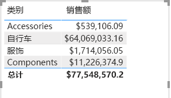

    现在，应用于“Product”***表的筛选器会传播到“Sales”** **表***。

20. 切换到“模型”视图，然后注意到两个表之间现在有一个连接器（两个表是否并排放置没有关系）。

    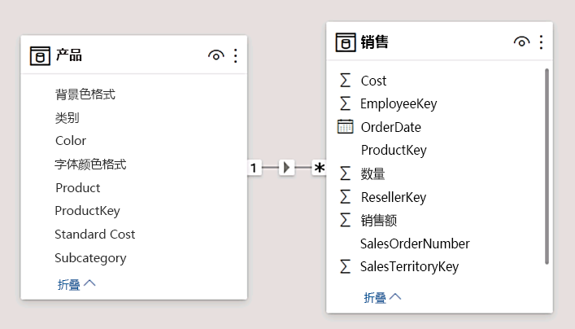

21. 在下图中，注意你可以解释由 1 和“*”指标表示的基数。

    筛选方向由箭头表示。实线表示活动关系，虚线表示不活动关系。

22. 将光标悬停在关系上以突出显示相关列。

    还可以通过更简单的方法创建关系。*在模型图中，可以拖放列以创建新的关系。

23. 若要使用其他方法创建新关系，请将“Reseller”表中的“ResellerKey”列拖放到“Sales”表中的“ResellerKey” 列上。

    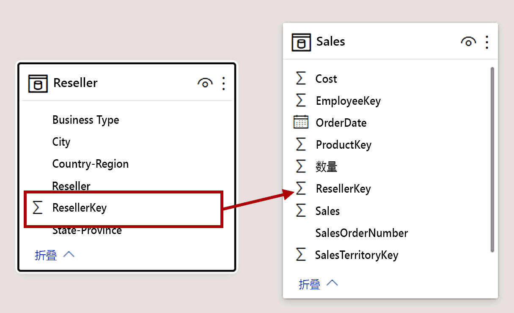

    *提示：有时候，有的列无法正常拖动。如果出现这种情况，请选择其他列，然后再次选择要拖动的列，然后重试。* 确保显示添加到该图的新关系。

24. 使用新方法创建以下两个模型关系：

    - “Region \| SalesTerritoryKey”到“Sales \| SalesTerritoryKey” 

    - “Salesperson \| EmployeeKey”到“Sales \| EmployeeKey” 

25. 在该图中，排列表，以使“Sales”表位于图的中心，并围绕该表排列相关的表。 将断开联接的表放在一边。

    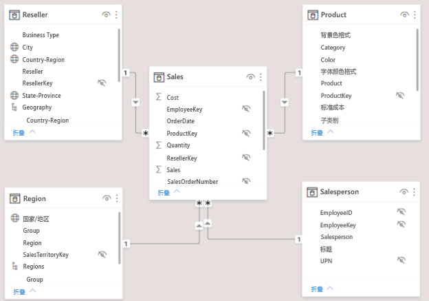

26. 保存 Power BI Desktop 文件。

## **练习 2：** 配置表

在本练习中，你将通过创建层次结构和隐藏、格式化列以及对其进行分类来配置每个表。

### **任务 1：配置“Product”表**

在此任务中，你将配置“Product”表。

1. 在“模型”视图中的“字段”窗格中，展开“Product”表以显示所有字段（如有必要）。

2. 若要创建层次结构，请在“字段”窗格中，右键单击“Category”列，然后选择“创建层次结构”。

    

3. 在“属性”窗格（位于“字段”窗格左侧）的“名称”框中，将文本替换为“Products”。

    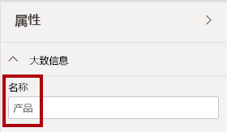

4. 要将第二个级别添加到层次结构，请在“属性”窗格中的“层次结构”下拉列表中，选择“Subcategory”（可能需要在窗格内部向下滚动）。

5. 若要将第三个级别添加到层次结构，请在“层次结构”下拉列表中，选择“Product”。

6. 若要完成层次结构设计，请单击“应用级别更改”。

    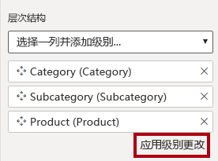

    *提示：务必单击“应用级别更改”，忽略此步骤是一种常见错误。*

7. 在“字段”窗格中，注意“Products”层次结构。

    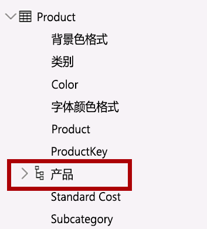

8. 若要显示层次结构级别，请展开“Products”层次结构。

    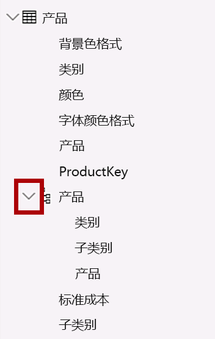

9. 若要将列组织到一个显示文件夹中，请在“字段”窗格中，先选择“Background Color Format”列。

10. 在按下 Ctrl 键的同时，选择“Font Color Format”列。

11. 在“属性”窗格的“显示文件夹”框中，输入“Formatting”。

    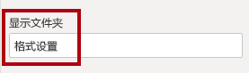

12. 在“字段”窗格中，请注意，两个列现在位于文件夹中。

    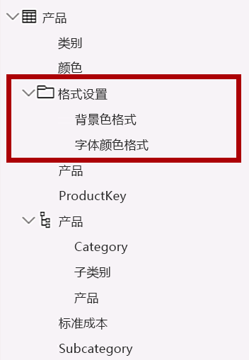

    显示文件夹是整理表的一种好方法，尤其是对于包含许多字段的表来说。

### **任务 2：配置“Region”表**

在此任务中，你将配置“Region”表。

1. 在“Region”表中，创建名为“Regions”的层次结构，其中包含以下三个级别：

    - Group

    - Country

    - Region

    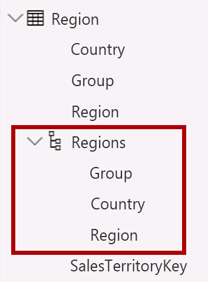

2. 选择“Country”列（而不是“Country”层次结构级别）。

3. 在“属性”窗格中，展开“高级”部分（位于窗格底部），然后在“数据类别”下拉列表中，选择“国家/地区”。

    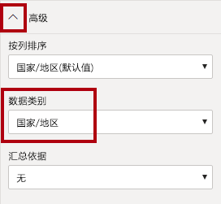

    数据分类可以为报表设计者提供提示。本例将列分类为国家或地区，可在 Power BI 呈现地图可视化效果时提供更准确的信息。

### **任务 3：配置“Reseller”表**

在此任务中，你将配置“Reseller”表。

1. 在“Reseller”表中，创建名为“Resellers”的层次结构，其中包含以下两个级别：

    - Business Type

    - Reseller

    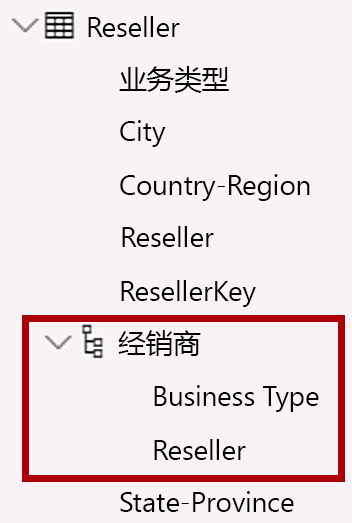

2. 创建名为“Geography”的第二个层次结构，其中包含以下四个级别：

    - Country-Region

    - State-Province

    - City

    - Reseller

    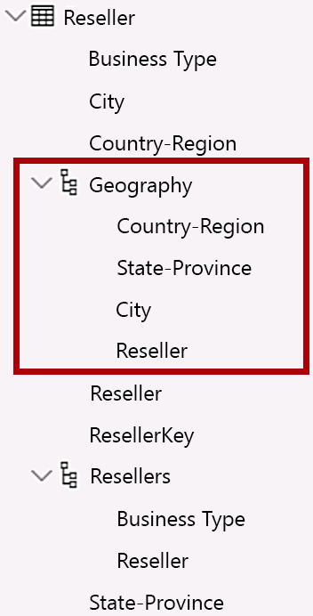

3. 将“Country-Region”、“State-Province”和“City”列的“数据类别”分别设置为“国家/地区”、“州或省”和“市”      。 

### **任务 4：配置“Sales”表**

在此任务中，你将配置“Sales”表。

1. 在“Sales”表中，选择“Cost”列。

2. 在“属性”窗格的“说明”框中，输入：“Based on standard cost”

    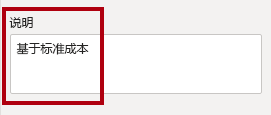

    说明可应用于表、列、层次结构或度量。*在“字段”窗格中，当报表作者将光标悬停在字段上时，说明文本会在工具提示中显示。*

3. 选择“Quantity”列。

4. 在“属性”窗格的“格式设置”部分中，将“千位分隔符”属性滑动到“是”。

    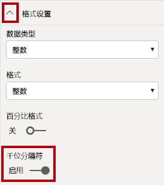

5. 选择“Unit Price”列。

6. 在“属性”窗格的“格式设置”部分中，将“小数位数”属性设置为“2”   。

7. 在“高级”组（可能需要向下滚动以找到它）的“汇总依据”下拉列表中，选择“Average”。

    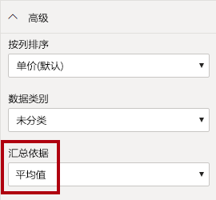

    默认情况下，数字列通过将值加在一起进行汇总。此默认行为不适用于“Unit Price”之类的代表比率的列。将默认汇总设置为平均值将生成有意义的结果。

### **任务 5：批量更新属性**

在此任务中，你将使用单个批量更新来更新多个列。 你将使用此方法来隐藏列，并设置列值的格式。

1. 在“字段”窗格中，选择“Product \| ProductKey”列 。

2. 在按下 Ctrl 键的同时选择以下 13 列（跨多个表）：

    - Region \| SalesTerritoryKey

    - Reseller \| ResellerKey

    - Sales \| EmployeeKey
    
    - Sales \| ProductKey

    - Sales \| ResellerKey

    - Sales \| SalesOrderNumber

    - Sales \| SalesTerritoryKey

    - Salesperson \| EmployeeID

    - Salesperson \| EmployeeKey

    - Salesperson \| UPN

    - SalespersonRegion \| EmployeeKey

    - SalespersonRegion \| SalesTerritoryKey

    - Targets \| EmployeeID

3. 在“属性”窗格中，将“已隐藏”属性滑动到“是”  。

    

    这些列是隐藏的，因为它们要么被关系使用，要么将在行级别安全性配置或计算逻辑中使用。

    在“在 Power BI Desktop 中创建 DAX 计算，第 1 部分”实验室中，你将在计算中使用 SalesOrderNumber* *。

4. 从以下三个列中进行选择（多选）：

    - Product \| Standard Cost

    - Sales \| Cost

    - Sales \| Sales

5. 在“属性”窗格的“格式设置”部分中，将“小数位数”属性设置为“0”（零）。

    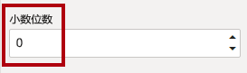

## **练习 3：** 查看模型界面

在本练习中，将切换到“报表”视图，查看模型接口。

### **任务 1：查看模型界面**

在此任务中，将切换到“报表”视图，查看模型接口。

1. 切换到“报表”视图。

2. 在“字段”窗格中，请注意以下事项：

    - 列、层次结构及其级别均为字段，可用于配置报表视觉对象

    - 仅与报表创作相关的字段可见

    - “SalespersonRegion”表不可见 - 因为其所有字段都被隐藏

    - “Region”和“Reseller”表中的空间字段使用空间图标修饰

    - 默认情况下，使用 sigma 符号 (Ʃ) 修饰的字段将进行汇总

    - 将光标悬停在“Sales \| Cost”字段上时，将显示工具提示

3. 展开“Sales \| OrderDate”字段，并注意它显示日期层次结构。

    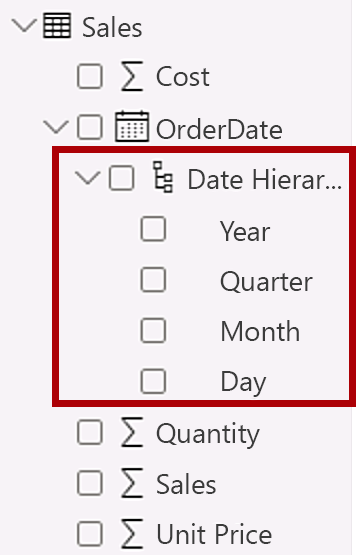

    “Targets \| TargetMonth”字段提供类似的层次结构。*这些层次结构不是由你创建的。它们是自动创建的。但是，有一个问题。Adventure Works 的会计年度从每年的 7 月 1 日开始。但是，在这些自动创建的日期层次结构中，日期层次结构年份始于每年的 1 月 1 日。*

    现在你将禁止此自动行为。*在“在 Power BI Desktop 中创建 DAX 计算，第 1 部分”实验室中，你将使用 DAX 创建日期表，并对其进行配置以定义 Adventure Works 的日历。*

4. 若要关闭自动/日期时间，请单击“文件”功能区选项卡以打开 backstage 视图。

5. 在左侧，选择“选项和设置”，然后选择“选项”。

    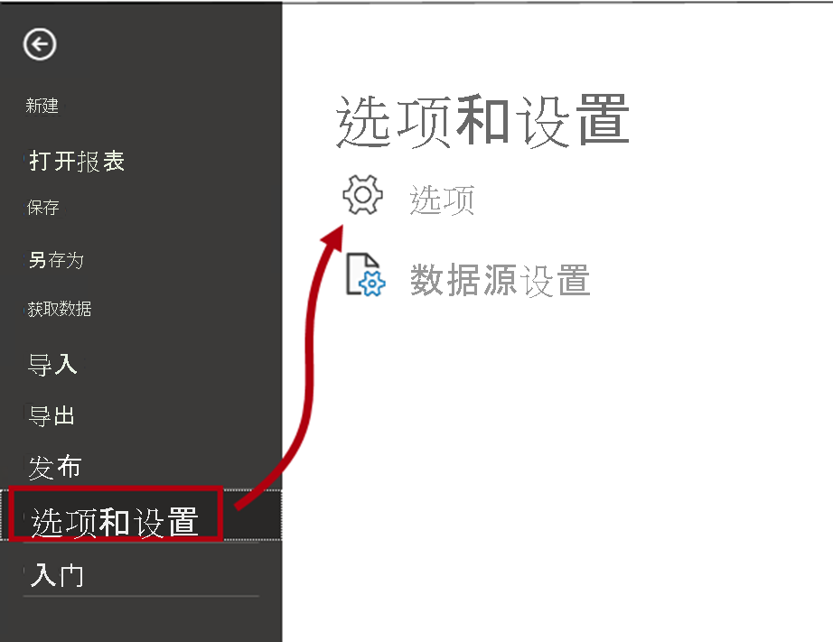

6. 在“选项”窗口左侧的“当前文件”组中，选择“数据负载”。

    

7. 在“时间智能”部分中，取消选中“自动日期/时间”。

    

8. 单击 **“确定”** 。

    

9. 在“字段”窗格中，请注意，日期层次结构不再可用。

    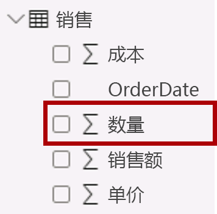

## 练习 4：**创建快速度量值**

在本练习中，你将创建两个快速度量值。

### **任务 1：创建快速度量值**

在此任务中，你将创建两个快速度量来计算利润和利润率。

1. 在“字段”窗格中，右键单击“Sales”表，然后选择“新建快速度量值”。

    

2. 在“快速度量值”窗口的“计算”下拉列表中，从“数学运算”组中选择“减法”。

    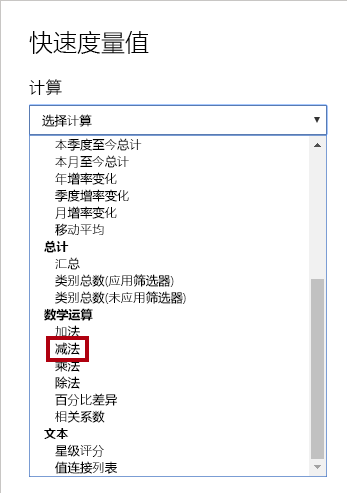

3. 在“快速度量”窗口的“字段”窗格中，展开“Sales”表。

4. 将“Sales”字段拖入“基值”框。

5. 将“Cost”字段拖入“要减去的值”框。

    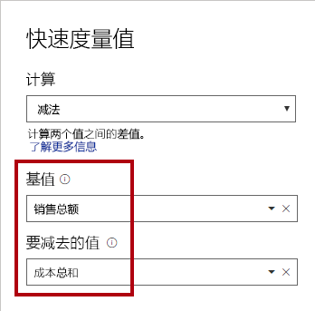

6. 单击 **“确定”** 。

    

    快速度量值可为你创建计算公式。*对于简单而通用的计算，可以轻松快速地创建。* 在“在 Power BI Desktop 中创建 DAX 计算，第 1 部分”实验室中，你将在不使用此工具的情况下创建度量值。

7. 注意“字段”窗格“Sales”表中的新度量。

    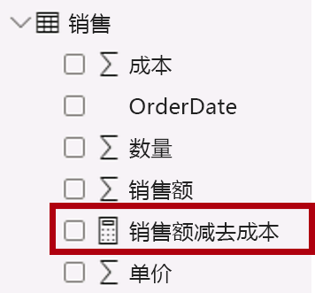

    度量值使用计算器图标修饰。

8. 若要重命名度量值，请右键单击它，然后选择“重命名”。

    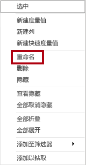

    *提示：* 若要重命名字段，也可以双击它，或选择它并按 F2。

9. 将度量值重命名为“Profit”，然后按 Enter。

10. 根据以下要求，在“Sales”表中添加第二个快速度量值：

    - 使用“除法”数学运算

    - 将“分子”设置为“Sales \| Profit”字段 

    - 将“分母”设置为“Sales \| Sales”字段 

    - 将度量值重命名为“Profit Margin”

    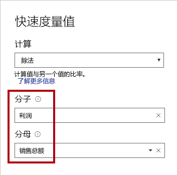

    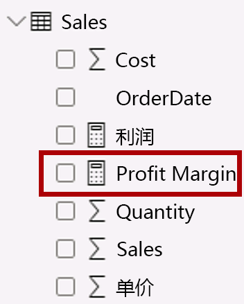

11. 确保选中“Profit Margin”度量值，然后在“度量工具”上下文功能区上，将格式设置为“百分比”并保留两位小数。

    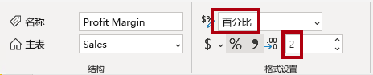

12. 若要测试这两个度量值，请先选择报表页上的表视觉对象。

13. 在“字段”窗格中，选中两个度量值。

    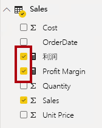

14. 单击并拖动右侧参考线以加宽表视觉对象。

    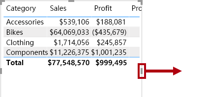

15. 验证这些度量是否生成了格式正确的合理结果。

    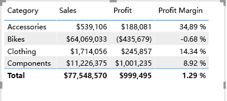

### **任务 2：创建多对多关系**

在本任务中，你将在“Salesperson”表和“Sales”表之间创建多对多关系。

1. 在 Power BI Desktop 中，在“报表”视图的“字段”窗格中，选中以下两个字段以创建表视觉对象：

    - Salesperson \| Salesperson

    - Sales \| Sales

    *实验室使用速记表示法引用字段。它将如下所示：Salesperson \| Salesperson。* 在此示例中，前面的 Salesperson 是表名称，后面的 Salesperson 是字段名称 。

    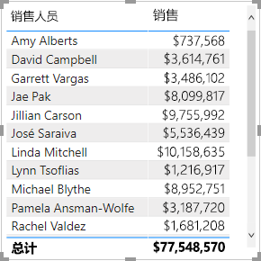

    *表显示每个销售人员的销售额。但是，销售员与销售额之间存在另一种关系。一些销售人员属于一个、两个或可能更多的销售区域。此外，销售区域可以分配有多个销售人员。*

    从绩效管理的角度来看，需要分析销售人员的销售额（基于其分配的区域）并将其与销售目标进行比较。在下一个练习中，你将创建关系来支持此分析。

2. 请注意，Michael Blythe 的销售额已近 900 万美元。

3. 切换到“模型”视图。

    

4. 拖动“SalespersonRegion”表，将其放置在“Region”和“Salesperson”表之间。

5. 使用拖放方法创建以下两个模型关系：

    - “Salesperson \| EmployeeKey”到“SalespersonRegion \| EmployeeKey” 

    - “Region \| SalesTerritoryKey”到“SalespersonRegion \| SalesTerritoryKey” 

    “SalespersonRegion”表可被视为桥接表**。

6. 切换到“报表”视图，可看到视觉对象尚未更新 - Michael Blythe 的销售额结果未更改。

7. 切换回“模型”视图，然后按照“Salesperson”表中的关系筛选方向（箭头）进行操作。

    考虑以下情况：“Salesperson”表筛选“Sales”表。* *还可以筛选“SalespersonRegion”表，但不会继续将筛选器传播到“Region”表（箭头指向错误方向） 。

    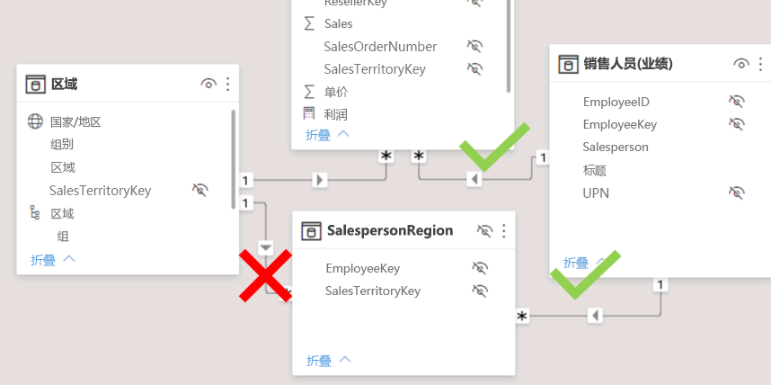

8. 若要编辑“Region”和“SalespersonRegion”表之间的关系，请双击该关系。

9. 在“编辑关系”窗口的“交叉筛选方向”下拉列表中，选择“双向”。  

10. 选中“在两个方向上应用安全筛选器”复选框。

    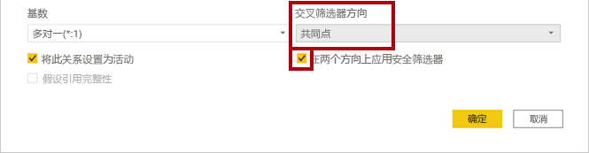

11. 单击 **“确定”** 。

    

12. 请注意，该关系具有双箭头。

    

13. 切换到“报表”视图，然后注意到销售额仍未更改。

    问题现在与以下事实有关：“Salesperson”*和“Sales”表之间存在两个可能的筛选器传播路径。基于“最少表数”评估在内部解决这种歧义。需要明确的是，不应设计具有此类歧义的模型，该问题将在本实验室的后面部分通过完成“在 Power BI Desktop 中创建 DAX 计算，第 1 部分”实验室得以解决*。

14. 切换到“模型”视图。

15. 要通过桥接表强制实施筛选传播，请编辑（双击）“Salesperson”表和“Sales”表之间的关系。

16. 在“编辑关系”窗口中，取消选中“使此关系可用”复选框。

    

17. 单击 **“确定”** 。

    

    筛选器传播现在将遵循唯一的可用路径。

18. 在关系图中，请注意，非活动关系由虚线表示。

    

19. 切换到“报表”视图，然后请注意，Michael Blythe 的销售额现在为近 2,200 万美元。

    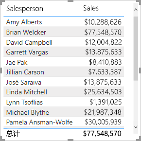

20. 还要注意，每个销售员的销售额（如果相加）将超过表中的总额。

    由于对区域销售额结果进行了两次、三次等计数，这通常是针对多对多关系的观测结果。*考虑列出的第二个销售人员 Brian Welcker。他的销售额等于总销售额。* 这是正确的结果，因为他是销售总监；他的销售额按所有区域的销售额进行度量。

    虽然多对多关系现在有效，但现在无法分析销售人员的销售额（因为该关系处于非活动状态）。在“在 Power BI Desktop 中创建 DAX 计算，第 1 部分”实验室中引入可可分析对销售人员分配的销售区域的销售额的计算表（用于绩效分析），以便能够重新激活此关系。

21. 切换到“建模”视图，然后在关闭图中选择“Salesperson”表。

22. 在“属性”窗格的“名称”框中，将文本替换为“Salesperson (Performance)”。

    已重命名的表现在反映了它的用途：用于根据对销售人员分配的销售区域的销售额来报告和分析销售人员的绩效。

### **任务 3：关联“Targets”表**

在此任务中，你将创建与“Targets”表的关系

1. 通过“Salesperson (Performance) \| EmployeeID”列和“Targets \| EmployeeID”列创建关系 。

2. 在“报表”视图中，将“Targets \| Target”字段添加到表视觉对象。

3. 重设表视觉对象的大小，使所有列均可见。

    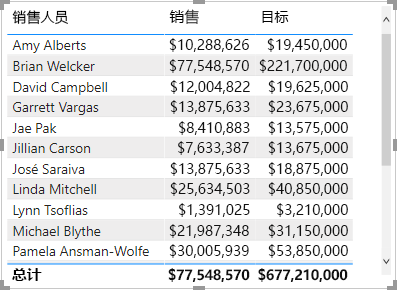

    现在能够以可视化方式显示销售额和目标，但请注意两个原因。*首先，没有对时间段应用筛选，因此目标还包括将来的目标金额。其次，目标不可相加，因此不应显示总数。可以通过设置视觉对象的格式来禁用它们，也可以使用计算逻辑将其删除。* 在“在 Power BI Desktop 中创建 DAX 计算，第 2 部分”实验室中，你将采用第二种方法：创建一个目标度量值，该度量值会在筛选的销售人员数超过一个时返回 BLANK。

### 任务 4：完成

在此任务中，你将完成本实验室。

1. 保存 Power BI Desktop 文件。

2. 如果系统提示应用查询，则单击“稍后应用”。

3. 如果你打算开始下一个实验室，请让 Power BI Desktop 保持打开状态。
