---
lab:
  title: 在 Power BI Desktop 中创建 DAX 计算，第 1 部分
  module: Module 5 - Create Model Calculations using DAX in Power BI
---


# <a name="create-dax-calculations-in-power-bi-desktop-part-1"></a>在 Power BI Desktop 中创建 DAX 计算，第 1 部分

**预估完成本实验室需要 45 分钟**

在本实验室中，你将使用数据分析表达式 (DAX) 创建计算表、计算列和简单的度量值。

本实验室介绍如何完成以下操作：

- 创建计算表

- 创建计算列

- 创建度量值

### <a name="lab-story"></a>**实验室场景**

此实验室是一系列实验室中的一个，它被设计成一个从准备数据到发布为报表和仪表板的完整场景。 你可以按任意顺序完成实验室。 但是，如果你打算逐步完成多个实验室，那么对于前 10 个实验室，建议你按以下顺序进行：

1. 在 Power BI Desktop 中准备数据

2. 在 Power BI Desktop 中加载数据

3. Power BI Desktop 中的模型数据

5. 在 Power BI Desktop 中创建 DAX 计算，第 1 部分

6. 在 Power BI Desktop 中创建 DAX 计算，第 2 部分

7. 在 Power BI Desktop 中设计报表，第 1 部分

8. 在 Power BI Desktop 中设计报表，第 2 部分

9. 创建 Power BI 仪表板

10. 在 Power BI Desktop 中执行数据分析

11. 强制执行行级别安全性

## <a name="exercise-1-create-calculated-tables"></a>**练习 1：创建计算表**

在本练习中，你将创建两个计算表。 第一个是“Salesperson”表，允许它与“Sales”表之间有直接关系。 第二个是“Date”表。

### <a name="task-1-get-started"></a>**任务 1：入门**

在此任务中，你将设置实验室环境。

*重要说明：如果你是继续上一个实验室（并且已经成功完成了该实验室），请不要完成此任务，而是继续下一个任务。*

1. 若要打开 Power BI Desktop，请在任务栏上单击“Microsoft Power BI Desktop”快捷方式。

    

1. 要关闭开始窗口，请单击窗口左上角的“X”。

    

1. 要打开入门 Power BI Desktop 文件，请单击“文件”功能区选项卡以打开 Backstage 视图。

1. 选择“打开报表”。

    

1. 单击“浏览报表”。

    

1. 在“打开”窗口，导航到“D:\PL300\Labs\05-create-dax-calculations-in-power-bi-desktop\Starter”文件夹 。

1. 选择“销售分析”文件。

1. 单击 **“打开”** 。

    

1. 关闭任何可能打开的信息窗口。

1. 要创建该文件的副本，请单击“文件”功能区选项卡以打开 Bckstage 视图。

1. 选择“另存为”。

    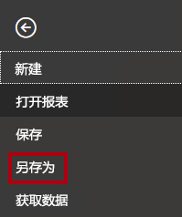

1. 如果系统提示应用更改，请单击“应用”。

    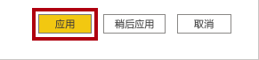

1. 在“另存为”窗口中，导航到“D:\PL300\MySolution”文件夹 。

1. 单击“保存” 。

    

### <a name="task-2-create-the-salesperson-table"></a>**任务 2：创建“Salesperson”表**

在此任务中，你将创建“Salesperson”表（与“Sales”有直接关系）。

1. 在 Power BI Desktop 中，在“报表”视图的“建模”功能区上，单击“计算”组中的“新建表”。

    

2. 在编辑栏（在创建或编辑计算时在功能区正下方打开）中，键入“Salesperson =”，按 Shift+Enter，键入“Salesperson (Performance)”，然后按 Enter。

    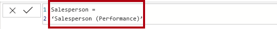

    为了方便起见，可以从 D:\PL300\Labs\05-create-dax-calculations-in-power-bi-desktop\Assets\Snippets.txt 中的代码片段文件复制本实验室中的所有 DAX 定义**。

    计算表的创建方式为，先输入表名称，后面依次跟等于号 (=) 和返回表的 DAX 公式。请注意，表名称不能是数据模型中已有的。

    编辑栏支持输入有效的 DAX 公式。它包括自动完成、Intellisense 和颜色编码等功能，让你能够快速、准确地输入公式。

    此表定义创建“Salesperson (Performance)”表的副本。** 它仅复制数据，但是不复制模型属性（如可见性、格式设置等）。

    *提示：建议输入“空格”（即回车和制表符）来以直观且易于阅读的格式布局公式，尤其在公式又长又复杂的情况下。若要输入回车符，请按 Shift+Enter。* “空白区域”是视需要选择输入的。

3. 在“字段”窗格中，我们注意到，表图标为蓝色阴影（表示计算表）。

    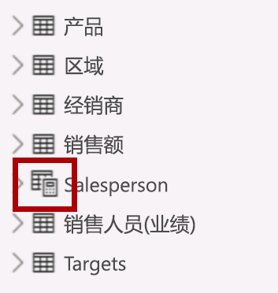

    计算表是使用返回表的 DAX 公式来定义的。*请务必了解，计算表会增加数据模型的大小，因为它们会具体化和存储值。* 每当刷新公式依赖项时，都会对其进行重新计算，就像在此数据模型中将新（未来）日期值加载到表中时一样。

    与基于 Power Query 的表不同，计算表不能用于从外部数据源加载数据。它们只能根据已加载到数据模型中的内容来转换数据。

4. 切换到“模型”视图。

5. 请注意“Salesperson”表可用（注意，它可能在视图中处于隐藏状态，可通过水平滚动来找到它）。

6. 创建从“Salesperson \| EmployeeKey”列到“Sales \| EmployeeKey”列的关系 。

7. 右键单击“Salesperson (Performance)”与“Sales”表之间的非活动关系，然后选择“删除”。

    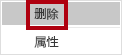

8. 当看到确认删除的提示时，单击“删除”。

    

9. 在“Salesperson”表中，选择以下列，然后将其隐藏（将“隐藏”属性设置为“是”）：

    - EmployeeID

    - EmployeeKey

    - UPN

10. 在模型图中，选择“Salesperson”表。

11. 在“属性”窗格的“说明”框中，输入：与销售额相关的销售员

    回想一下，当用户将光标悬停在表或字段上时，描述将显示为“字段”窗格中的工具提示。**

12. 对于“Salesperson (Performance)”表，将说明设置为：销售人员与一个或多个区域相关

    数据模型现在会在分析销售人员时提供两种替代方案。 *“Salesperson”表可便于分析销售人员的销售额，而“Salesperson (Performance)”表则可便于分析分配给销售人员的一个或多个销售区域中的销售额。 *

### <a name="task-3-create-the-date-table"></a>**任务 3：创建“Date”表**

在此任务中，你将创建“Date”表。

1. 切换到“数据”视图。

    

2. 在“主页”功能区选项卡上，单击“计算”组中的“新建表”。

    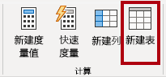

3. 在公式栏中，输入以下内容：


    **DAX**


    ```
    Date =  
    CALENDARAUTO(6)
    ```


    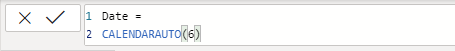

    
    CALENDARAUTO() 函数返回一个由日期值组成的单列表。 *“自动”行为扫描所有数据模型日期列，以确定存储在数据模型中的最旧和最新日期值。* 然后，它为此范围内的每个日期都创建一行，并在两个方向上扩展此范围，以确保存储全年的数据。

    此函数可以采用一个可选参数，该参数表示一年的最后一个月。*如果省略，则值为“12”，表示 12 月是一年的最后一个月。* 在此示例中，输入“6”，表示 6 月是一年的最后一个月。

4. 注意包含日期值的列。

    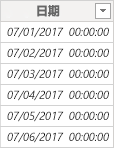

    *显示的日期使用美国区域设置（即 mm/dd/yyyy）进行格式设置。*

5. 在左下角的状态栏中，我们注意到表统计信息确认生成了 1826 行数据，这代表五个全年的数据。

    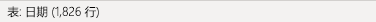

### <a name="task-4-create-calculated-columns"></a>任务 4：创建计算列

在此任务中，你将添加其他列，以支持按不同时间段进行筛选和分组。 你还将创建一个计算列来控制其他列的排序顺序。

为了方便起见，可以从 D:\PL300\Labs\05-create-dax-calculations-in-power-bi-desktop\Assets\Snippets.txt 中的代码片段文件复制本实验室中的所有 DAX 定义**。

1. 在“表工具”关联功能区上，单击“计算”组中的“新建列”。

    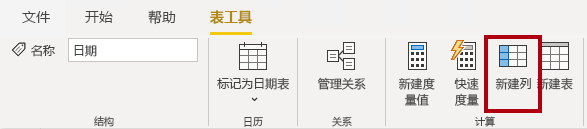

2. 在公式栏中键入以下内容（或从代码片段文件中复制），然后按 Enter：


    **DAX**


    ```
    Year =
    "FY" & YEAR('Date'[Date]) + IF(MONTH('Date'[Date]) > 6, 1)
    ```


    计算列的创建方式为，先输入列名称，后面依次跟等于号 (=) 和返回单值结果的 DAX 公式。列名称不能是表中已有的。

    此公式使用日期的年份值，但如果月份是在 6 月后，则会在年份值上加 1。这就是 Adventure Works 会计年度的计算方式。

3. 验证新列是否已添加。

    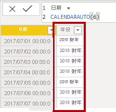

4. 使用代码片段文件定义为“Date”表创建以下两个计算列：

    - Quarter

    - Month

    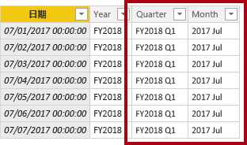

5. 若要验证计算，请切换到“报表”视图。

6. 若要新建报表页，请单击左下角的加号图标。

    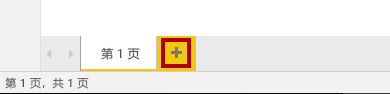

7. 若要将矩阵视觉对象添加到新的报表页，请在“可视化效果”窗格中选择矩阵视觉对象类型。

    *提示：* 可以将光标悬停在每个图标上，以查看描述视觉对象类型的工具提示。

    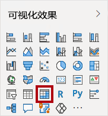

8. 在“字段”窗格中，从“Date”表内，将“Year”字段拖入“行”井/区域中。

    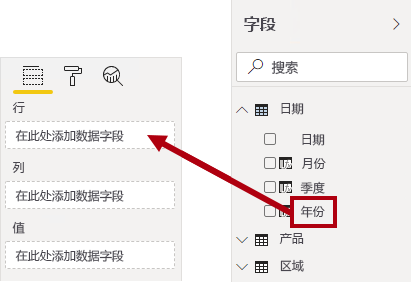

9. 将“Month”字段拖入“Year”字段正下方的“行”井/区域。

    

10. 在矩阵视觉对象的右上角（或底部，取决于视觉对象的位置），单击“叉状双箭头”图标（它将全年向下扩展一级）。

    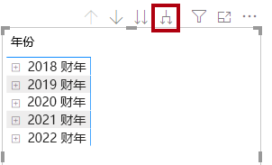

11. 我们注意到，年份展开到月份，月份是按字母顺序排序，而不是按时间顺序排序。

    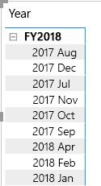

    *默认情况下，文本值按字母顺序排序，数字按从小到大的顺序排序，日期按从早到晚的顺序排序。*

12. 若要自定义“Month”字段排序顺序，请切换到“数据”视图。

13. 将“MonthKey”列添加到“Date”表中。


    **DAX**


    ```
    MonthKey =
    (YEAR('Date'[Date]) * 100) + MONTH('Date'[Date])
    ```


    *此公式会为每个年份/月份组合计算一个数值。*

14. 在“数据”视图中，验证新列是否包含数值（例如，201707 表示 2017 年 7 月等）。

    

15. 切换回“报表”视图。

16. 在“字段”窗格中，确保已选中“Month”字段（如果选中，则有深灰色背景）。

17. 在“列工具”关联功能区上，单击“排序”组中的“按列排序”，然后选择“MonthKey”。

    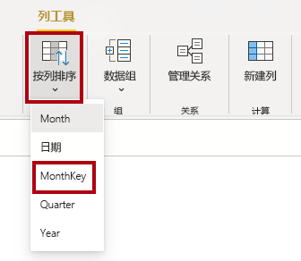

18. 在矩阵视觉对象中，我们注意到，月份现在按时间顺序排序。

    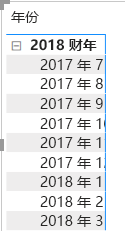

### <a name="task-5-complete-the-date-table"></a>任务 5：完成“Date”表

在此任务中，你将通过隐藏列和创建层次结构来完成“Date”表的设计。 然后，你将创建与“Sales”和“Targets”表的关系。

1. 切换到“模型”视图。

2. 在“Date”表中，隐藏“MonthKey”列（将“隐藏”设置为“是”）。

3. 在“字段”右侧窗格中，选择 Date 表，右键单击“Year”列，然后选择“创建层次结构”   。 

4. 右键单击“重命名”，将新创建的层次结构重命名为“Fiscal” 。 
5. 通过在“字段”窗格中选择其余两个字段，单击鼠标右键，选择“添加到层次结构 -> Fiscal”，将其添加到“Fiscal”层次结构 。
    
    - Quarter

    - Month

    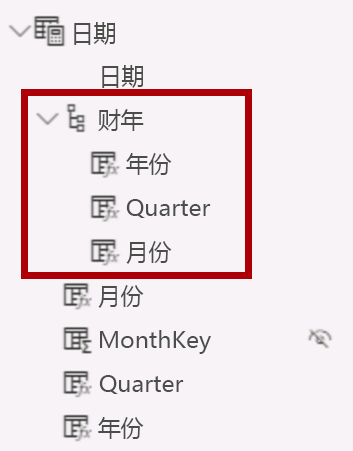

6. 创建以下两个模型关系：

    - 从“Date \| Date”到“Sales \| OrderDate” 

    - 从“Date \| Date”到“Targets \| TargetMonth” 

7. 隐藏以下两列：

    - Sales \| OrderDate

    - Targets \| TargetMonth

### <a name="task-6-mark-the-date-table"></a>**任务 6：标记“Date”表**

在此任务中，你会将“Date”表标记为日期表。

1. 切换到“报表”视图。

2. 在“字段”窗格中，选择“Date”表（不是“Date”字段）。

3. 在“表工具”关联功能区上，单击“日历”组中的“标记为日期表”，然后选择“标记为日期表”。

    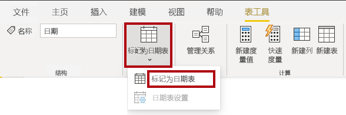

4. 在“标记为日期表”窗口中，选择“日期列”下拉列表中的“日期”。

    

5. 单击 **“确定”** 。

    

6. 保存 Power BI Desktop 文件。

    Power BI Desktop 现在知道此表定义的是日期（时间）。*依靠时间智能计算时，这一点很重要。“在 Power BI Desktop 中创建 DAX 计算，第 2 部分”实验室中将使用时间智能计算。*

    请注意，当数据源中没有日期表时，这种用于日期表的设计方法是合适的。如果你有数据仓库，则应该从其日期维度表（而不是数据模型中的“重新定义”日期逻辑）中加载日期数据。

## <a name="exercise-2-create-measures"></a>**练习 2：创建度量值**

在此练习中，你将创建几个度量值并对其进行格式设置。

### <a name="task-1-create-simple-measures"></a>**任务 1：创建简单的度量值**

在此任务中，你将创建简单的度量值。 简单的度量值聚合单个列中的值或对表中的行进行计数。

1. 在“报表”视图“第 2 页”上的“字段”窗格中，将“Sales \| Unit Price”字段拖到矩阵视觉对象。  

    *实验室使用速记表示法引用字段。它将如下所示：Sales \| Unit Price。在此示例中，Sales 是表名称，Unit Price 是字段名称。 *

    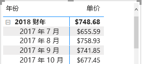

    回想一下，在“在 Power BI Desktop 中对数据建模，第 2 部分”实验室中，你将“Unit Price”列设置为按“平均值”汇总。*  *你在矩阵视觉对象中看到的结果是每月平均单位价格（单位价格值的总和除以单位价格计数）。

2. 在视觉对象“字段”窗格（位于“可视化效果”窗格之下）的“值”字段井/区域，注意“Unit Price”已列出。

    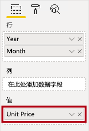

3. 单击“Unit Price”的向下箭头，然后注意可用的菜单选项。

    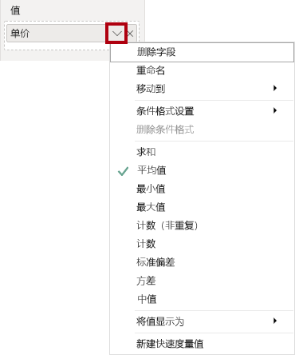

    借助可见的数值列，报表作者可以在设计报表时确定汇总（或不汇总）列值的方式。*这可能会生成不当的报表。但是某些数据建模人员不喜欢碰运气，他们选择隐藏这些列，而不是公开度量值中定义的聚合逻辑。* 这就是你将在本实验室中采用的方法。

4. 若要创建度量值，请在“字段”窗格中右键单击“Sales”表，然后选择“新建度量值”。

    

5. 在编辑栏中，添加以下度量值定义：


    **DAX**


    ```
    Avg Price =  
    ‎AVERAGE(Sales[Unit Price])
    ```


6. 将“Avg Price”度量值添加到矩阵视觉对象。

7. 我们注意到，它生成的结果与“Unit Price”列相同（但格式不同）。

8. 在“值”井中，打开“Avg Price”字段的关联菜单，我们注意到，聚合技术是无法更改的。

    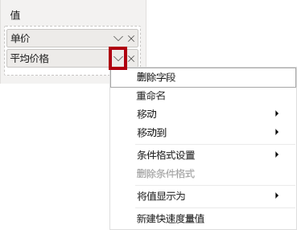

    无法修改度量值的聚合行为。

9. 使用代码片段文件定义为“Sales”表创建以下五个度量值：

    - Median Price

    - Min Price

    - Max Price

    - Orders

    - Order Lines

    “Orders”度量值中使用的 DISTINCTCOUNT() 函数只会对订单进行一次计数（忽略重复项）。*“Order Lines”度量值中使用的 COUNTROWS() 函数对表执行运算。*

    在此示例中，订单数是通过统计非重复“SalesOrderNumber”列值来计算的，而订单行数则就是表行数（每行都是一个订单行）。**

10. 切换到“模型”视图，然后选择四个价格度量值：“Avg Price”、“Max Price”、“Median Price”和“Min Price”。

11. 对于选择的多个度量值，配置以下要求：

    - 将格式设置为两位小数

    - 分配到名为“Pricing”的显示文件夹

    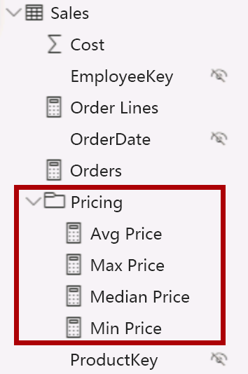

12. 隐藏“Unit Price”列。

    报表作者现在无法使用“Unit Price”列。*他们必须使用你添加到模型中的定价度量值。* 这种设计方法可确保报表作者不会以不当的方式对价格进行聚合（例如，通过对价格进行求和）。

13. 同时选择“Order Lines”和“Orders”度量值并配置以下要求：

    - 设置使用千位分隔符的格式

    - 分配到名为“Counts”的显示文件夹

    

14. 在“报表”视图中，在矩阵视觉对象的“值”井/区域中，对于“Unit Price”字段，单击“X”将其删除。

    

15. 增加矩阵视觉对象的大小，以占满报表页的宽度和高度。

16. 在“矩阵”视觉对象中添加以下五个新度量值：

    - Median Price

    - Min Price

    - Max Price

    - Orders

    - Order Lines

17. 验证结果是否合理，且格式是否正确。

    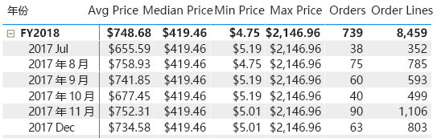


### <a name="task-2-finish-up"></a>**任务 2：完成**

在此任务中，你将完成本实验室。

1. 保存 Power BI Desktop 文件。

2. 如果你打算开始下一个实验室，请让 Power BI Desktop 保持打开状态。

    “在 Power BI Desktop 中创建 DAX 计算，第 2 部分”实验室中将使用 DAX 生成高级计算，来改进数据模型。**
