---
lab:
  title: 在 Power BI Desktop 中创建 DAX 计算，第 2 部分
  module: Module 5 - Create Model Calculations using DAX in Power BI
---


# <a name="create-dax-calculations-in-power-bi-desktop-part-2"></a>在 Power BI Desktop 中创建 DAX 计算，第 2 部分

**预估完成本实验室需要 45 分钟**

在本实验室中，你将使用涉及筛选器上下文控制的 DAX 表达式来创建度量值。

本实验室介绍如何完成以下操作：

- 使用 CALCULATE() 函数控制筛选器上下文

- 使用时间智能函数

### <a name="lab-story"></a>**实验室场景**

此实验室是一系列实验室中的一个，它被设计成一个从准备数据到发布为报表和仪表板的完整场景。 你可以按任意顺序完成实验室。 但是，如果你打算逐步完成多个实验室，那么对于前 10 个实验室，建议你按以下顺序进行：

1. 在 Power BI Desktop 中准备数据

2. 在 Power BI Desktop 中加载数据

3. 在 Power BI Desktop 中对数据建模

5. 在 Power BI Desktop 中创建 DAX 计算，第 1 部分

6. 在 Power BI Desktop 中创建 DAX 计算，第 2 部分

7. 在 Power BI Desktop 中设计报表，第 1 部分

8. 在 Power BI Desktop 中设计报表，第 2 部分

9. 创建 Power BI 仪表板

10. 在 Power BI Desktop 中执行数据分析

11. 强制执行行级别安全性

## <a name="exercise-1-work-with-filter-context"></a>**练习 1：处理筛选器上下文**

在本练习中，你将使用涉及筛选器上下文控制的 DAX 表达式来创建度量值。

### <a name="task-1-get-started"></a>**任务 1：入门**

在此任务中，你将设置实验室环境。

*重要说明：如果你是继续上一个实验室（并且已经成功完成了该实验室），请不要完成此任务，而是继续下一个任务。*

1. 若要打开 Power BI Desktop，请在任务栏上单击“Microsoft Power BI Desktop”快捷方式。

    

1. 要关闭开始窗口，请单击窗口左上角的“X”。

    

1. 要打开入门 Power BI Desktop 文件，请单击“文件”功能区选项卡以打开 Backstage 视图。

1. 选择“打开报表”。

    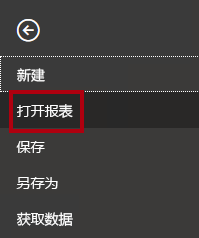

1. 单击“浏览报表”。

    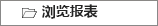

1. 在“打开”窗口，导航到“D:\PL300\Labs\06-create-dax-calculations-in-power-bi-desktop-advanced\Starter”文件夹 。

1. 选择“销售分析”文件。

1. 单击 **“打开”** 。

    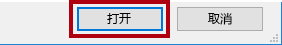

1. 关闭任何可能打开的信息窗口。

1. 要创建该文件的副本，请单击“文件”功能区选项卡以打开 Bckstage 视图。

1. 选择“另存为”。

    

1. 如果系统提示应用更改，请单击“应用”。

    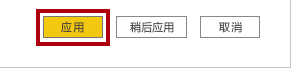

1. 在“另存为”窗口中，导航到“D:\PL300\MySolution”文件夹 。

1. 单击“保存” 。

    

### <a name="task-2-create-a-matrix-visual"></a>**任务 2：创建矩阵视觉对象**

在此任务中，你将创建一个矩阵视觉对象来支持测试新的度量值。

1. 在 Power BI Desktop 的“报表”视图中，新建一个报表页。

    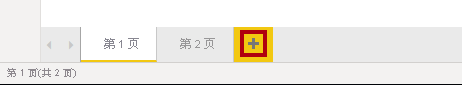

2. 在“第 3 页”上，添加一个矩阵视觉对象。

    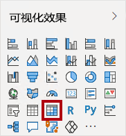

3. 调整矩阵视觉对象的大小，以占满整个报表页。

4. 若要配置矩阵视觉对象字段，请将“Region \| Regions”层次结构从“字段”窗格中拖放到视觉对象中 。

    实验室使用速记表示法引用字段或层次结构。*它将如下所示：Region \| Regions。在此示例中，Region 是表名称，Regions 是层次结构名称。 *

5. 此外，还添加“Sales \| Sales”字段。

6. 若要展开整个层次结构，请单击矩阵视觉对象右上角的分叉双箭头图标两次。

    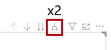

    回想一下，“Regions”***层次结构包含“组”** **、“Country”** **和“Region”** **级别。***

7. 若要设置矩阵视觉对象的格式，请选择“可视化效果”窗格下的“格式”窗格。

    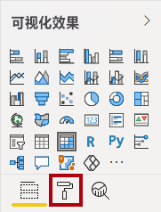

8. 在“搜索”框中，输入“渐变”。

    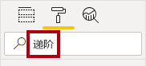

9. 将“渐变布局”属性设置为“关”。

    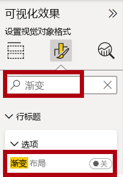

10. 验证矩阵视觉对象是否有四个列标题。

    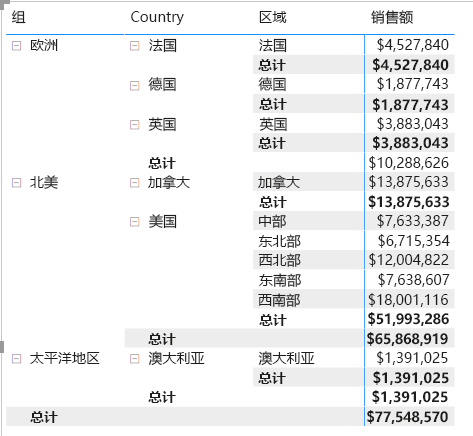

    在 Adventure Works 中，销售区域分为组、国家/地区和区域。*除美国之外的其他所有国家/地区都只有一个区域（以国家/地区命名）。* 由于美国的销售区域非常大，该国分为五个销售区域。

    *在此练习中，你将创建多个度量值，然后通过将它们添加到矩阵视觉对象来测试它们。*

### <a name="task-3-manipulate-filter-context"></a>**任务 3：控制筛选器上下文**

在此任务中，你将使用 DAX 表达式创建几个度量值，这些度量值使用 CALCULATE() 函数来处理筛选器上下文。

1. 基于以下表达式向“Sales”表添加一个度量值：

    为了方便起见，可以从 D:\PL300\Labs\06-create-dax-calculations-in-power-bi-desktop-advanced\Assets\Snippets.txt 文件复制本实验室中的所有 DAX 定义。**


    **DAX**


    ```
    Sales All Region =

    CALCULATE(SUM(Sales[Sales]), REMOVEFILTERS(Region))
    ```


    CALCULATE() 函数是一种功能强大的函数，用于控制筛选器上下文。*第一个参数接受表达式或度量值（度量值就是命名表达式）。* 后续参数可便于修改筛选器上下文。

    REMOVEFILTERS() 函数用于删除活动筛选器。它可以不接受任何参数，也可以接受一个表、一列或多列作为它的参数。

    在此公式中，度量值计算修改后的筛选器上下文中“Sales”列的总和，这将删除应用到“Region”表的任何筛选器。* *

2. 将“Sales All Region”度量值添加到矩阵视觉对象。

    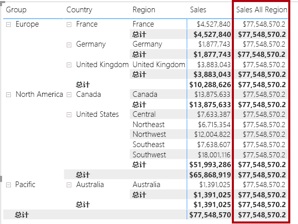

3. 我们注意到，“Sales All Region”度量值计算每个区域、国家/地区（小计）和组（小计）的所有区域销售总额。

    此新度量值尚未生成有用的结果。将某个组、国家/地区或区域的销售额除以该值，便会得出一个有用的比率，称为“占总计的百分比”。

4. 务必选中“字段”窗格中的“Sales All Region”度量值（选中后呈现深灰色背景），然后将公式栏中的度量值名称和公式替换为以下公式：

    *提示：若要替换现有公式，请先复制代码片段。然后，在编辑栏中单击，并按 Ctrl+A 选择所有文本。然后，按 Ctrl+V 粘贴代码片段，以覆盖所选文本。然后，按 Enter。*


    **DAX**


    ```
    Sales % All Region =  
    ‎DIVIDE(  
    ‎ SUM(Sales[Sales]),  
    ‎ CALCULATE(  
    ‎ SUM(Sales[Sales]),  
    ‎ REMOVEFILTERS(Region)  
    ‎ )  
    ‎)
    ```


    此度量值已重命名，以准确反映更新后的公式。*DIVIDE() 函数将“Sales”度量值（未经筛选器上下文修改）除以修改后的上下文中的“Sales”度量值（即删除了应用于“Region”表的任何筛选器）。  *

5. 在矩阵视觉对象中，我们注意到，此度量值已重命名，现在每个组、国家/地区和区域的显示值都不同。

6. 将“Sales % All Region”度量值的格式设置为，有两位小数的百分比。

7. 在矩阵视觉对象中，审阅“Sales % All Region”度量值的值。

    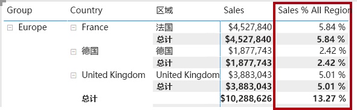

8. 根据以下表达式，向“Sales”表添加另一个度量值，并将格式设置为百分比：


    **DAX**

    ```
    Sales % Country =  
    ‎DIVIDE(  
    ‎ SUM(Sales[Sales]),  
    ‎ CALCULATE(  
    ‎ SUM(Sales[Sales]),  
    ‎ REMOVEFILTERS(Region[Region])  
    ‎ )  
    ‎)
    ```


9. 我们注意到，“Sales % Country”度量值公式与“Sales % All Region”度量值公式略有不同。

    不同之处在于，分母修改筛选器上下文的方法是，删除“Region”表的“Region”列上的筛选器，而不是删除“Region”表的所有列上的筛选器。*  也就是说，应用于组或国家/地区列的所有筛选器都会保留。* 它获得的结果表示销售额在国家/地区中所占的百分比。

10. 将“Sales % Country”度量值添加到矩阵视觉对象。

11. 我们注意到，只有美国的区域生成的值不是 100%。

    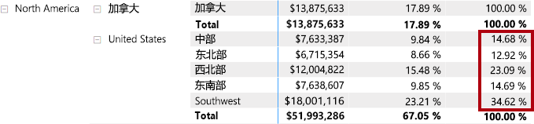

    回想一下，只有美国有多个区域。所有其他国家/地区都只有一个区域，这就解释了为什么它们对应的值都是 100%。

12. 若要提高此度量值在矩阵视觉对象中的可读性，请使用以下改进的公式来覆盖“Sales % Country”度量值。


    **DAX**


    ```
    Sales % Country =  
    ‎IF(  
    ‎ ISINSCOPE(Region[Region]),  
    ‎ DIVIDE(  
    ‎ SUM(Sales[Sales]),  
    ‎ CALCULATE(  
    ‎ SUM(Sales[Sales]),  
    ‎ REMOVEFILTERS(Region[Region])  
    ‎ )  
    ‎ )  
    ‎)
    ```


    嵌入 IF() 函数的 ISINSCOPE() 函数用于测试区域列是否为级别层次结构中的级别。*如果为 true，则计算 DIVIDE() 函数。* 没有 false 部分表示，当区域列不在范围内时返回 BLANK。

13. 我们注意到，“Sales % Country”度量值现在只在区域处于范围内时才返回值。

    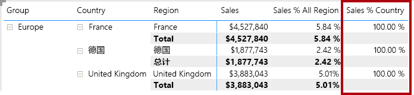

14. 根据以下表达式，向“Sales”表添加另一个度量值，并将格式设置为百分比：


    **DAX**


    ```
    Sales % Group =  
    ‎DIVIDE(  
    ‎ SUM(Sales[Sales]),  
    ‎ CALCULATE(  
    ‎ SUM(Sales[Sales]),  
    ‎ REMOVEFILTERS(  
    ‎ Region[Region],  
    ‎ Region[Country]  
    ‎ )  
    ‎ )  
    ‎)
    ```


    *为了取得表示销售额在组中所占百分比的结果，可以应用两个筛选器来有效地删除两列上的筛选器。*

15. 将“Sales % Group”度量值添加到矩阵视觉对象。

16. 若要提高此度量值在矩阵视觉对象中的可读性，请使用以下改进的公式来覆盖“Sales % Group”度量值。


    **DAX**


    ```
    Sales % Group =  
    ‎IF(  
    ‎ ISINSCOPE(Region[Region])  
    ‎ || ISINSCOPE(Region[Country]),  
    ‎ DIVIDE(  
    ‎ SUM(Sales[Sales]),  
    ‎ CALCULATE(  
    ‎ SUM(Sales[Sales]),  
    ‎ REMOVEFILTERS(  
    ‎ Region[Region],  
    ‎ Region[Country]  
    ‎ )  
    ‎ )  
    ‎ )  
    ‎)
    ```


17. 我们注意到，“Sales % Group”度量值现在只在区域或国家/地区处于范围内时才返回值。

18. 在“模型”视图中，将这三个新度量值放入名为“Ratios”的显示文件夹中。

    

19. 保存 Power BI Desktop 文件。

    添加到“Sales”表中的度量值修改了筛选器上下文来实现分层导航。*我们注意到，用于计算小计的模式需要从筛选器上下文中删除一些列，而为了计算总计，则必须删除所有列。*

## <a name="exercise-2-work-with-time-intelligence"></a>**练习 2：处理时间智能**

在此练习中，你将创建年初至今 (YTD) 销售额度量值和年度同比 (YoY) 销售额增长率度量值。

### <a name="task-1-create-a-ytd-measure"></a>**任务 1：创建 YTD 度量值**

在此任务中，你将创建一个 Sales YTD 额度量值。

1. 在“报表”视图中的“第 2 页”上，注意矩阵视觉对象显示了多个度量值，并在行上对年份和月份进行了分组。

2. 根据以下表达式，向“Sales”表添加一个度量值，并将格式设置为没有小数位：


    **DAX**


    ```
    Sales YTD =  
    ‎TOTALYTD(SUM(Sales[Sales]), 'Date'[Date], "6-30")
    ```


    TOTALYTD() 函数对给定日期列计算表达式（在本例中为对“Sales”列求和）。*日期列必须属于标记为日期表的日期表，标记方法如“在 Power BI Desktop 中创建 DAX 计算，第 1 部分”实验室所示。*

    此函数还可以接受第三个可选参数，即表示一年中的最后一天。*如果没有此日期，则表示 12 月 31 日是一年中的最后一天。* 对于 Adventure Works，6 月是一年中的最后一个月，因此使用的是“6-30”。

3. 向矩阵视觉对象添加“Sales”字段和“Sales YTD”度量值。

4. 注意一年内销售额的累计。

    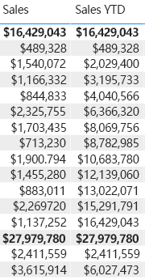

    TOTALYTD() 函数执行筛选器控制，特别是时间筛选器控制。*例如，若要计算 2017 年 9 月（会计年度的第三个月）的 YTD 销售额，则会删除“Date”表上的所有筛选器，取而代之的是新筛选器，此筛选器筛选出从年初（2017 年 7 月 1 日）一直到上下文内日期期限的最后一天（2017 年 9 月 30 日）的所有日期。*

    请注意，DAX 中提供了许多时间智能函数，以支持常用的时间筛选操作。

### <a name="task-2-create-a-yoy-growth-measure"></a>**任务 2：创建 YoY 增长率度量值**

在此任务中，你将创建一个 Sales YoY Growth 度量值。

1. 根据以下表达式，向“Sales”表再添加一个度量值：


    **DAX**


    ```
    Sales YoY Growth =  
    ‎VAR SalesPriorYear =  
    ‎ CALCULATE(  
    ‎ SUM(Sales[Sales]),  
    ‎ PARALLELPERIOD(  
    ‎ 'Date'[Date],  
    ‎ -12,  
    ‎ MONTH  
    ‎ )  
    ‎ )  
    ‎RETURN  
    ‎ SalesPriorYear
    ```


    “Sales YoY Growth”***度量值公式声明了一个变量。** 变量对于简化公式逻辑很有用，而且当表达式需要在公式中进行多次计算时（YoY 增长率逻辑就是这种情况），变量可以提高效率。变量是用唯一名称进行声明，然后度量值表达式必须在“RETURN”关键字之后输出。*

    “SalesPriorYear”变量分配给在修改后的上下文中对“Sales”列进行求和的表达式，修改后的上下文使用 PARALLELPERIOD() 函数从筛选器上下文中的每个日期往回移动 12 个月。* *

2. 将“Sales YoY Growth”度量值添加到矩阵视觉对象。

3. 请注意，新的度量值对前 12 个月返回 BLANK（2017 会计年度之前没有任何销售额记录）。

4. 请注意，2018 年 7 月的“Sales YoY Growth”度量值的值是 2017 年 1 月的“Sales”值。

    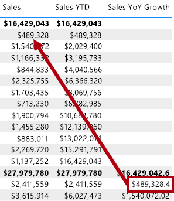

    *至此，公式的“困难部分”已经过测试，可以用计算增长率结果的最终公式来覆盖此度量值了。*

5. 若要完成此度量值，请使用以下公式来覆盖“Sales YoY Growth”度量值，并将格式设置为有两位小数的百分比：


    **DAX**


    ```
    Sales YoY Growth =  
    ‎VAR SalesPriorYear =  
    ‎ CALCULATE(  
    ‎ SUM(Sales[Sales]),  
    ‎ PARALLELPERIOD(  
    ‎ 'Date'[Date],  
    ‎ -12,  
    ‎ MONTH  
    ‎ )  
    ‎ )  
    ‎RETURN  
    ‎ DIVIDE(  
    ‎ (SUM(Sales[Sales]) - SalesPriorYear),  
    ‎ SalesPriorYear  
    ‎ )
    ```


6. 在公式的“RETURN”子句中，我们注意到，变量被引用了两次。

7. 验证 2018 年 7 月的 YoY 增长率是否为“392.83%”。

    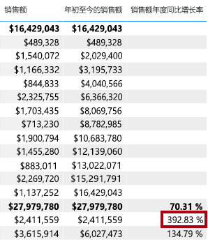

    也就是说，2018 年 7 月的销售额（2,411,559 美元）比去年同期的销售额（489,328 美元）增长了近 400%（约 4 倍）。

8. 在“模型”视图中，将这两个新度量值放入名为“Time Intelligence”的显示文件夹中。

    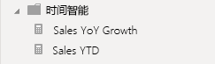

### <a name="task-3-finish-up"></a>**任务 3：完成**

在此任务中，你将完成本实验室。

1. 要清理可用于开发报表的解决方案，请在左下角右键单击“第 2 页”选项卡，然后选择“删除页”。

    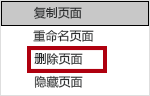

2. 当系统提示删除页面时，单击“删除”。

    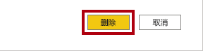

3. 另外再删除“第 3 页”。

4. 若要清除剩余的页面，请在该页面上选择表视觉对象，然后按 Delete 键。

5. 保存 Power BI Desktop 文件。

6. 如果你打算开始下一个实验室，请让 Power BI Desktop 保持打开状态。

    “在 Power BI Desktop 中设计报表，第 1 部分”实验室中将基于数据模型创建报表。**
