---
lab:
  title: 在 Power BI Desktop 中设计报表，第 1 部分
  module: Module 7 - Create Reports
ms.openlocfilehash: 9aa794d25d2eb2ec611315a7ec6ac472e9a3a141
ms.sourcegitcommit: 3520e7d016e94549d408464207c1b91cd47867c2
ms.translationtype: HT
ms.contentlocale: zh-CN
ms.lasthandoff: 03/05/2022
ms.locfileid: "139273302"
---
# 在 Power BI Desktop 中设计报表，第 1 部分

**预估完成本实验室需要 45 分钟**

在本实验室中，你将创建一个三页的报表。 然后将其发布到 Power BI，接着打开报表并与之进行交互。

本实验室介绍如何完成以下操作：

- 设计报表

- 配置视觉对象字段和格式属性

### **实验室场景**

此实验室是一系列实验室中的一个，它被设计成一个从准备数据到发布为报表和仪表板的完整场景。 你可以按任意顺序完成实验室。 但是，如果你打算逐步完成多个实验室，那么对于前 10 个实验室，建议你按以下顺序进行：

1. 在 Power BI Desktop 中准备数据

2. 在 Power BI Desktop 中加载数据

3. Power BI Desktop 中的模型数据

5. 在 Power BI Desktop 中创建 DAX 计算，第 1 部分

6. 在 Power BI Desktop 中创建 DAX 计算，第 2 部分

7. 在 Power BI Desktop 中设计报表，第 1 部分

8. 在 Power BI Desktop 中设计报表，第 2 部分

9. 创建 Power BI 面板

10. 在 Power BI Desktop 中执行数据分析

11. 强制执行行级别安全性

## **练习 1：** 创建报表

在本练习中，你将创建一个三页的报表，名为“销售报表”。

### **任务 1：入门 - 登录**

在此任务中，你将通过登录到 Power BI 来设置实验室环境。

*重要说明：如果已登录到 Power BI，则继续执行下一个任务。*

1. 要打开 Microsoft Edge，请在任务栏上单击 Microsoft Edge 程序快捷方式。

    

1. 在 Microsoft Edge 浏览器窗口中，导航到 **https://powerbi.com**。

    *提示：还可以使用 Microsoft Edge 收藏夹栏上收藏的 Power BI 服务。*

1. 单击“登录”（位于右上角）。

    

1. 输入提供给你的帐户详细信息（查看“资源”）。

1. 如果系统提示更新密码，请重新输入提供的密码，然后输入新密码并确认。

    *重要说明：请确保记下新密码。*

1. 完成登录过程。

1. 如果 Microsoft Edge 提示你选择是否保持登录状态，请单击“是”。

1. 使 Microsoft Edge 浏览器窗口保持打开状态。

### **任务 2：** 开始使用 - 启用地图和着色地图视觉对象

在此任务中，将通过在 Power BI 管理门户中更新“集成”设置，在实验室环境中启用地图和着色地图视觉对象。 

1. 要打开 Power BI 管理门户，请在浏览器的右上角单击“设置”图标。

    

1. 选择“管理门户”。

    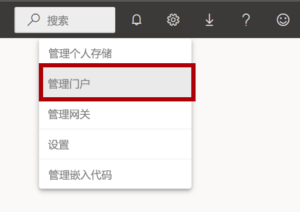

1. 向下滚动页面到“集成”设置。 单击箭头以展开“地图和着色地图视觉对象”选项。

    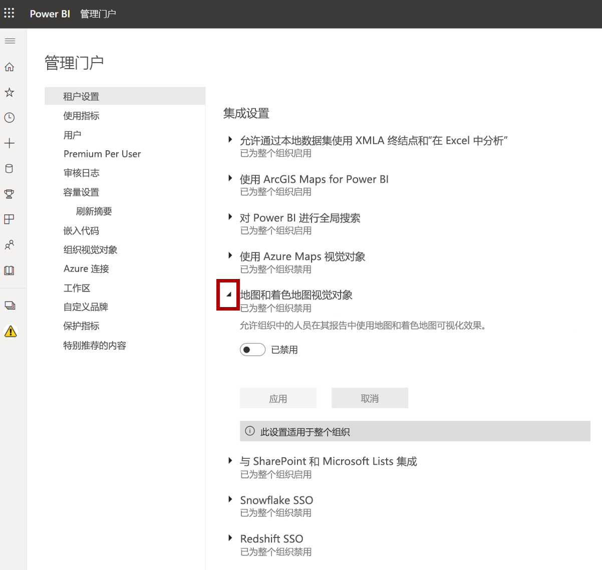

1. 将“地图和着色地图视觉对象”选项设置为“启用”。

1. 单击“应用”以应用更改。 

    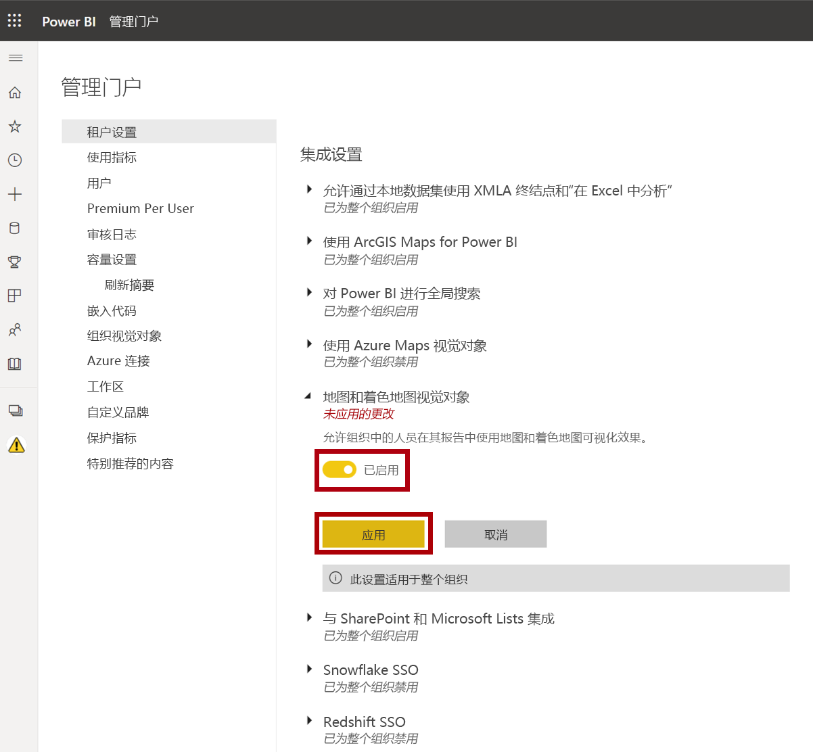

1. 此时会在浏览器的右上角出现一条消息，指示将在接下来的 15 分钟内应用“租户”设置的更改。 

    

1. 使 Microsoft Edge 浏览器窗口保持打开状态。

### 任务 3：开始使用 - 打开报表

在此任务中，你将通过打开入门报表来设置实验室环境。

*重要说明：如果你是继续上一个实验室（并且已经成功完成了该实验室），请不要完成此任务，而是继续下一个任务。*

1. 若要打开 Power BI Desktop，请在任务栏上单击“Microsoft Power BI Desktop”快捷方式。

    

2. 要关闭开始窗口，请单击窗口左上角的“X”。

    

3. 要登录到 Power BI 服务，请单击右上角的“登录”。

    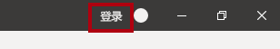

4. 使用登录 Power BI 服务所用的同一帐户完成登录过程。

5. 要打开入门 Power BI Desktop 文件，请单击“文件”功能区选项卡以打开 Backstage 视图。

6. 选择“打开报表”。

    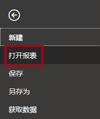

7. 单击“浏览报表”。

    

8. 在“打开”窗口中，导航到“D:\PL300\Labs\07-design-report-in-power-bi-desktop\Starter”文件夹 。

9. 选择“销售分析”文件。

10. 单击 **“打开”** 。

    

11. 关闭任何可能打开的信息窗口。

12. 要创建该文件的副本，请单击“文件”功能区选项卡以打开 Bckstage 视图。

13. 选择“另存为”。

    

14. 如果系统提示应用更改，请单击“应用”。

    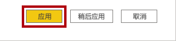

15. 在“另存为”窗口中，导航到“D:\PL300\MySolution”文件夹 。

16. 单击“保存” 。

    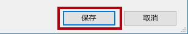

### 任务 4：设计页面 1

在此任务中，你将设计报表的第 1 页。 完成设计后，该页面将如下所示：

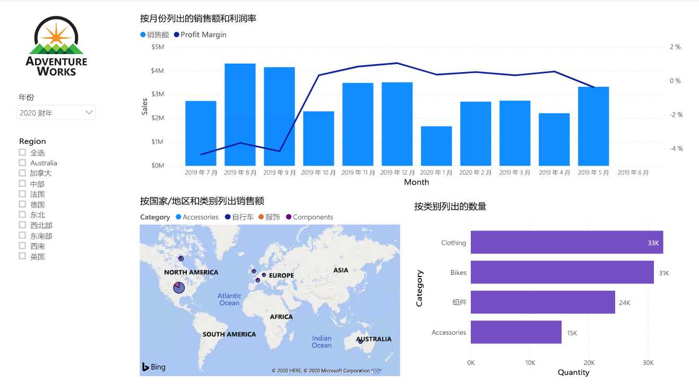

1. 在 Power BI Desktop 中，要重命名页面，请在左下角右键单击“第 1 页”，然后选择“重命名”。

    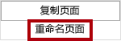

    *提示：* 还可以双击页面名称以进行重命名。

2. 将页面重命名为“概述”，然后按 Enter。

    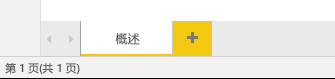

3. 若要添加图像，请在“插入”功能区选项卡上的“元素”组中，单击“图像”。

    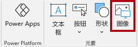

4. 在“打开”窗口中，导航到“D:\PL300\Resources”文件夹 。

5. 选择 AdventureWorksLogo.jpg 文件，然后单击“打开”。

    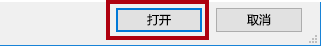

6. 将图像拖放到左上角，并拖动参考线标记以调整其大小。

    

7. 若要添加切片器，首先通过单击报表页的空白区域取消选择该图像。
8. 在“字段”窗格中，选择“Date \| Year”字段（并非层次结构的“Year”级别）  。
    
    *实验室使用速记表示法引用字段。它将如下所示：Date \| Year。* 在此示例中，Date 是表名称，Year 是字段名称。 

9. 可以看到已将年份值表添加到报表页。

10. 若要将视觉对象从表转换为切片器，请在“视觉对象”窗格中，选择“切片器”。

    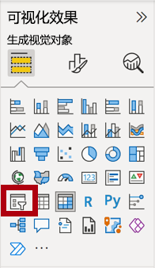

11. 要将切片器从列表转换为下拉列表，请在切片器的右上角单击向下箭头，然后选择“下拉列表”。

    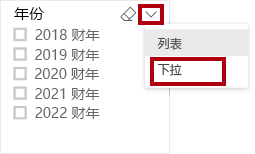

12. 调整切片器的大小和放置，使其位于图像下方，并且宽度与图像相同。

    

13. 在“年份”切片器中，打开下拉列表，选择“2020 财年”，然后折叠下拉列表。

    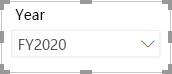

    报表页现在按年份“FY2020”进行筛选。

14. 通过单击报表页的空白区域取消选择该切片器。

15. 基于“Region \| Region”字段（不是层次结构的“区域”级别）创建第二个切片器 。

16. 将切片器保留为列表，然后调整切片器的大小，并将其放置在“年份”切片器下。

    

17. 若要设置切片器的格式，请在“可视化效果”窗格下打开“格式”窗格。

    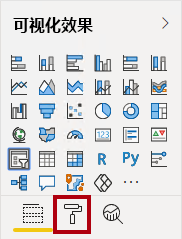

18. 展开“选择控件”组。

    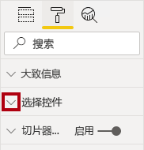

19. 将“显示‘全选’选项”设置为“启用”。

    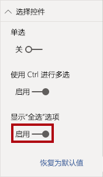

20. 请注意，在“区域”切片器中，第一项现在为“全选”。

    选择此项后，将全选或取消选择所有项。通过该项，报表用户可更轻松地设置所需切片器项。

21. 通过单击报表页的空白区域取消选择该切片器。

22. 若要将图表添加到页面，请在“可视化效果”窗格中，单击“折线和堆积柱形图”视觉对象类型。

    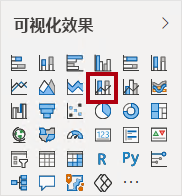

23. 调整视觉对象的大小和位置，使其位于徽标右侧，填充与报表页面相同的宽度。

    

24. 将以下字段拖放到视觉对象中：

    - Date \| Month

    - Sales \| Sales

25. 请注意，在视觉对象字段窗格（不是“字段”窗格 - 视觉对象字段窗格位于“可视化效果”窗格下方）中，这些字段已分配给“共享轴”和“列值”井/区域。

    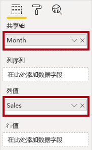

    通过将字段拖到视觉对象中即可将其添加到默认井/区域中。为了精确起见，可直接将字段拖到井/区域中，接下来你将执行此操作。

26. 将“Sales \| Profit Margin”字段从“字段”窗格拖动到“行值”井中  。

    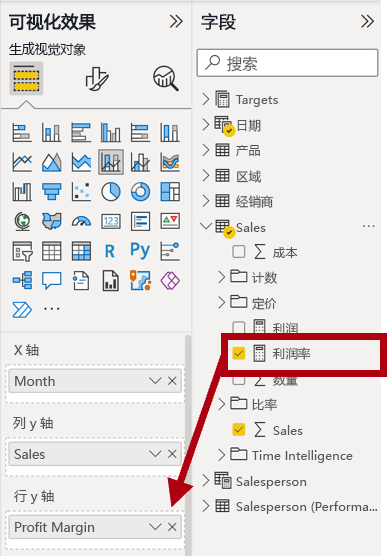

27. 请注意，视觉对象的时间段只有 11 个月。

    2020 年的最后一个月（即 6 月）没有任何销售额（尚未发布）。*默认情况下，视觉对象已删除销售额为“BLANK”的月份。* 现在可将视觉对象配置为显示所有月份。

28. 在视觉对象字段窗格中的“共享轴”井/区域中，对于“Month”字段，单击向下箭头，然后选择“显示没有数据的项”。

    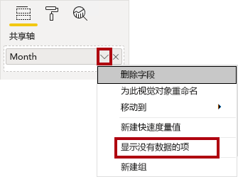

29. 可以看到现在显示了月份“2020 年 6 月”。

30. 通过单击报表页的空白区域取消选择该图表。

31. 若要将图表添加到页面，请在“可视化效果”窗格中，单击“地图”视觉对象类型。

    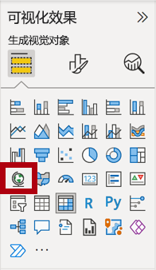

32. 调整该视觉对象的大小和位置，使其位于柱形图/折线图的下方，填充上方图表一半的宽度。

    

33. 将以下字段添加到视觉对象井/区域中：

    - 位置：Region \| Country

    - 图例：Product \| Category

    - 大小：Sales \| Sales

34. 通过单击报表页的空白区域取消选择该图表。

35. 若要将图表添加到页面，请在“可视化效果”窗格中，单击“堆积条形图”视觉对象类型。

    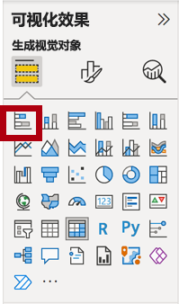

36. 调整该视觉对象的大小和位置，使其填充剩余的报表页面空间。

    

37. 将以下字段添加到视觉对象井/区域中：

    - 轴：Product \| Category

    - 值：Sales \| Quantity

38. 若要设置视觉对象的格式，请打开“格式”窗格。

    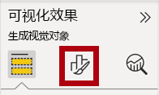

39. 展开“数据颜色”组，然后将“默认颜色”属性设置为合适的颜色（以补充柱形图/折线图）。

40. 将“数据标签”属性设置为“启用”。

    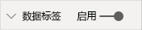

41. 保存 Power BI Desktop 文件。

    *第一页的设计现已完成。*

### 任务 5：设计页面 2

在此任务中，你将设计报表的第 2 页。 完成设计后，该页面将如下所示：

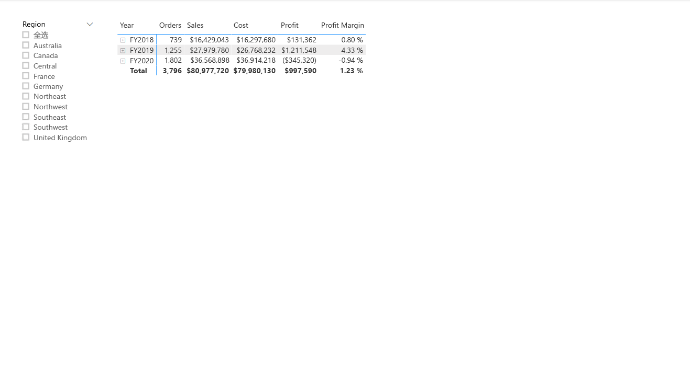

*重要说明：在实验室中提供了详细说明后，实验室步骤将提供更简洁的说明。* 如果需要详细说明，可以回顾此实验室中的其他任务。

1. 若要创建新页，请单击左下角的加号图标。

    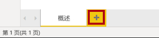

2. 将页面重命名为“利润”。

    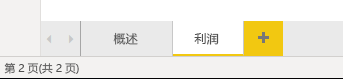

  
‎ 

3. 基于“Region \| Region”字段添加切片器。

4. 使用“格式”窗格启用“全选”选项（在“选择控件”组中）。

5. 调整该切片器的大小和位置，使其位于报表页面左侧，高度约为页面高度的一半。

    

6. 添加矩阵视觉对象，并调整其大小和位置，使其填充剩余的报表页面空间

    

7. 向矩阵“行”井/区域添加“日期 \| 财务”层次结构 。

    

8. 将以下五个“Sales”表字段添加到“值”井/区域：

    - Orders（来自“计数”文件夹）

    - Sales

    - Cost

    - Profit

    - Profit Margin

    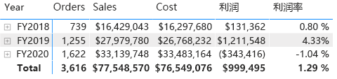

9. 在“筛选器”窗格（位于“可视化效果”窗格左侧）中，请注意“此页面上的筛选器”井/区域（可能需要向下滚动才可看到）。

    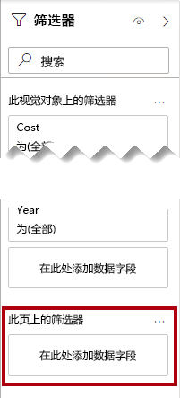

10. 将“Product \| Category”字段从“字段”窗格拖动到“筛选此页”井/区域中  。

11. 在筛选器卡中，单击右上角的箭头以折叠此卡。

    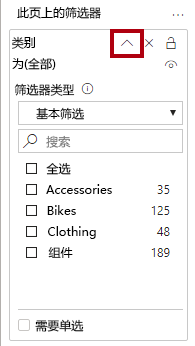

    添加到“筛选器”窗格中的字段可以实现与切片器相同的结果。*区别之一是它们不占用报告页面上的空间。* 另一个区别是，可以通过配置它们来满足更加复杂的筛选要求。

12. 将以下每个“Product”表字段添加到“此页面上的筛选器”井/区域，并将其直接折叠在“类别”卡片下：

    - Subcategory

    - 产品

    - Color

    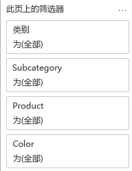

13. 保存 Power BI Desktop 文件。

    *第二页的设计现已完成。*

### 任务 6：设计页面 3

在此任务中，你将设计报表的第 3 页，也是最后一页。 完成设计后，该页面将如下所示：

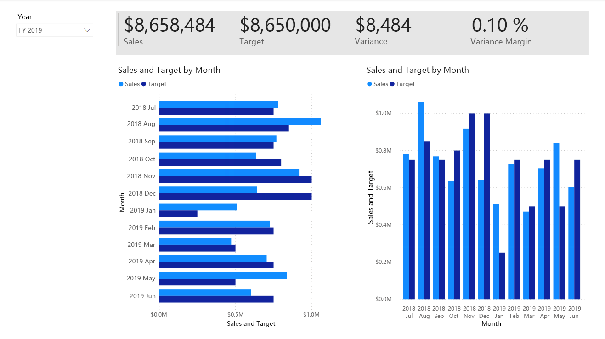

1. 创建一个新的页面，然后将其重命名为“我的绩效”。

1. 要模拟行级安全筛选器的性能，请将“Salesperson (Performance) \| Salesperson”字段拖动到筛选器窗格中的页面级筛选器。
    
    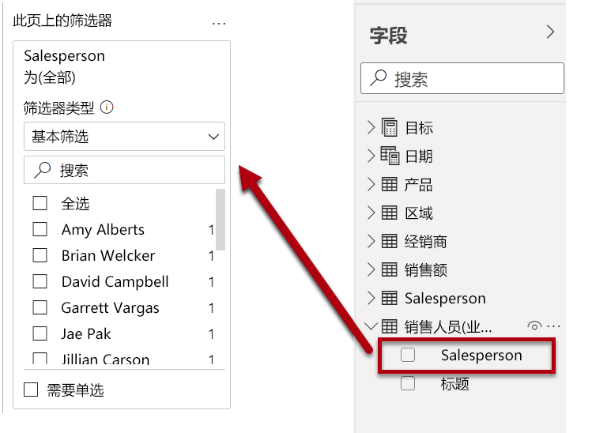 

1. 选择“Michael Blythe”。 “My Performance”报表页面上的数据现将进行筛选，仅显示 Michael Blythe 的数据。

1. 基于“Date \| Year”字段添加下拉切片器，然后重设大小并重新定位，使其位于页面的左上角。

    

1. 在切片器中，将页面设置为按“FY2019”进行筛选。

    

1. 添加“多行卡”视觉对象，然后重设大小并重新定位，使其位于切片器的右侧，并填充页面的剩余宽度。

    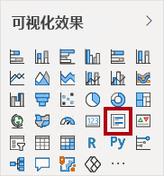

    

1. 向视觉对象添加以下四个字段：

    - Sales \| Sales

    - Targets \| Target

    - Targets \| Variance

    - Targets \| Variance Margin

1. 设置视觉对象的格式：

    - 在“数据标签”组中，将“文本大小”属性增加到“28pt”

    - 在“背景”组，将“颜色”设置为浅灰色

    

1. 添加一个“簇状条形图”视觉对象，然后调整其大小和位置，使其位于多行卡片视觉对象的下方，填充剩余的页面高度，并且宽度为多行卡片视觉对象宽度的一半。

    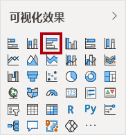

    

1. 将以下字段添加到视觉对象井/区域中：

    - 轴：Date \| Month

    - 值：“Sales \| Sales”和“Targets \| Target” 

    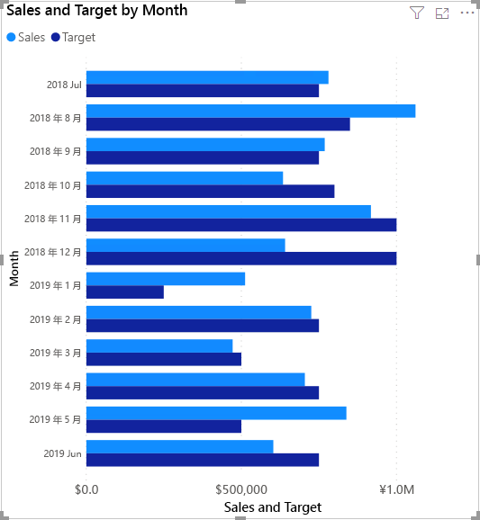

1. 若要创建视觉对象的副本，请按 Ctrl+C，然后按 Ctrl+V。

1. 将新的视觉对象放置在原始视觉对象的右侧。

    

1. 若要修改可视化效果类型，请在“可视化效果”窗格中选择“簇状柱形图”。

    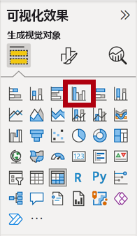

    现在可以看到用两种不同的可视化效果类型表示的相同数据。*这并没有充分利用页面布局，但是你将在“在 Power BI Desktop 中设计报表，第 2 部分”实验室中通过叠加视觉对象来对其进行改进。通过向页面添加按钮，你就可以让报表用户决定显示两个视觉对象中的哪一个。*

    *现在，已经完成第三页（最后一页）的设计。*

### 任务 7：发布报表

在此任务中，你将发布报表。

1. 选择“概述”页。

2. 保存 Power BI Desktop 文件。

3. 在“主页”功能区选项卡上，单击“共享”组中的“发布”。

    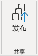

4. 请注意，在“发布到 Power BI”窗口中，已选择“我的工作区”。

5. 若要发布报表，请单击“选择”。

    

6. 发布成功后，单击“知道了”。

    

7. 不要关闭 Power BI Desktop。

    *在下一个练习中，你将在 Power BI 服务中浏览报表。*

## **练习 2：浏览报表**

在此练习中，你将浏览已发布到 Power BI 的报表。

### **任务 1：浏览报表**

在此任务中，你将浏览已发布到 Power BI 的报表。

1. 在 Microsoft Edge 浏览器窗口，在 Power BI 服务的“导航”窗格（位于左侧，可能处于折叠状态）中，展开“我的工作区” 。

    

2. 查看工作区的内容，注意“销售额分析”报表和数据集。

    *当你发布了 Power BI Desktop 文件后，数据模型已发布为数据集。*

    如果你看不到数据集，请按 F5 重载浏览器，然后再次展开此工作区。

    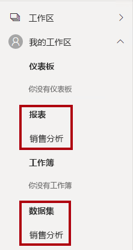

3. 单击“销售分析”报表以将其打开。

4. 在左侧的“页面”窗格中，选择“概述”页面。 

5. 在“区域”切片器中，按住 Ctrl 键的同时选择多个区域。

6. 在柱形图/折线图中，选择任意月份列以交叉筛选页面。

7. 在按住 Ctrl 键的同时选择其他月份。

    *默认情况下，交叉筛选将筛选页面上的所有其他视觉对象。*

8. 可以看到，已对条形图进行筛选并突出显示，其中粗体部分表示所筛选的月份。

9. 将光标悬停在条形图视觉对象上，然后在右上方将光标悬停在筛选器图标上。

    

    *通过“筛选器”图标可了解应用于视觉对象的所有筛选器，包括来自其他视觉对象的切片器和交叉筛选器。*

10. 将光标悬停在条形图上，可以看到工具提示信息。

11. 若要撤消交叉筛选，请在柱形图/折线图中单击视觉对象的空白区域。

12. 将光标悬停在地图视觉对象上，然后在右上方单击“焦点模式”图标。

    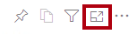

    *焦点模式会将视觉对象缩放至整页大小。*

13. 将光标悬停在条形图的不同段上，以显示工具提示。

14. 若要返回到“报表”页，请在左上方单击“返回报表”。

    

15. 再次将光标悬停在地图视觉对象上方，然后单击右上角的省略号 (…)，查看显示的菜单选项。

    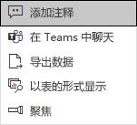

16. 试用除“在 Teams 中聊天”以外的每个选项。

17. 在左侧的“页面”窗格，选择“利润”页。

    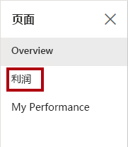

18. 请注意，“区域”切片器与“概述”页面上“区域”切片器中的所选内容并不相同  。

    *切片器未同步。“在 Power BI Desktop 中设计报表，第 2 部分”实验室中将修改报表设计，以确保切片器在各个页面之间同步。*

19. 在“筛选器”窗格（位于右侧）中，展开筛选器卡，并应用一些筛选器。

    通过“筛选器”窗格，可以定义超出切片器页面范围的筛选器。

20. 在矩阵视觉对象中，使用加号 (+) 按钮钻取“财务”层次结构。

21. 选择“我的绩效”页。

    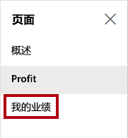

22. 在菜单栏的右上方，单击“查看”，然后选择“全屏”。

    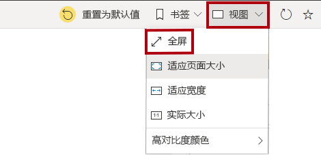

23. 通过修改切片器并交叉筛选页面来与页面进行交互。

24. 窗口底部显示用于更改页面、在页面之间向后或向前导航或退出全屏模式的命令。

25. 单击左侧图标退出全屏模式。

    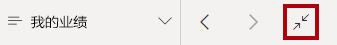

### **任务 2：完成**

在此任务中，你将完成本实验室。

1. 要返回到你的工作区，请在窗口网页的横幅中，单击“我的工作区”。

    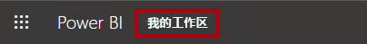

2. 使 Microsoft Edge 浏览器窗口保持打开状态。

    “在 Power BI Desktop 中设计报表，第 2 部分”实验室中将使用高级功能改进报表设计。
