---
lab:
  title: 在 Power BI Desktop 中设计报表，第 2 部分
  module: Module 7 - Create Reports
ms.openlocfilehash: 13dbd8523318739a7e005f1023ab2ae8b32ce8a1
ms.sourcegitcommit: 3520e7d016e94549d408464207c1b91cd47867c2
ms.translationtype: HT
ms.contentlocale: zh-CN
ms.lasthandoff: 03/05/2022
ms.locfileid: "139273292"
---
# 在 Power BI Desktop 中设计报表，第 2 部分

**预估完成本实验室需要 45 分钟**

在本实验室中，你将使用高级设计功能优化“销售额分析”报表。

本实验室介绍如何完成以下操作：

- 同步切片器

- 创建钻取页

- 应用条件格式

- 创建并使用书签

### **实验室场景**

此实验室是一系列实验室中的一个，它被设计成一个从准备数据到发布为报表和仪表板的完整场景。 你可以按任意顺序完成实验室。 但是，如果你打算逐步完成多个实验室，那么对于前 10 个实验室，建议你按以下顺序进行：

1. 在 Power BI Desktop 中准备数据

2. 在 Power BI Desktop 中加载数据

3. Power BI Desktop 中的模型数据

5. 在 Power BI Desktop 中创建 DAX 计算，第 1 部分

6. 在 Power BI Desktop 中创建 DAX 计算，第 2 部分

7. 在 Power BI Desktop 中设计报表，第 1 部分

8. 在 Power BI Desktop 中设计报表，第 2 部分

9. 创建 Power BI 面板

10. 在 Power BI Desktop 中执行数据分析

11. 强制执行行级别安全性

## **练习 1：** 配置同步切片器

在此练习中，你将同步报表页面切片器。

### 任务 1：入门 - 登录

在此任务中，你将通过登录到 Power BI 来设置实验室环境。

*重要说明：如果已登录到 Power BI，则继续执行下一个任务。*

1. 要打开 Microsoft Edge，请在任务栏上单击 Microsoft Edge 程序快捷方式。

    

1. 在 Microsoft Edge 浏览器窗口中，导航到 **https://powerbi.com**。

    *提示：还可以使用 Microsoft Edge 收藏夹栏上收藏的 Power BI 服务。*

1. 单击“登录”（位于右上角）。

    

1. 输入提供给你的帐户详细信息。

1. 如果系统提示更新密码，请重新输入提供的密码，然后输入新密码并确认。

    *重要说明：请确保记下新密码。*

1. 完成登录过程。

1. 如果 Microsoft Edge 提示你选择是否保持登录状态，请单击“是”。

1. 在 Microsoft Edge 浏览器窗口的 Power BI 服务中，在“导航”窗格中展开“我的工作区”。

    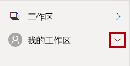

1. 使 Microsoft Edge 浏览器窗口保持打开状态。

### 任务 2：入门 - 打开报表

在此任务中，你将通过打开入门报表来设置实验室环境。

*重要说明：如果你是继续上一个实验室（并且已经成功完成了该实验室），请不要完成此任务，而是继续下一个任务。*

1. 若要打开 Power BI Desktop，请在任务栏上单击“Microsoft Power BI Desktop”快捷方式。

    

2. 要关闭开始窗口，请单击窗口左上角的“X”。

    

3. 要登录到 Power BI 服务，请单击右上角的“登录”。

    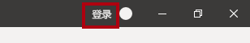

4. 使用登录 Power BI 服务所用的同一帐户完成登录过程。

5. 要打开入门 Power BI Desktop 文件，请单击“文件”功能区选项卡以打开 Backstage 视图。

6. 选择“打开报表”。

    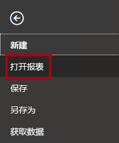

7. 单击“浏览报表”。

    

8. 在“打开”窗口中，导航到 D:\PL300\Labs\08-design-report-in-power-bi-desktop-enhanced\Starter 文件夹。 

9. 选择“销售分析”文件。

10. 单击 **“打开”** 。

    

11. 关闭任何可能打开的信息窗口。

12. 要创建该文件的副本，请单击“文件”功能区选项卡以打开 Bckstage 视图。

13. 选择“另存为”。

    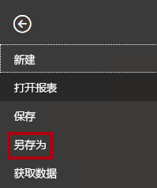

14. 如果系统提示应用更改，请单击“应用”。

    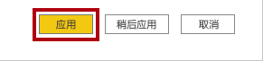

15. 在“另存为”窗口中，导航到“D:\PL300\MySolution”文件夹 。

16. 单击“保存” 。

    

### **任务 3：同步切片器**

在此任务中，你将同步“年份”和“区域”切片器。

你将继续开发“在 Power BI Desktop 中设计报表，第 1 部分”实验室中创建的报表。

1. 在 Power BI Desktop 的“概述”页上，将“年份”切片器设置为“FY2018”。

2. 转到“我的绩效”页，然后注意“年份”切片器是另一个值。

    当切片器不同步时，可能会导致呈现出错误的数据，让报表用户受挫。现在同步报表切片器。

3. 返回到“概述”页，然后选择“年份”切片器。

4. 在“视图”功能区选项卡上的“显示窗格”组中，单击“同步切片器”。

    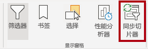

5. 在（“可视化效果”窗格左侧的）“同步切片器”窗格中的第二列（代表同步），选中“概述”和“我的绩效”页的复选框。

    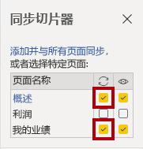

6. 在“概述”页上，选择“区域”切片器。

7. 将切片器与“概述”和“利润”页同步。

    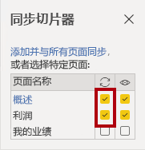

8. 可以这样测试同步切片器功能：选择不同的筛选器选项，然后验证所同步的切片器是否以相同的选项为依据进行筛选。

9. 若要关闭“同步切片器”页，请单击窗格右上角的“X”。

    

## **练习 2：** 配置钻取

在此练习中，你将创建一个新页面并将其配置为钻取页面。 完成设计后，该页面将如下所示：

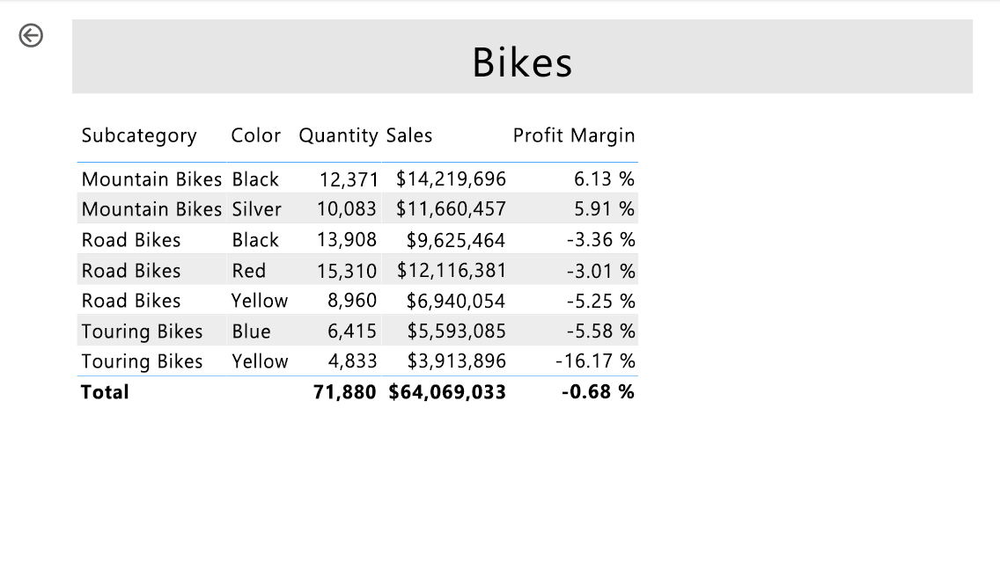

### **任务 1：创建钻取页**

在此任务中，你将创建一个新页面并将其配置为钻取页面。

1. 添加名为“产品详细信息”的新报表页。

    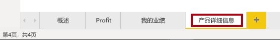

2. 右键单击“产品详细信息”页面选项卡，然后选择“隐藏页面”。

    

    报表用户无法直接进入钻取页。*他们需要从其他页面的视觉对象进行访问。* 你将在本实验室的最后一个练习中了解如何钻取到页面。

3. 在“可视化效果”窗格下的“钻取”部分中，将“Product \| Category”字段添加到“在此处添加钻取字段”框   。

    *实验室使用速记表示法引用字段。它将如下所示：Product \| Category。在此示例中，Product 是表名称，Category 是字段名称 。*

    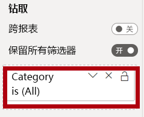

4. 若要测试钻取页，请在钻取筛选器卡中选择“自行车”。

    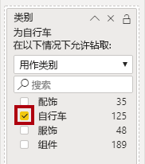

5. 在报表页的左上角，注意箭头按钮。

    

    将字段添加到钻取井/区域时，系统会自动添加一个按钮。报表用户可以通过该按钮后退到到其起始页面。

6. 向页面添加“卡片”视觉对象，然后调整其大小和位置，使其位于按钮右侧，并填充剩余的页面宽度。

    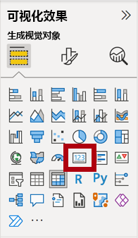

    

7. 将“Product \| Category”字段拖到卡片视觉对象。

8. 为视觉对象配置格式选项，然后将“类别标签”属性设置为“关闭”。

    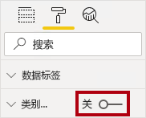

9. 将“背景色”属性设置为浅灰色。

10. 向页面添加“表”视觉对象，然后调整其大小和位置，使其位于卡片视觉对象下方，填充页面上的剩余空间。

    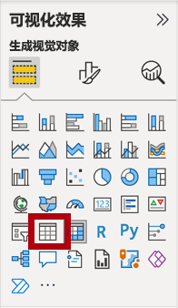

    

11. 向视觉对象添加以下字段：

    - Product \| Subcategory

    - Product \| Color

    - Sales \| Quantity

    - Sales \| Sales

    - Sales \| Profit Margin

12. 为视觉对象配置格式选项，并在“网格”部分将“文本大小”属性设置为“20 磅”。

    钻取页的设计即将完成。你将在下一个练习中使用条件格式来优化页面。

## **练习 3：** 添加条件格式

在此练习中，你将使用条件格式来优化钻取页面。 完成设计后，该页面将如下所示：

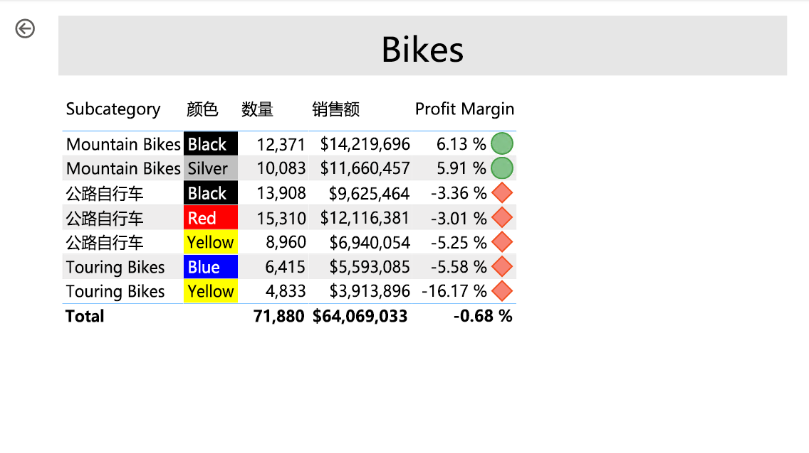

### **任务 1：添加条件格式**

在此任务中，你将使用条件格式来优化钻取页面。

1. 选择表视觉对象。

2. 在“可视化”窗格中，单击“Profit Margin”值上的向下箭头，然后选择“条件格式 \| 图标” 。

    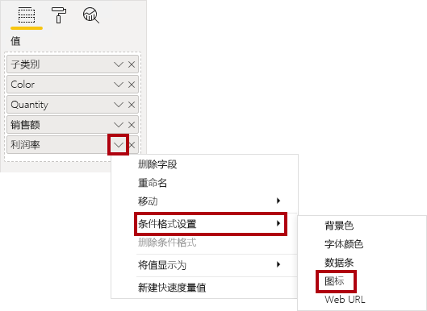

3. 在“图标 - 利润率”窗口中，在“图标布局”下拉列表中选择“数据右侧”。

    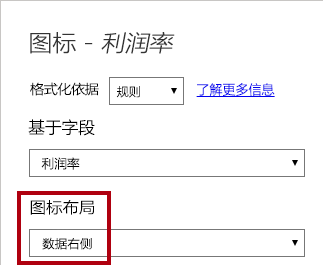

4. 若要删除中间规则，请在黄色三角形的左侧单击“X”。

    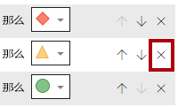

5. 如下所示配置第一条规则（红色菱形）：

    - 在第二个控件中，删除值

    - 在第三个控件中，选择“数字”

    - 在第五个控件中，输入 0

    - 在第六个控件中，选择“数字”

6. 如下所示配置第二条规则（绿色圆圈）：

    - 在第二个控件中，输入 0

    - 在第三个控件中，选择“数字”

    - 在第五个控件中，删除值

    - 在第六个控件中，选择“数字”

    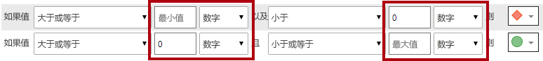

    规则总结如下：如果利润率值小于 0，则显示红色菱形；如果该值大于或等于 0，则显示绿色圆圈。

7. 单击 **“确定”** 。

    

8. 在表格视觉对象中，验证是否显示了正确的图标。

    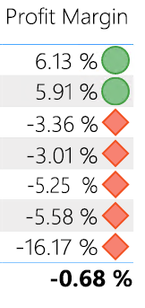

9. 为“颜色”字段配置背景色条件格式。

10. 在“背景色 - 颜色”窗口中，在“格式化依据”下拉列表中选择“字段值”。

    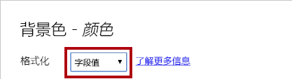

11. 在“依据字段”下拉列表中，选择“产品 \| 格式设置 \| 背景色格式”。 

    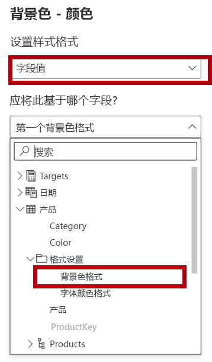

12. 单击 **“确定”** 。

    

13. 重复前面的步骤，使用“产品 \| 格式设置 \| 字体颜色格式”字段为“颜色”字段配置字体颜色条件格式 

    回想一下，背景和字体颜色源自“在 Power BI Desktop 中准备数据”实验室中的“ColorFormats.csv”文件，然后与“在 Power BI Desktop 中加载数据”实验室中的“产品”查询集成。**

## 练习 4：添加书签和按钮

在此练习中，你将通过按钮优化“我的业绩”页面，使报表用户可以选择要显示的视觉对象类型。 完成设计后，该页面将如下所示：

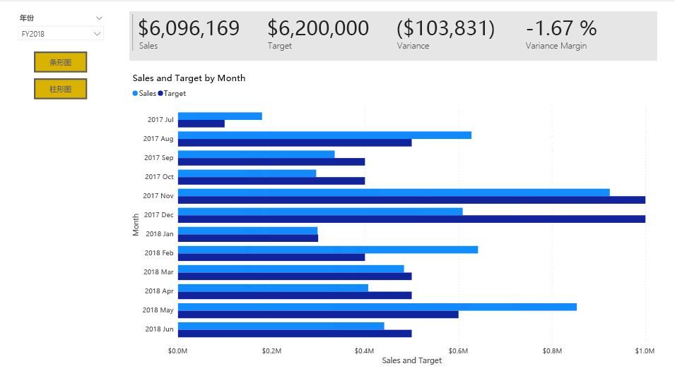

### **任务 1：添加书签**

在此任务中，你将添加两个书签，其中一个书签显示每月销售额/目标视觉对象。

1. 转到“我的绩效”页。

2. 在“视图”功能区选项卡上的“显示窗格”组中，单击“书签”。

    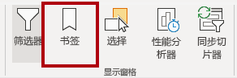

3. 在“视图”功能区选项卡上的“显示窗格”组中，单击“选择”。

    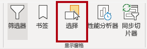

4. 若要隐藏视觉对象，请在“选择”窗格中的任一“每月销售额和目标”项旁边单击眼睛图标。

    

5. 在“书签”窗格中，单击“添加”。

    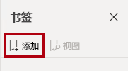

6. 若要重命名书签，请双击该书签。

7. 如果可见图表是条形图，请将书签重命名为“打开条形图”，否则将书签重命名为“打开柱形图”。

8. 若要编辑书签，请在“书签”窗格中将光标悬停在相应书签的上方，单击省略号，然后选择“数据”。

    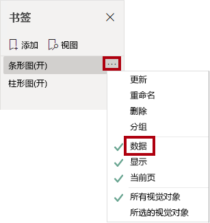

    如果禁用“数据”选项，意味着书签将不使用当前筛选器状态。*这一点很重要，否则书签会永远锁定在“年份”切片器当前应用的筛选器中。*

9. 要更新书签，请再次单击省略号，然后选择“更新”。

    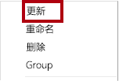

    *在下面的步骤中，你将创建并配置第二个书签，以显示第二个视觉对象。*

10. 在“选择”窗格中，交换两个“每月销售额和目标”项的可见性。

    *换句话说，即隐藏当前可见的视觉对象，并显示当前隐藏的视觉。*

    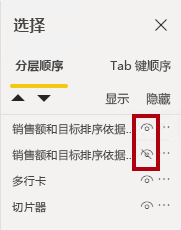

11. 创建第二个书签，并对其进行相应的命名（“打开柱形图”或“打开条形图”）。

    

12. 将第二个书签配置为忽略筛选器（禁用“数据”选项），并更新书签。

13. 要使这两个视觉对象都可见，只需在“选择”窗格中显示隐藏的视觉对象即可。

14. 重设两个视觉对象的大小并重新定位，使其填充多卡视觉对象下方的页面，并完全相互重叠。

    *提示：若要选择被覆盖的视觉对象，请在“选择”窗格中选择它。*

    

15. 在“书签”窗格中，选择每个书签，并注意仅其中一个视觉对象可见。

    *设计的下一个阶段是向页面添加两个按钮，让报表用户可以选择书签。*

### **任务 2：添加按钮**

在此任务中，你将添加两个按钮，并为每个按钮分配书签操作。

1. 在“插入”功能区上的“元素”组中单击“按钮”，然后选择“空白”。

    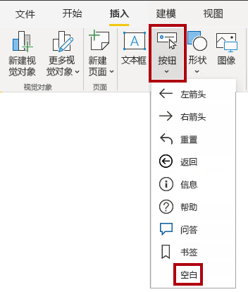

2. 将按钮直接置于“年份”切片器下。

3. 选择按钮，然后在“格式按钮”窗格中，将“按钮文本”属性设置为“启用”。

    

4. 展开“按钮文本”部分，然后在“按钮文本”框中输入“条形图”。

5. 展开“背景”部分，然后使用补色设置背景色。

6. 将“操作”属性设置为“开”（位于列表底部附近）。

    

7. 展开“操作”部分，然后将“类型”下拉列表设置为“书签”。

8. 在“书签”下拉列表中，选择“打开条形图”。

    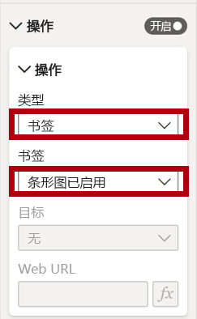

9. 使用复制和粘贴创建按钮的副本，然后配置新按钮，如下所示：

    *提示：复制和粘贴的快捷方式命令是，先按 Ctrl+C 然后按 Ctrl+V。*

    - 将“按钮文本”属性设置为“柱形图”

    - 在“操作”部分，将“书签”下拉列表设置为“打开柱形图”

    *现在，已经完成了“销售分析”报表的设计。*

### **任务 3：发布报表**

在此任务中，你将发布报表。

1. 选择“概述”页。

2. 在“年份”切片器中，选择“FY2020”。

3. 在“区域”切片器中，选择“全选”。

4. 保存 Power BI Desktop 文件。

    *在任何情况下都必须先保存文件，然后再发布到 Power BI 服务。*

5. 在“主页”功能区选项卡上，单击“共享”组中的“发布”。

    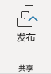

6. 请注意，在“发布到 Power BI”窗口中，已选择“我的工作区”。

7. 若要发布报表，请单击“选择”。

    

8. 如果系统提示替换数据集，请单击“替换”。

9. 发布成功后，单击“知道了”。

    

10. 关闭 Power BI Desktop。

    *在下一个练习中，你将在 Power BI 服务中浏览报表。*

## 练习 5：**浏览报表**

在本练习中，你将在 Power BI 服务中浏览报表。

### **任务 1：浏览报表**

在此任务中，你将在 Power BI 服务中浏览报表。

1. 在 Microsoft Edge 浏览器窗口，在 Power BI 服务的“导航”窗格中，单击“销售额分析”报表 。

2. 若要测试钻取报表功能，请在“概述”页面的“各类别的数量”视觉对象中右键单击“服装”栏，然后选择“钻取 \| 产品详细信息”。   

    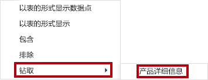

3. 请注意，“产品详细信息”页针对“服装”。

4. 要返回源页面，请单击页面左上角的箭头按钮。

5. 选择“我的绩效”页。

6. 单击每个按钮，然后注意是否显示了其他视觉对象。

### **任务 2：完成**

在此任务中，你将完成本实验室。

1. 要返回到你的工作区，请在窗口网页的横幅中，单击“我的工作区”。

    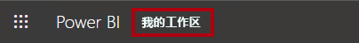

2. 使 Microsoft Edge 浏览器窗口保持打开状态。
