---
lab:
  title: 创建 Power BI 面板
  module: Module 8 - Create Dashboards
---

# 创建 Power BI 仪表板

**预估完成本实验室需要 45 分钟**

在本实验室中，你将创建“销售额监视”仪表板。

本实验室介绍如何完成以下操作：

- 将视觉对象固定到仪表板

- 使用问答功能创建仪表板磁贴

### **实验室场景**

此实验室是一系列实验室中的一个，它被设计成一个从准备数据到发布为报表和仪表板的完整场景。 你可以按任意顺序完成实验室。 但是，如果你打算逐步完成多个实验室，那么对于前 10 个实验室，建议你按以下顺序进行：

1. 在 Power BI Desktop 中准备数据

2. 在 Power BI Desktop 中加载数据

3. 在 Power BI Desktop 中对数据建模

5. 在 Power BI Desktop 中创建 DAX 计算，第 1 部分

6. 在 Power BI Desktop 中创建 DAX 计算，第 2 部分

7. 在 Power BI Desktop 中设计报表，第 1 部分

8. 在 Power BI Desktop 中设计报表，第 2 部分

9. 创建 Power BI 仪表板

10. 在 Power BI Desktop 中执行数据分析

11. 强制执行行级别安全性

## **练习 1：创建仪表板**

在此练习中，你将创建“销售额监视”仪表板。 完成的仪表板将如下所示：

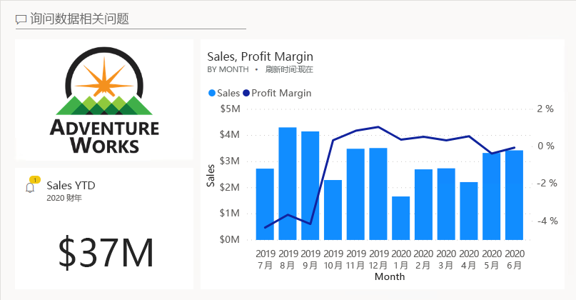

### **任务 1：入门 - 登录**

在此任务中，你将通过登录到 Power BI 来设置实验室环境。

*重要说明：如果已在之前的实验室中登录了 Power BI，则继续下一个任务。*

1. 要打开 Microsoft Edge，请在任务栏上单击 Microsoft Edge 程序快捷方式。

    

2. 在 Microsoft Edge 浏览器窗口中，导航到 **https://powerbi.com**。

    *提示：还可以使用 Microsoft Edge 收藏夹栏上收藏的 Power BI 服务。*

3. 单击“登录”（位于右上角）。

    

4. 输入提供给你的帐户详细信息。

5. 如果系统提示更新密码，请重新输入提供的密码，然后输入新密码并确认。

    *重要说明：请确保记下新密码。*

6. 完成登录过程。

7. 如果 Microsoft Edge 提示你选择是否保持登录状态，请单击“是”。

8. 在 Microsoft Edge 浏览器窗口的 Power BI 服务中，在“导航”窗格中展开“我的工作区”。

    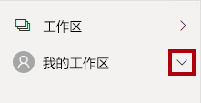

9. 使 Microsoft Edge 浏览器窗口保持打开状态。

### **任务 2：入门 - 打开报表**

在此任务中，你将通过打开入门报表来设置实验室环境。

*重要说明：如果你是继续上一个实验室（并且已经成功完成了该实验室），请不要完成此任务，而是继续下一个任务。*

1. 若要打开 Power BI Desktop，请在任务栏上单击“Microsoft Power BI Desktop”快捷方式。

    

2. 要关闭开始窗口，请单击窗口左上角的“X”。

    

3. 如果 Power BI Desktop 未登录到 Power BI 服务，请单击右上角的“登录”。

    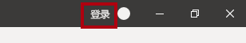

4. 使用登录 Power BI 服务所用的同一帐户完成登录过程。

5. 要打开入门 Power BI Desktop 文件，请单击“文件”功能区选项卡以打开 Backstage 视图。

6. 选择“打开报表”。

    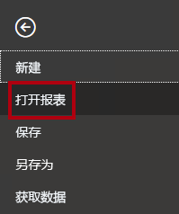

7. 单击“浏览报表”。

    

8. 在“打开”窗口中，导航到“D:\PL300\Labs\09-create-power-bi-dashboard\Starter”文件夹 。

9. 选择“销售分析”文件。

10. 单击 **“打开”** 。

    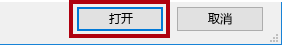

11. 关闭任何可能打开的信息窗口。

12. 要创建该文件的副本，请单击“文件”功能区选项卡以打开 Bckstage 视图。

13. 选择“另存为”。

    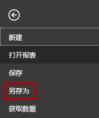

14. 如果系统提示应用更改，请单击“应用”。

    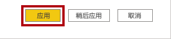

15. 在“另存为”窗口中，导航到“D:\PL300\MySolution”文件夹 。

16. 单击“保存” 。

    

### **任务 3：入门 - 发布报表**

在此任务中，你将通过创建数据集来设置实验室环境。

*重要说明：如果你已在“在 Power BI Desktop 中设计报表，第 2 部分”实验室中发布报表，请继续完成下一个任务。*

1. 在 Microsoft Edge 浏览器窗口，在 Power BI 服务的“导航”窗格中，单击底部的“获取数据” 。

    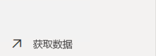

2. 在“文件”磁贴中，单击“获取” 。

    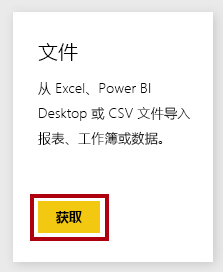

3. 单击“本地文件”磁贴。

    

4. 在“打开”窗口，导航到“D:\PL300\Labs\08-design-report-in-power-bi-desktop-enhanced\Solution”文件夹 。

5. 选择“Sales Analysis.pbix”文件，然后单击“打开” 。

6. 如果系统提示替换数据集，请单击“替换”。

### **任务 4：创建仪表板**

在此任务中，你将创建“销售额监视”仪表板。 你将固定报表中的一个视觉对象、添加基于图像数据 URI 的磁贴以及使用问答来创建磁贴。

1. 在 Microsoft Edge 浏览器窗口的 Power BI 服务中，打开“销售分析”报表。

2. 在“概述”页中，将“Year”切片器设置为“FY2020”。

    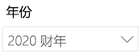

3. 将“区域”切片器设置为“全选”。

    *将视觉对象固定到仪表板时，它们将使用当前筛选器上下文。固定后，不能更改筛选上下文。对于基于时间的筛选器，最好使用相对日期切片器（或对于问答，使用基于相对时间的问题）。*

4. 若要创建仪表板并固定视觉对象，请将光标悬停在“月销售额和利润率”（列/行）视觉对象上。

5. 单击右上角的图钉。

    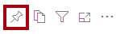

6. 在“固定到仪表板”窗口中的“仪表板名称”框内输入“Sales Monitoring”。

    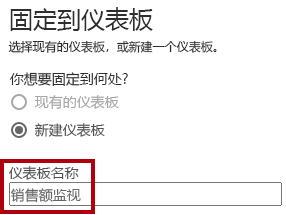

7. 单击“固定”。

    

8. 打开导航窗格，然后打开“销售监视”仪表板。

    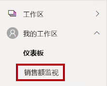

9. 注意仪表板只有一个磁贴。

    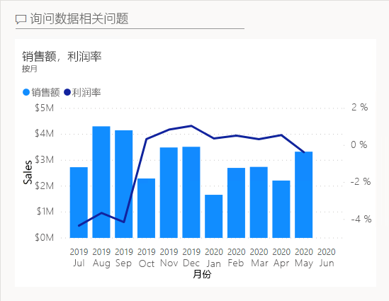

10. 要根据问题添加磁贴，请在仪表板左上角单击“询问数据相关问题”。

    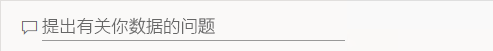

    可以使用问答功能提出问题，Power BI 会通过视觉对象进行答复。

11. 单击“问答”框下方蓝色框中的任何建议问题。

12. 查看答复。

13. 删除问答框中的所有文本。

14. 在问答框中输入以下内容：年初至今的销售额

    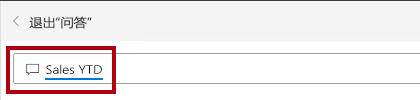

15. 请注意，答复为“(空)”。

    

    你可能还记得在“在 Power BI Desktop 中创建 DAX 计算，第 2 部分”实验室中添加了“年初至今的销售额”度量值* 。此度量值是时间智能表达式，它需要对“日期”表进行筛选以生成结果。*

16. 在问题中加入“FY2020 年”。

    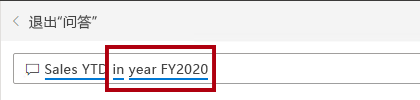

17. 请注意，答复现在为“3300 万美元”。

    

18. 要将答复固定到仪表板，请单击右上角的“固定视觉对象”。

    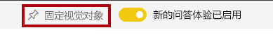

19. 当系统提示将磁贴固定到仪表板时，单击“固定”。

    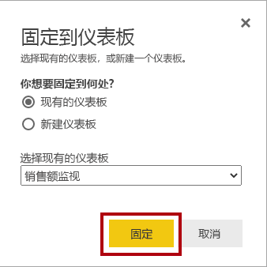

20. 要返回到该仪表板，请单击左上角的“退出问答”。

    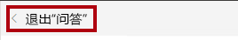

21. 要添加公司徽标，请在菜单栏上单击“编辑”，然后选择“添加磁贴” 。

    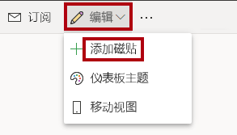

    *通过此技术添加仪表板磁贴可让你使用媒体修饰仪表板，其中包括 Web 内容、图像、格式丰富的文本框和视频（使用 YouTube 或 Vimeo 链接）。*

22. 在“添加磁贴”窗格（位于右侧）中，选择“图像”磁贴 。

    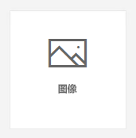

23. 单击“下一步”。

    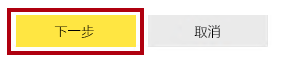

24. 在“添加图像磁贴”窗格的“URL”框中，输入在 D:\PL300\Resources\AdventureWorksLogo_DataURL.txt 文件中找到的完整 URL  。

    *可以使用图像的 URL 嵌入图像，也可以使用数据 URL 嵌入内联内容。*

25. 单击窗格底部的“应用”。

    

26. 要调整徽标磁贴的大小，请拖动右下角，并将磁贴大小调整为一个单位宽，两个单位高。

    磁贴大小被限制为矩形。只能按矩形的倍数调整其大小。

27. 整理磁贴，使徽标显示在左上方，使“年初至今的销售额”磁贴显示在徽标下方，并使“销售额和利润率”磁贴显示在右侧。

    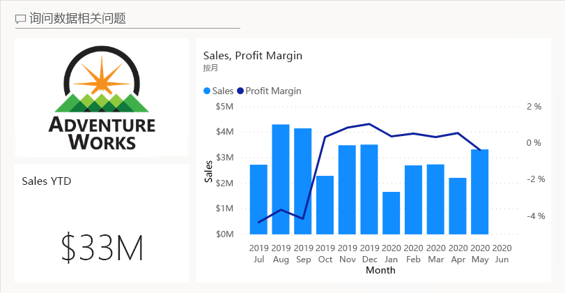

### **任务 5：编辑磁贴详细信息**

在此任务中，你将编辑两个磁贴的详细信息。

1. 将光标悬停在“年初至今的销售额”磁贴上，单击磁贴右上角的省略号，然后选择“编辑详细信息”。

    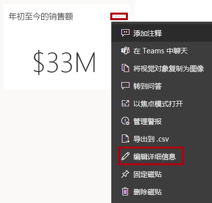

2. 在“磁贴详细信息”窗格（位于右侧）的“副标题”框中输入“FY2020”。

    

3. 单击“应用”。

    

4. 请注意，“年初至今的销售额”磁贴显示了副标题。

    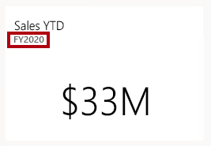

5. 编辑“销售额和利润率”磁贴的磁贴详细信息。

6. 在“磁贴详细信息”窗格的“功能”部分中，选中“显示上次刷新时间”。

    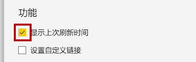

7. 单击“应用”。

    

8. 请注意，该磁贴会显示上次刷新时间（在 Power BI Desktop 中加载数据模型时执行刷新）。

    你将在下一个练习中刷新数据集。*一般情况下，将通过计划刷新执行此操作，而在这种情况下，Power BI 将使用网关连接到 SQL Server 数据库。但是由于课堂条件有限，因此没有使用网关。* 为此，需要打开 Power BI Desktop 并执行手动数据刷新，然后将文件上传到工作区。

## **练习 2：** 刷新数据集

在此练习中，你首先需要将 2020 年 6 月的销售订单数据加载到 AdventureWorksDW2020 数据库。 然后打开 Power BI Desktop 文件，执行数据刷新，再将该文件上传到工作区。

### **任务 1：更新实验室数据库**

在此任务中，你将运行 PowerShell 脚本来更新 AdventureWorksDW2020 数据库中的数据。

1. 在文件资源管理器中打开 D:\PL300\Setup 文件夹，右键单击 UpdateDatabase-2-AddSales.ps1 文件，然后选择“使用 PowerShell 运行”  。

    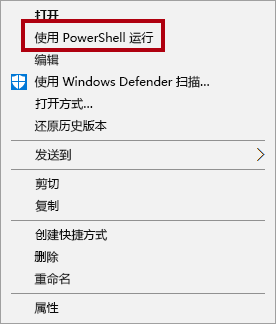

2. 如果系统提示更改执行策略，请按“A”。

3. 当系统提示按任意键关闭时，请再次按 Enter。

    AdventureWorksDW2020 数据库现在包含 2020 年 6 月的销售订单。**

### **任务 2：刷新 Power BI Desktop 文件**

在此任务中，你需要打开 Power BI Desktop 销售额分析文件，执行数据刷新，然后将该文件上传到“销售额分析”工作区 。

1. 在 Power BI Desktop 文件的“字段”窗格中，右键单击“销售额”表，然后选择“刷新数据”。

    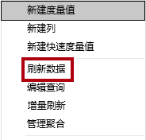

2. 完成刷新后，保存 Power BI Desktop 文件。

3. 若要将文件发布到工作区，请在“主页”功能区选项卡上的“共享”组中，单击“发布”。

    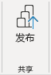

4. 当系统提示替换数据集时，单击“替换”。

    

    Power BI 服务中的数据集现已包含 2020 年 6 月的销售数据。

5. 关闭 Power BI Desktop。

## **练习 3：** 查看仪表板

在此练习中，你将查看仪表板，以查看更新的销售额以及触发的警报。

### **任务 1：查看仪表板**

在此任务中，你将查看仪表板，以查看更新的销售额以及触发的警报。

1. 在 Microsoft Edge 浏览器窗口的 Power BI 服务中，查看“销售监视”仪表板。

2. 在“销售额和利润率”磁贴中的副标题部分，可以看到数据刷新时间为“刚刚刷新”。

3. 还可以看到，其中包含“2020 年 6 月”列。

    如果没有看到 2020 年 6 月的数据，可能需要按 F5 重新加载 Web 浏览器。**

    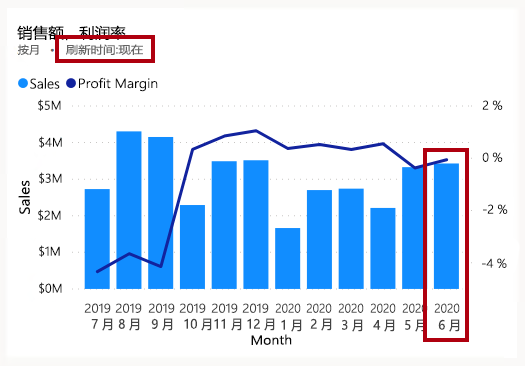

    “年初至今的销售额”磁贴上的警报也应触发。** 一小段时间后，警报应通知你销售额现已超出配置的阈值。

4. 请注意，“年初至今的销售额”磁贴已更新为“3700 万美元”。

5. 请验证“年初至今的销售额”磁贴上是否显示了警报通知图标。

    如果未看到通知，可能需要按 F5 重新加载浏览器。** 如果仍未看到通知，请再等待几分钟。

    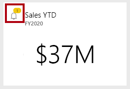

    *警报通知显示在仪表板磁贴上，可以通过电子邮件传递通知，也可以将通知推送到移动应用（包括 Apple Watch）。*

6. 在网页的右上角，单击“通知”图标。

    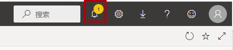

7. 在“所有通知”窗格中，查看警报通知的详细信息。

8. 要关闭该窗格，请单击“关闭”。
