---
lab:
  title: 在 Power BI Desktop 中执行数据分析
  module: Module 9 - Identify Patterns and Trends
ms.openlocfilehash: 42ec8ac1a9fd160fe2181ae8d966d85d04b9b82d
ms.sourcegitcommit: 9ea1e7e21b9b3c718030c94b1693d153a2010ec7
ms.translationtype: HT
ms.contentlocale: zh-CN
ms.lasthandoff: 07/07/2022
ms.locfileid: "147015325"
---
# 在 Power BI Desktop 中执行数据分析

**预估完成本实验室需要 45 分钟**

在本实验室中，你将创建“销售额探索”报表。

本实验室介绍如何完成以下操作：

- 创建动画散点图

- 使用视觉对象预测值

### **实验室场景**

此实验室是一系列实验室中的一个，它被设计成一个从准备数据到发布为报表和仪表板的完整场景。 你可以按任意顺序完成实验室。 但是，如果你打算逐步完成多个实验室，建议你按以下顺序进行：

1. 在 Power BI Desktop 中准备数据

2. 在 Power BI Desktop 中加载数据

3. Power BI Desktop 中的模型数据

5. 在 Power BI Desktop 中创建 DAX 计算，第 1 部分

6. 在 Power BI Desktop 中创建 DAX 计算，第 2 部分

7. 在 Power BI Desktop 中设计报表，第 1 部分

8. 在 Power BI Desktop 中设计报表，第 2 部分

9. 创建 Power BI 面板

10. 在 Power BI Desktop 中执行数据分析

11. 强制执行行级别安全性

## **练习 1：** 创建报表

在本练习中，你将创建“销售探索”报表。

### **任务 1：入门 - 登录**

在此任务中，你将通过登录到 Power BI 来设置实验室环境。

*重要说明：如果已在之前的实验室中登录了 Power BI，则继续下一个任务。*

1. 要打开 Microsoft Edge，请在任务栏上单击 Microsoft Edge 程序快捷方式。

    

1. 在 Microsoft Edge 浏览器窗口中，导航到 **https://powerbi.microsoft.com**。

    *提示：还可以使用 Microsoft Edge 收藏夹栏上收藏的 Power BI 服务。*

1. 单击“登录”（位于右上角）。

    

1. 输入提供给你的帐户详细信息。

1. 如果系统提示更新密码，请重新输入提供的密码，然后输入新密码并确认。

    *重要说明：请确保记下新密码。*

1. 完成登录过程。

1. 如果 Microsoft Edge 提示你选择是否保持登录状态，请单击“是”。

1. 在 Microsoft Edge 浏览器窗口的 Power BI 服务中，在“导航”窗格中展开“我的工作区”。

    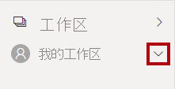

1. 使 Microsoft Edge 浏览器窗口保持打开状态。

### **任务 2：入门 - 创建数据集**

在此任务中，你将通过创建数据集来设置实验室环境。

*重要说明：如果你已在“创建 Power BI 仪表板”实验室中发布了数据集，则继续下一个任务。*

1. 在 Microsoft Edge 浏览器窗口，在 Power BI 服务的“导航”窗格中，单击底部的“获取数据” 。

    

2. 在“文件”磁贴中，单击“获取” 。

    

3. 单击“本地文件”磁贴。

    

4. 在“打开”窗口中，导航到“D:\PL300\Labs\08-create-power-bi-dashboard\Solution”文件夹 。

5. 选择“Sales Analysis.pbix”文件，然后单击“打开” 。

6. 如果系统提示替换数据集，请单击“替换它”。

### **任务 3：创建报表**

在此任务中，你将创建“销售探索”报表。

1. 若要打开 Power BI Desktop，请在任务栏上单击“Microsoft Power BI Desktop”快捷方式。

    *重要说明：* 如果你已（从之前的实验室）打开 Power BI Desktop，则关闭该实例。

    

2. 要关闭开始窗口，请单击窗口左上角的“X”。

    

3. 如果 Power BI Desktop 未登录到 Power BI 服务，请单击右上角的“登录”。

    

4. 使用登录 Power BI 服务所用的同一帐户完成登录过程。

5. 要保存文件，请单击“文件”功能区选项卡以打开 backstage 视图。

6. 选择“保存”  。

    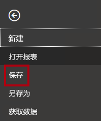

7. 在“另存为”窗口中，导航到“D:\PL300\MySolution”文件夹 。

8. 在“文件名”框中，输入“Sales Exploration”，然后单击“保存”  。

    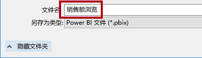

9. 要创建与“销售额分析”数据集的实时连接，请在“开始”功能区选项卡的“数据”组中，单击“Power BI 数据集”   。

    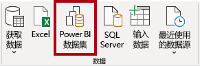

10. 在“选择创建报表所需的数据集”窗口中，选择“销售分析”数据集。

11. 单击“创建”。

    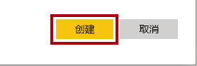

12. 保存 Power BI Desktop 文件。

    现在，你将创建两个报表页面，在每个页面上，你将使用不同的视觉对象来分析和浏览数据。

## **练习 2：** 创建散点图

在此练习中，你将创建可以制作成动画的散点图。

### **任务 1：创建动画散点图**

在此任务中，你将创建可以制作成动画的散点图。

1. 将“第 1 页”重命名为“散点图”。

    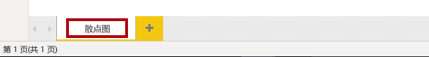

2. 将“散点图”视觉对象添加到报表页面，然后调整其位置和大小，使其填满整个页面。

    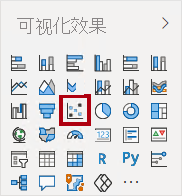

    

3. 将以下字段添加到视觉对象井/区域中：

    实验室使用速记表示法引用字段。 它将如下所示：Reseller \| Business Type  。 在此示例中，“Reseller”是表名称，“Business Type”是字段名称。

    

    - X 轴：Sales \| Sales 

    - Y 轴：Sales \| Profit Margin

    - 图例：Reseller \| Business Type

    - 大小：Sales \| Quantity

    - 播放轴：Date \| Quarter

    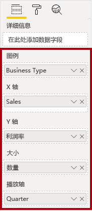

    将字段添加到“播放轴”井/区域时，可以对图表进行动画处理。

4. 在“筛选器”窗格中，将“Product \| Category”字段添加到“此页上的筛选器”井/区域中  。

5. 在筛选器卡中，按“自行车”进行筛选。

    

6. 若要对图表进行动画处理，请单击左下角的“播放”。

    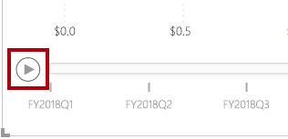

7. 观看从“2018 财年第一季度”到“2020 财年第四季度”的整个动画周期。

    通过散点图可以同时了解多个度量值：本例中为订单数量、销售收入和利润率。

    每个气泡表示一种经销商业务类型。*气泡大小的变化反映了订单数量的增加或减少。* 水平移动表示销售收入的增加/减少，垂直移动表示盈利率的增加/减少。

8. 动画效果停止时，单击某个气泡以显示其随时间变化的轨迹。

9. 将光标悬停在任意气泡上方以显示工具提示，该工具提示描述了经销商类型在该时间点的度量值。

10. 在“筛选器”窗格中，仅按“衣服”进行筛选，请注意，它会产生截然不同的结果。

11. 保存 Power BI Desktop 文件。

## **练习 3：** 创建预测

在此练习中，你将创建预测，以确定未来可能获得的销售收入。

### **任务 1：创建预测**

在此任务中，你将创建预测，以确定未来可能获得的销售收入。

1. 添加一个新页面，然后将该页面重命名为“预测”。

    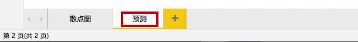

2. 向报表页面添加一个“折线图”视觉对象，然后调整其位置和大小，使其填满整个页面。

    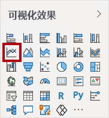

    

  

3. 将以下字段添加到视觉对象井/区域中：

    - X 轴：Date \| Date

    - Y 轴：Sales \| Sales 

    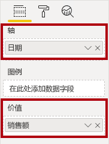

4. 在“筛选器”窗格中，将“Date \| Year”字段添加到“此页上的筛选器”井/区域中  。

5. 在筛选器卡中，按两个年份进行筛选：2019 财年和 2020 财年。

    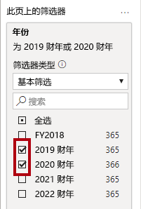

    *按时间线进行预测时，需要至少两个周期（年）的数据才能生成准确稳定的预测。*

  

6. 将“Product \| Category”字段也添加到“此页上的筛选器”井/区域中，并按“自行车”进行筛选  。

    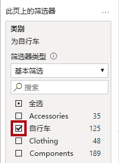

7. 若要添加预测，请在“可视化效果”窗格下选择“分析”窗格。

    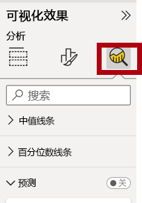

8. 展开“预测”部分。

    如果“预测”部分不可用，可能是因为未正确配置该视觉对象。仅当满足以下两个条件时，才能进行预测：轴有一个日期类型的字段，并且只有一个值字段。

9. 将“预测”选项设置为“启用” 。

    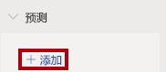

10. 配置以下预测属性：

    - 单位：Months

    - 预测时长：1 个月

    - 季节性：365
    
    - 置信区间：80%

11. 单击“应用”。

    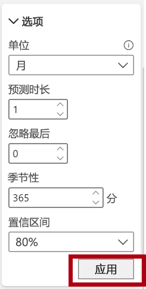

12. 在该折线图视觉对象中，你会发现预测在历史数据的基础上延长了一个月。

    灰色区域表示置信度。置信度越广，预测可能越不稳定，因此准确性就越差。

    当你知道周期的长度（本例中为每年）时，应输入季节性点。有时可能是每周 (7) 或每月 (30)。

13. 在“筛选器”窗格中，仅按“衣服”进行筛选，请注意，它会产生不同的结果。

14. 保存 Power BI Desktop 文件。

### **任务 2：完成**

在此任务中，你将完成本实验室。

1. 选择“散点图”页。

2. 保存 Power BI Desktop 文件。

3. 若要将文件发布到“我的工作区”，请在“主页”功能区选项卡上的“共享”组中，单击“发布”，然后单击“选择”以发布    。

    

4.  关闭 Power BI Desktop。
