---
lab:
  title: 强制执行行级别安全性
  module: Module 13 - Row-Level Security
---

# 强制执行行级别安全性

**预估完成本实验室需要 45 分钟**

In this lab you will create a many-to-many relationship between the <bpt id="p1">**</bpt>Salesperson<ept id="p1">**</ept> table and the <bpt id="p2">**</bpt>Sales<ept id="p2">**</ept> table. You will also enforce row-level security to ensure that a salesperson can only analyze sales data for their assigned region(s).

本实验室介绍如何完成以下操作：

- 配置多对多关系

- 强制执行行级别安全性

### **实验室场景**

This lab is one of many in a series of labs that was designed as a complete story from data preparation to publication as reports and dashboards. You can complete the labs in any order. However, if you intend to work through multiple labs, for the first 10 labs, we suggest you do them in the following order:

1. 在 Power BI Desktop 中准备数据

2. 在 Power BI Desktop 中加载数据

3. 在 Power BI Desktop 中对数据建模

5. 在 Power BI Desktop 中创建 DAX 计算，第 1 部分

6. 在 Power BI Desktop 中创建 DAX 计算，第 2 部分

7. 在 Power BI Desktop 中设计报表，第 1 部分

8. 在 Power BI Desktop 中设计报表，第 2 部分

9. 创建 Power BI 仪表板

10. 在 Power BI Desktop 中执行数据分析

11. 强制执行行级别安全性

## **练习 1：强制执行行级别安全性**

在此练习中，你将强制执行行级别安全性，以确保销售员只能看到向其分配的区域的销售额。

### **任务 1：入门**

在此任务中，你将设置实验室环境。

*重要说明：如果你是继续上一个实验室（并且已经成功完成了该实验室），请不要完成此任务，而是继续下一个任务。*

1. 若要打开 Power BI Desktop，请在任务栏上单击“Microsoft Power BI Desktop”快捷方式。

    

1. 要关闭开始窗口，请单击窗口左上角的“X”。

    

1. 要打开入门 Power BI Desktop 文件，请单击“文件”功能区选项卡以打开 Backstage 视图。

1. 选择“打开报表”。

    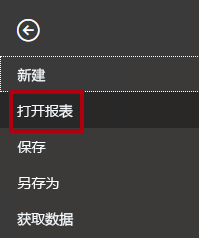

1. 单击“浏览报表”。

    

1. 在“打开”窗口中，导航到 D:\PL300\Labs\12-row-level-security\Starter 文件夹 。

1. 选择“销售分析”文件。

1. 单击 **“打开”** 。

    

1. 关闭任何可能打开的信息窗口。

1. 要创建该文件的副本，请单击“文件”功能区选项卡以打开 Bckstage 视图。

1. 选择“另存为”。

    

1. 如果系统提示应用更改，请单击“应用”。

    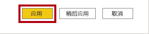

1. 在“另存为”窗口中，导航到“D:\PL300\MySolution”文件夹 。

1. 单击“保存” 。

    

### **任务 2：强制执行行级别安全性**

在此任务中，你将强制执行行级别安全性，以确保销售员只能看到向其分配的区域的销售额。

1. 切换到“数据”视图。

    

2. 在“字段”窗格中，选择“Salesperson (Performance)”表。

3. 查看数据，会发现 Michael Blythe（EmployeeKey 为 281）的 UPN 值为 **michael-blythe@adventureworks.com**

    *回顾一下，Michael Blythe 分配到了三个销售区域：美国东北部、美国中部和美国东南部。*

4. 切换到“报表”视图。

5. 在“建模”功能区选项卡的“安全性”组中，单击“管理角色”  。

    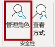

6. 在“管理角色”窗口中，单击“创建”。

    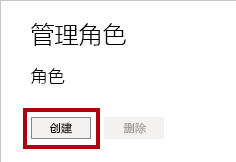

7. 在方框中，用角色名称替换选定的文本：“Salespeople”的名称，然后按 Enter。

    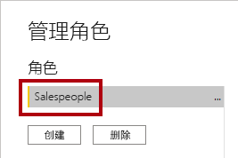

8. 要分配筛选器，请在“Salesperson (Performance)”表中单击省略号“(…)”字符，然后选择“添加筛选器 \| [UPN]”。

    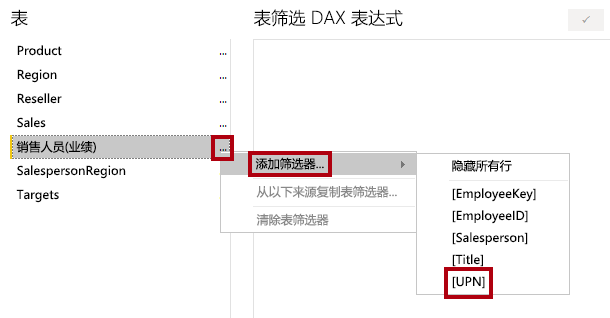

9. 在“表筛选器 DAX 表达式”框中，通过将“值”替换为“USERPRINCIPALNAME()”来修改表达式。

    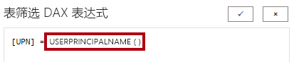

    USERPRINCIPALNAME () 是一种数据分析表达式 (DAX) 函数，它返回已经过身份验证的用户的名称。*这意味着，“Salesperson (Performance)”表将按查询模型的用户的用户主体名称 (UPN) 进行筛选。*

10. 单击“保存” 。

    

11. 要测试安全角色，请在“建模”功能区选项卡的“安全性”组内，单击“以其身份查看”。

    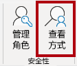

12. 在“以角色身份查看”窗口中，勾选“其他用户”项，然后在相应的框中输入：** michael-blythe@adventureworks.com**

13. 选中“销售员”角色。

    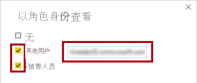

    完成此配置后，系统将使用“Salespeople”角色，并使用 Michael Blythe 的姓名扮演该用户。**

14. 单击 **“确定”** 。

    

15. 请注意报表页上面的黄色横幅，其中说明了测试安全性上下文。

    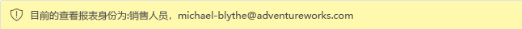

16. 在表视觉对象中，请注意，仅列出了销售人员 Michael Blythe。

    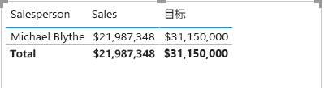

17. 要停止测试，请在黄色横幅的右侧单击“停止查看”。

    

    Power BI Desktop 文件发布到 Power BI 服务后，你将需要完成发布后的任务，将安全主体映射到“销售人员”角色。** 在本实验室中不执行此操作。

18. 要删除该角色，请在“建模”功能区选项卡的“安全性”组内，单击“管理角色”。

    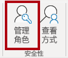

19. 在“管理角色”窗口中，单击“删除”。

    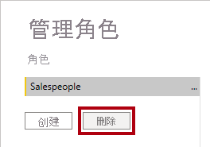

20. 当系统提示确认删除时，单击“是，删除”。

21. 单击“保存” 。

    

### **任务 2：完成**

在此任务中，你将完成本实验室。

1. 保存 Power BI Desktop 文件。
