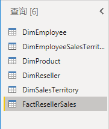
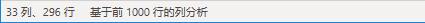
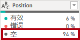
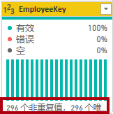
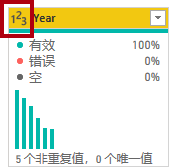

---
lab:
  title: 在 Power BI Desktop 中获取数据
  module: Get Data in Power BI
---

# 在 Power BI Desktop 中获取数据

## **实验室场景**

本实验室旨在介绍 Power BI Desktop 应用程序以及如何连接到数据，以及如何使用数据预览技术了解源数据的特征和质量。 学习目标为：

- 打开 Power BI Desktop
- 连接不同的数据源
- 使用 Power Query 预览源数据
- 在 Power Query 中使用数据分析功能

**此实验室应该大约需要 30 分钟。**

## Power BI Desktop 入门

若要完成本练习，请先打开 Web 浏览器并输入以下 URL 以下载 zip 文件夹：

`https://github.com/MicrosoftLearning/PL-300-Microsoft-Power-BI-Data-Analyst/raw/Main/Allfiles/Labs/01-prepare-data-with-power-query-in-power-bi-desktop/01-prepare-data.zip`

将文件夹解压缩到 C:\Users\Student\Downloads\01-prepare-data **** 文件夹。

打开 01-Starter-Sales Analysis.pbix **** 文件。

- 此启动文件已经过特殊配置，可帮助完成实验室。 入门文件中禁用了以下报表级设置：

  - 数据加载 > 首次加载时从数据源导入关系
  - 数据加载 > 加载数据后自动检测新关系

## 从 SQL Server 获取数据

此任务介绍如何连接到 SQL Server 数据库并导入表，这会在 Power Query 中创建查询。

1. 在“主页”功能区选项卡上的“数据”组中，选择“SQL Server”。

     

1. 在“SQL Server 数据库”窗口的“服务器”框中，输入“localhost”，将“数据库”留空，然后选择“确定”********************。

    > ***备注**：在此实验室中，使用 localhost **** 连接到 SQL Server 数据库，因为网关数据源无法解析 localhost****。 但在创建自己的解决方案时，不建议这样做。*

1. 如果提示输入凭据，请选择“Windows”>“使用当前的凭据”****，然后选择“连接”****。

1. 如果收到无法建立加密连接的警告，请选择“确定”****。

1. 在“导航器”窗格中，展开“AdventureWorksDW2020”数据库。********

    > ***备注**：AdventureWorksDW2020 **** 数据库基于 AdventureWorksDW2017 **** 示例数据库。 已对其进行修改，以支持课程实验室的学习目标。*

1. 选择 DimEmployee 表，注意表数据的预览。****

     

    > ***备注**：可以通过预览数据来查看列和行示例。*

1. 若要导入表数据，请选中以下表格旁边的复选框****：

    - DimEmployee
    - DimEmployeeSalesTerritory
    - DimProduct
    - DimReseller
    - DimSalesTerritory
    - FactResellerSales

1. 选择“转换数据”**** 完成此任务，这将打开 Power Query 编辑器 - 将其保持打开状态以进行下一个任务。

现已从 SQL Server 数据库连接到六个表。

## **在 Power Query 编辑器中预览数据**

此任务介绍 Power Query 编辑器，并允许查看和分析数据。 这有助于确定之后如何清理和转换数据。 你还将查看前缀为“Dim”的维度表，以及前缀为“Fact”的事实数据表。

1. 请注意“Power Query 编辑器”窗口左侧的“查询”窗格。 “查询”窗格包含一个针对每个所选表的查询。

     

1. 选择第一个查询 -“DimEmployee”。

    > SQL Server 数据库的 DimEmployee **** 表中每个员工占一行。此表中的行子集表示销售人员，与要开发的模型相关。**

1. 状态栏的左下角提供了一些表统计信息 - 该表包含 33 列和 296 行。

     

1. 在“数据预览”窗格中，水平滚动以查看所有列。 请注意，最后五列包含表或值链接。

    > 这五列表示与数据库中其他表的关系，可用于将表联接在一起。联接表的操作会在“在 Power BI Desktop 中加载已转换的数据”**** 实验室中完成。**

1. 要评估列质量，请在“视图”功能区选项卡的“数据预览”组中，勾选“列质量”。 通过列质量功能，可以轻松确定列中的有效值、错误值或空值的百分比。

     

1. 请注意，Position 列 94% 的行都为空 (null)。

     

1. 若要评估列分步，请在“视图”功能区选项卡的“数据预览”组中，选中“列分步”。

1. 再次查看 Position 列，请注意有四个非重复值和一个唯一值。

1. 查看 EmployeeKey 列的列分布，其中包含 296 个非重复值和 296 个唯一值。

     

    > ***备注**：当非重复值和唯一值的计数相同时，这表示列包含唯一值。 建模时，某些表包含唯一列，这一点很重要。 这些唯一的列可用于创建一对多关系，你将在**在 Power BI Desktop 中为数据建模**实验室中进行此操作。*

1. 在“查询”窗格中，选择 DimProduct 查询。

    > *DimProduct 表包含的每个行表示公司已销售的每个产品。*****

1. 在“查询”窗格中，选择 DimReseller 查询。

    > 在 DimReseller 表中，每个经销商占一行。经销商对 Adventure Works 的产品进行销售、分销或增值。

1. 若要查看列值，请在“视图”功能区选项卡的“数据预览”组中，选中“列配置文件”。

1. 选择“BusinessType”列标题，并注意“数据预览”窗格下面的新窗格。 在“数据预览”窗格中查看列统计信息和值分布情况。

    > 请注意以下数据质量问题：有两个表示 warehouse 的标签（“Warehouse”以及拼写错误的“Ware House”） 。

     

1. 将光标悬停在“Ware House”栏上，请注意有 5 个行包含此值。

1. 在“查询”窗格中，选择 DimSalesTerritory 查询。  

    > 在 DimSalesTerritory 表中，每个销售区域占一行，包括 Corporate HQ（总部）。区域会分配到国家/地区，国家/地区会分配到组。“Power BI Desktop 中为数据建模”实验室中会创建一个层次结构，用来支持在区域、国家/地区或组级别进行分析。

1. 在“查询”窗格中，选择 FactResellerSales 查询。

    > 在 FactResellerSales 表中，每个销售订单行占一行 - 一个销售订单包含一个或多个行项。

1. 查看 TotalProductCost 列的列质量，请注意 8% 的行都为空。

    > 缺少 TotalProductCost **** 列值是数据质量问题。**

## **从 CSV 文件获取数据**

在此任务中，基于 CSV 文件创建新查询。

1. 若要添加新查询，请在“Power Query 编辑器”窗口的“主页”功能区选项卡上的“新建查询”组中，选择“新建源”向下箭头，然后选择“文本/CSV”。

1. 导航到 01-prepare-data > ResellerSalesTargets.csv **** 文件。 选择“打开”  。

1. 在“ResellerSalesTargets.csv”窗口中，查看预览数据。 选择“确定”。

1. 在“查询”窗格中，请注意添加了 ResellerSalesTargets 查询。

    > 在 ResellerSalesTargets CSV 文件中，每个年度的每个销售人员占一行。每行记录 12 个月度销售目标（以千为单位）。Adventure Works 公司的业务年度从 7 月 1 日开始。

1. 请注意，没有列包含空值。  如果没有月度销售目标，则改为存储一个连字符。

1. 在列名左侧的各个列标题中查看图标。 这些图标表示列数据类型。 123 是整数，ABC 是文本。

     

1. 基于 ColorFormats.csv **** 文件重复这些步骤，以创建查询。

    > 在 ColorFormats CSV 文件中，每个产品颜色占一行。每行都记录十六进制代码以设置背景和字体颜色的格式。

现在应该有两个新查询：ResellerSalesTargets**** 和 ColorFormats****。

 

## 实验已完成
