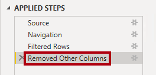
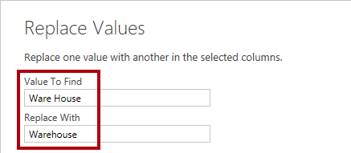
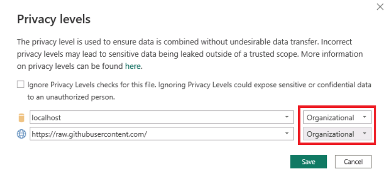
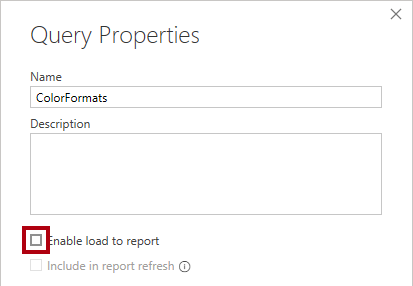
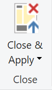

---
lab:
  title: 在 Power BI 中清理、转换和加载数据
  module: 'Clean, transform, and load data in Power BI'
---

# 在 Power BI 中清理、转换和加载数据

## 实验室场景

在本实验室中，你将使用数据清理和转换技术开始塑造数据模型。 然后，你将应用查询，将每个查询作为表加载到语义模型中。

在此实验室中，你将了解如何完成以下操作：

- 应用各种数据转换。
- 将查询加载到语义模型。

**此实验室应该大约需要 45 分钟。**

## 开始使用

若要完成本练习，请先打开 Web 浏览器并输入以下 URL 以下载 zip 文件夹：

`https://github.com/MicrosoftLearning/PL-300-Microsoft-Power-BI-Data-Analyst/raw/Main/Allfiles/Labs/02-transform-data-power-bi/02-transform-data.zip`

将文件夹解压缩到 C:\Users\Student\Downloads\02-transform-data 文件夹****。

打开 02-Starter-Sales Analysis.pbix **** 文件。

> ***备注**：可以通过选择“取消”**** 来取消登录。 关闭所有其他信息窗口。 如果系统提示应用更改，请选择“稍后应用”****。*

## 配置 Salesperson 查询

在此任务中，使用 Power Query 编辑器来配置 Salesperson 查询。

> ***重要说明**：当收到指示对列进行重命名时，请务必完全按照所述内容对它们进行重命名。

1. 若要打开“Power Query 编辑器”窗口，请在“开始”功能区选项卡上的“查询”组中，选择“转换数据”图标。

    

1. 在“Power Query 编辑器”窗口的“查询”窗格中，选择“DimEmployee”查询  。

    

    > **注意：** 如果收到一条警告消息，要求指定如何连接，请选择“**编辑凭据**”，使用当前凭据进行连接，然后选择“**确定**”以使用未加密的连接。
 
1. 若要重命名查询，请在“查询设置”窗格（位于右侧）的“名称”框中，将文本替换为 Salesperson，然后按 Enter 键。 然后，在“查询”窗格中验证名称是否已更新。

    > 查询名称确定模型表名称。建议定义简明的用户友好名称。

1. 若要查找特定列，请在“开始”功能区选项卡上的“管理列”组中，选择“选择列”向下箭头，然后选择“转到列”****************。

    > 包含多列时，“转到列”功能非常有用。如果不使用该功能，可以水平滚动查找列。

    

1. 在“转到列”窗口中，若要按列名对列表进行排序，请选择“AZ”排序按钮，然后选择“名称”和 SalesPersonFlag   。 单击“确定”。

    

1. 找到 SalesPersonFlag 列，然后筛选该列以仅选择“Salespeople”（即 TRUE），然后单击“确定”  。

1. 查询设置”窗格中，可以注意到“应用的步骤”列表中添加了“筛选的行”步骤。

    > 创建的每一个转换都会生成另一个步骤逻辑。可以编辑或删除步骤。在查询转换阶段，还可以选择一个步骤来预览查询结果。

    

1. 若要删除列，请在“开始”功能区选项卡上的“管理列”组中，选择“选择列”图标************。

1. 在“选择列”窗口中，要取消选中所有列，请取消选中“(选择所有列)”项 。

1. 若要包含列，请检查以下六列：

    - EmployeeKey
    - EmployeeNationalIDAlternateKey
    - FirstName
    - LastName
    - Title
    - EmailAddress

1. 在“应用的步骤”列表中，请注意添加了另一个查询步骤。

    

1. 若要创建单一名称列，请首先选择 FirstName 列标头。 在按住 Ctrl 键的同时选择 LastName 列。

    

1. 右键单击任一所选列标题，然后在上下文菜单中选择“合并列”。

    > 可以通过以下方式应用许多常见的转换：右键单击列标头，然后从上下文菜单中进行选择。但是请注意，功能区中还有更多转换可用。

1. 在“合并列”窗口中的“分隔符”下拉列表中，选择“空格”。

1. 在“新列名”框中，将文本替换为“Salesperson”。

1. 若要重命名 EmployeeNationalIDAlternateKey 列，请双击 EmployeeNationalIDAlternateKey 列标头并将文本替换为 EmployeeID，然后按 Enter。

1. 使用前面的步骤将“EmailAddress”列重命名为“UPN”。

    > *UPN 是用户主体名称的缩写。*

**在左下方的状态栏中，验证查询是否有 5 列和 18 行。**

## **配置 SalespersonRegion 查询**

在此任务中，你将配置 SalespersonRegion 查询。

1. 在“查询”窗格中，选择 DimEmployeeSalesTerritory 查询。

1. 在“查询设置”窗格中，将查询重命名为“SalespersonRegion”。

1. 若要删除最后两列，请首先选择 DimEmployee 列标头。

1. 在按住 Ctrl 键的同时选择 DimSalesTerritory 列标头。

1. 右键单击任一选择列标题，然后在上下文菜单中选择“删除列”。

**在状态栏中，验证查询是否有 2 列和 39 行。**

## 配置 Product 查询

在此任务中，你将配置 Product 查询。

> ***重要说明**：如果已经提供详细说明，实验室步骤将提供更简洁的说明。 如果需要详细说明，可以回顾先前任务的步骤。*

1. 选择 DimProduct 查询，并将查询重命名为 Product 。

1. 找到“FinishedGoodsFlag”列，然后对该列进行筛选以检索为成品的产品（即 TRUE）。

1. 删除除以下列之外的所有列：

    - ProductKey
    - EnglishProductName
    - StandardCost
    - Color
    - DimProductSubcategory

1. 请注意“DimProductSubcategory”列代表相关表（它包含“值”链接）。

1. 在 DimProductSubcategory 列标头中，选择列名右侧的展开按钮。

    

1. 查看列的完整列表，然后选择“选择所有列”框以取消选择所有列。

1. 选择 EnglishProductSubcategoryName 和 DimProductCategory，然后先取消选中“使用原始列名作为前缀”复选框，再选择“确定”   。

    

    > 通过选择这两个列，将应用转换以联接到 DimProductSubcategory 表，将这些列包含在内***。** 事实上，“DimProductCategory”列是数据源中的另一个相关表。*

    > 查询列名称必须始终是唯一的。*选中后，此复选框将为每个列添加扩展列名作为前缀（在本例中为“DimProductSubcategory”）。因为已知所选列名不会与“Product”查询中的列名冲突，可以取消选择此选项。*

1. 请注意，该转换的结果是添加了两列，并且删除了“DimProductSubcategory”列。

1. 展开“DimProductCategory”列，然后仅引入“EnglishProductCategoryName”列。

1. 对以下四列进行重命名：

    - 将 EnglishProductName 重命名为 Product
    - 将 StandardCost 重命名为 Standard Cost（包含一个空格）
    - 将 EnglishProductSubcategoryName 重命名为 Subcategory
    - 将 EnglishProductCategoryName 重命名为 Category

在状态栏中，验证查询是否有 6 列和 397 行。****

## 配置 Reseller 查询

在此任务中，配置 Reseller 查询。

1. 选择 DimReseller 查询并重命名为 Reseller 。

1. 删除除以下列之外的所有列：

    - ResellerKey
    - BusinessType
    - ResellerName
    - DimGeography

1. 展开 DimGeography 列以仅包含以下三列 ：

    - City
    - StateProvinceName
    - EnglishCountryRegionName

1. 在 Business Type 列标头上，选择向下箭头，然后查看非重复列值，并注意 Warehouse 和 Ware House 这两个值  。

1. 右键单击“Business Type”列标题，然后选择“替换值”。

1. 在“替换值”窗口中，配置以下各值：

    - 在“要查找的值”框中，输入“Ware House”
    - 在“替换为”框中，输入“Warehouse”

    

1. 对以下四列进行重命名：

    - 将 BusinessType 重命名为 Business Type（包含一个空格）
    - 将 ResellerName 重命名为 Reseller
    - 将 StateProvinceName 重命名为 State-Province
    - 将 EnglishCountryRegionName 重命名为 Country-Region

在状态栏中，验证查询是否有 6 列和 701 行。****

## 配置 Region 查询

在此任务中，你将配置 Region 查询。

1. 选择 DimSalesTerritory 查询，并将查询重命名为 Region 。

1. 向“SalesTerritoryAlternateKey”列应用筛选器以删除值 0（零）。

    > 这会删除一行。

1. 删除除以下列之外的所有列：

    - SalesTerritoryKey
    - SalesTerritoryRegion
    - SalesTerritoryCountry
    - SalesTerritoryGroup

1. 对以下三列进行重命名：

    - 将 SalesTerritoryRegion 重命名为 Region
    - 将 SalesTerritoryCountry 重命名为 Country
    - 将 SalesTerritoryGroup 重命名为 Group

在状态栏中，验证查询是否有 4 列和 10 行。****

## 配置 Sales 查询

在此任务中，配置 Sales 查询。

1. 选择 FactResellerSales 查询，并将其重命名为 Sales 。

1. 删除除以下列之外的所有列：

    - SalesOrderNumber
    - OrderDate
    - ProductKey
    - ResellerKey
    - EmployeeKey
    - SalesTerritoryKey
    - OrderQuantity
    - UnitPrice
    - TotalProductCost
    - SalesAmount
    - DimProduct

    > ***备注**：你可能还记得在 Power BI Desktop 中准备数据**** 实验室中，有一小部分 FactResellerSales**** 行缺少 TotalProductCost**** 值。 为了协助修复缺失值，已将用于检索产品标准成本的“DimProduct”**** 列包含在内。*

1. 展开“DimProduct”列，取消选中所有列，然后仅包括“StandardCost”列。

1. 若要创建自定义列，请在“添加列”功能区选项卡上的“常规”组中，选择“自定义列”  。

    

1. 在“自定义列”窗口的“新列名”框中，将文本替换为“Cost”。

1. 在“自定义列公式”框中，输入以下表达式（等号后面的内容），然后保存新列：****

   ` if [TotalProductCost] = null then [OrderQuantity] * [StandardCost] else [TotalProductCost] `

    > *注意****：可以从 02-transform-data 文件夹的 Snippets.txt**** 文件中复制表达式。*

    > 此表达式测试是否缺失 TotalProductCost 值。如果缺失，则通过将 OrderQuantity 值乘以 StandardCost 值来生成一个值；否则，它使用现有的 TotalProductCost 值。

1. 删除以下两列：

    - TotalProductCost
    - StandardCost

1. 对以下三列进行重命名：

    - 将 OrderQuantity 重命名为 Quantity
    - 将 UnitPrice 重命名为 Unit Price（包含一个空格）
    - 将 SalesAmount 重命名为 Sales

1. 若要修改列数据类型，请在 Quantity 列标头中，选择列名左侧的“1.2”图标，然后选择“整数”  。

    > 配置正确数据类型是非常重要的。当列包含数值时，如果想执行数学计算，也务必要选择正确的类型。

    

1. 将以下三列数据类型修改为“定点小数”。

    > 定点十进制数数据类型允许 19 位数字，并允许更高的精度，以避免舍入错误。请务必为财务值或费率（例如汇率）使用定点十进制数类型。

    - Unit Price
    - Sales
    - Cost

**在状态栏中，验证查询是否有 10 列和超过 999 行。** *对于每一查询，最多将加载 1000 行作为预览数据。*

## 配置 Targets 查询

在此任务中，你将配置 Targets 查询。

1. 选择 ResellerSalesTargets 查询，并重命名为 Targets 。

    > **注意：** 如果收到一条警告消息，要求指定如何连接，请选择“**编辑凭据**”，并使用匿名访问。

1. 若要对 12 个月的列进行逆透视（M01-M12），首先，选择多个 Year 和 EmployeeID 列标头   。

1. 右键单击任一选择列标题，然后在上下文菜单中选择“逆透视其他列”。

1. 请注意，列名称现在显示在“Attribute”列中，而值显示在“Value”列中 。

1. 将筛选器应用于 Value 列以删除连字符 (-) 值。

    > *你可能还记得，在源 CSV 文件中使用连字符来表示零 (0)。*

1. 重命名以下两列：

    - Attribute 重命名为 MonthNumber（没有空格）
    - 将 Value 重命名为 Target

1. 要准备“MonthNumber”列值，请右键单击“MonthNumber”列标题，然后选择“替换值”。

    > 现在，你将应用转换来生成一个日期列。*日期将派生自 Year 和 MonthNumber 列 。* 你将使用“示例中的列”功能来创建列。

1. 在“替换值”窗口的“要查找的值”框中，输入“M”并将“替换为”留空   。

1. 将 MonthNumber 列数据类型修改为“整数”。

1. 在**添加列**功能区选项卡上的**常规**组中，选择**示例中的列**图标。

    

1. 请注意，第一行对应年份“2017”和月份“7”。

1. 在“Column1”列的第一个网格单元中，开始输入“7/1/2017”，然后按 Enter。

    > ***备注**：由于虚拟机使用美国区域设置，因此该日期实际上是 2017 年 7 月 1 日。 其他区域设置可能需要在日期之前添加 0****。*

1. 请注意，网格单元格将更新为预测值。

    > 此功能已准确预测你正在合并 Year 列和 MonthNumber 列中的值 。

1. 另请注意查询网格上方显示的公式。

    

1. 若要重命名新列，请双击 Merged 列标头，并将该列重命名为 TargetMonth 。

1. 删除以下列：

    - Year
    - MonthNumber

1. 修改以下列数据类型：

    - 将 Target 的数据类型修改为定点十进制数
    - 将 TargetMonth 的数据类型修改为日期

1. 若要将 Target 值乘以 1000，请选择 Target 列标头，然后在“转换”功能区选项卡上的“编号列”组中，选择“标准”，然后选择“乘”     。

    > *你可能还记得，目标值是以千为单位存储的。*

    

1. 在“乘”窗口的“值”框中，输入 1000，然后选择“确定”   。

在状态栏中，验证查询是否有 3 列和 809 行。****

## 配置 ColorFormats 查询

在此任务中，你将配置 ColorFormats 查询。

1. 选择 ColorFormats 查询，注意第一行包含列名。

1. 在“开始”功能区选项卡上的“转换”组中，选择“将第一行用作标头”  。

    

在状态栏中，验证查询是否有 3 列和 10 行。****

## 更新 Product 查询

在此任务中，你将通过合并 ColorFormats 查询来更新 Product 查询。

1. 选择 Product 查询。

1. 若要合并 ColorFormats 查询，请在“开始”功能区选项卡上的“合并”组中，选择“合并查询”****************。

    > 合并查询能够实现集成数据，在本例中，这些数据来自不同的数据源（SQL Server 和 CSV 文件）。

    

1. 在“合并”窗口的“Product”查询网格中，选择“Color”列标题。

    

1. 在“产品”查询网格下方的下拉列表中，选择“ColorFormats”查询 。

    

1. 在“ColorFormats”查询网格中，选择“Color”列标题。

1. 在“隐私级别”窗口打开后，对于这两个数据源，在相应的下拉列表中选择“组织”，然后选择“保存”  。

    > 可以为数据源配置隐私级别来确定数据是否可以在源之间共享。将每个数据源设置为“组织”以使它们能够共享数据（如有必要）。私有数据源永远不能与其他数据源共享。这并不意味着私有数据不能共享，这只是表示 Power Query 引擎无法在源之间共享数据。

    

1. 在“合并”窗口中，使用默认的联接类型保持左外选择，然后选择“确定”  。

1. 展开“ColorFormats”列以包括以下两列：

    - 背景色格式
    - 字体颜色格式

在状态栏中，验证查询现在是否有 8 列和 397 行。****

## 更新 ColorFormats 查询

在此任务中，你将更新 ColorFormats 以禁用加载它。

1. 选择 ColorFormats 查询。

1. 在“查询设置”**** 窗格中，选择“所有属性”**** 链接。

    

1. 在“查询属性”窗口中，取消选中“启用加载到报表”复选框。

    > 禁用加载意味着它不会作为表加载到数据模型。这样做是因为查询已经与 Product 查询合并，后者已启用了加载到数据模型。

    

### 查看最终产品

1. 在Power Query 编辑器中，验证是否具有 8 个查询****，按如下所示正确命名：

    - Salesperson
    - SalespersonRegion
    - Product
    - Reseller
    - Region
    - Sales
    - Targets
    - ColorFormats（这不会加载到数据模型）

1. 选择“关闭 &amp; 应用”**** 以将数据加载到模型，然后关闭 Power Query 编辑器窗口。

    

1. 现在可以在 Power BI Desktop 中看到画布，右侧有“筛选器”、“可视化”和“数据”窗格。 在“数据”窗格中，可以注意到有 7 个表**** 已加载到数据模型中。

    

## 实验已完成
