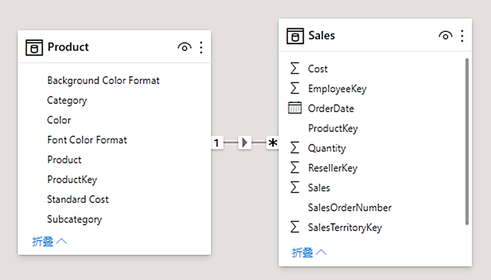
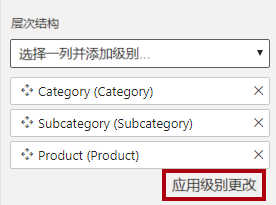
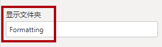
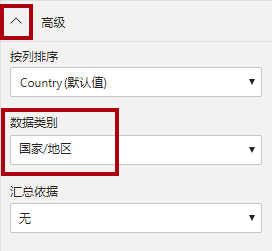
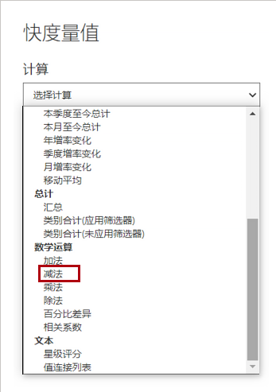
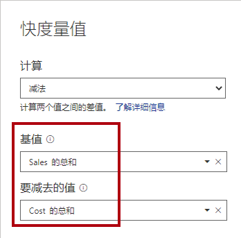
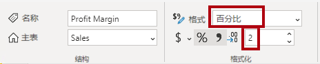
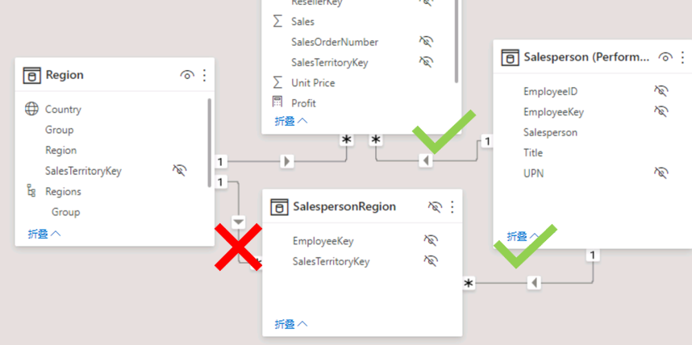
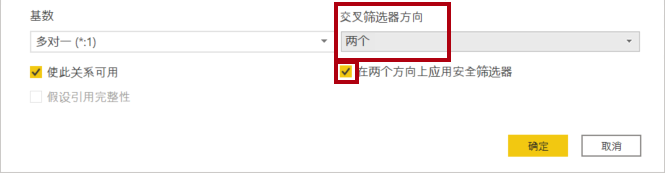

---
lab:
  title: 在 Power BI 中设计数据模型
  module: Design a Data Model in Power BI
---

# 在 Power BI 中设计数据模型

## 实验室场景

在本实验室中，开始开发数据模型。 它将涉及在表之间创建关系，然后配置表和列属性以提高数据模型的友好性和可用性。 还可创建层次结构和快速度量值。

本实验室介绍如何完成以下操作：

- 创建模型关系
- 配置表和列属性
- 创建层次结构

**此实验室应该大约需要 45 分钟。**

## 开始使用

若要完成本练习，请先打开 Web 浏览器并输入以下 URL 以下载 zip 文件夹：

`https://github.com/MicrosoftLearning/PL-300-Microsoft-Power-BI-Data-Analyst/raw/Main/Allfiles/Labs/03-configure-data-model-in-power-bi-desktop/03-model-data.zip`

将文件夹解压缩到 C:\Users\Student\Downloads\03-model-data**** 文件夹。

打开 03-Starter-Sales Analysis.pbix**** 文件。

> ***备注**：可以通过选择“取消”**** 来取消登录。 关闭所有其他信息窗口。 如果系统提示应用更改，请选择“稍后应用”****。*

## 创建模型关系

在本任务中，你将创建模型关系。 该文件配置为不标识表之间的关系，这不是默认设置，但建议这样做，以防止为模型创建正确的关系时需要额外工作。

> **重要说明**：*本实验室使用速记表示法引用字段。如下所示：产品 \| 类别****。在此示例中，产品**** 是表名，类别**** 是字段名。*

1. 在 Power BI Desktop 左侧，选择“报表视图”**** 图标。

     

1. 若要查看所有表字段，请在“数据”窗格中，右键单击空白区域，然后选择“全部展开”。

1. 若要创建表视觉对象，请在“数据”窗格的“Product”表内部，选中“Category”字段。

1. 若要向表中添加其他列，请在“数据”窗格中，选中“Sales \| Sales”字段 。

1. 请注意，表视觉对象列出了四个产品类别，每个类别的销售额值相同，且总额相同。

     

     > 问题在于该表基于来自不同表的字段。预期每个产品类别都显示该类别的销售额。但是，由于这些表之间没有模型关系，“Sales”表未经过筛选。现在，添加一个关系用于在表之间传播筛选器。

1. 从左侧导航窗格中选择“模型视图”**** 图标，然后选择“管理关系”****。

     

1. 在“管理关系”窗口中，请注意尚未定义任何关系。 要创建关系，请选择“新建关系”****。

1. 配置从 Product**** 表到 Sales**** 表的关系。 请注意，已自动配置以下元素：

    - **已选择各个表中的 ProductKey 列**。 由于这些列具有相同名称和数据类型，因此自动将其选中。可能需要在实际数据中查找具有不同名称的匹配列。
    - **基数类型为一对多 (1:\*)**。 由于 Power BI 认为“Product”表中的“ProductKey”列包含唯一值，因此已自动检测到基数。* *一对多关系是最常见的基数，在本实验室中创建的所有关系都将是这种类型。
    - **交叉筛选片方向类型为“单一”**。 单个筛选方向表示筛选器从“一侧”传播到“多侧”。在本例中，这意味着应用于“Product”表的筛选器将传播到“Sales”表，但传播方向不能反过来 。
    - **已选中“使此关系可用”**。 活动关系传播筛选。*可以将关系标记为非活动状态，这样筛选就不会传播。当表之间存在多个关系路径时，可能存在非活动关系。* 在这种情况下，模型计算可以使用特殊函数来激活它们。

     

1. 选择“确定”，可以看到“管理关系”窗口中已列出新关系，然后选择“关闭”  。

     

请注意，两个表之间现在有一个连接器（*两个表是否彼此相邻无关紧要*）。
    - 可以解释基数，其由“1”和“(*)”指示器表示 。
    - 筛选方向由箭头表示。
    - 实线表示活动关系，虚线表示非活动关系。
    - 将光标悬停在关系上以突出显示相关列。

### 创建其他关系

创建关系还有更简单的方法。 在模型图中，可以拖放列以创建新的关系。

1. 若要使用其他方法创建新关系，请将“Reseller”表中的“ResellerKey”列拖放到“Sales”表中的“ResellerKey”列上   。

    > ***提示**：有时会无法拖动某个列。 如果出现这种情况，请选择其他列，然后再次选择要拖动的列并重试。 确保能看到添加到该图的新关系。*

     

1. 使用新方法创建以下两个模型关系：

     - “Region \| SalesTerritoryKey”到“Sales \| SalesTerritoryKey”
     - “Salesperson \| EmployeeKey”到“Sales \| EmployeeKey”

1. 在该图中，排列表，以使“Sales”表位于图的中心，并围绕该表排列相关的表。 将断开联接的表放在一边。

     

1. 在报表视图中，可以看到表视觉对象已更新为针对每个产品类别显示不同的值。

    > 现在，应用于“Product”***表的筛选器会传播到“Sales”** **表***。

     

1. 保存 Power BI Desktop 文件。

## 配置“Product”表

在此任务中，你将使用层次结构和显示文件夹配置“产品”**** 表。

1. 在“模型”视图>“数据”窗格**** 中，展开“产品”**** 表以显示所有字段（如有必要）。

1. 若要创建层次结构，请在“数据”窗格中，右键单击“类别”**** 列，然后选择“创建层次结构”****。

1. 将名称更新为“产品”****（右键单击或双击以重命名）。

1. 要将第二个级别添加到层次结构，请在“属性”窗格中的“层次结构”下拉列表中，选择“Subcategory”（可能需要在窗格内部向下滚动）。

1. 若要将第三个级别添加到层次结构，请在“层次结构”下拉列表中，选择“Product”。

1. 若要完成层次结构设计，请选择“应用级别更改”。

     

1. 在“数据”窗格中，注意“Products”层次结构。 若要显示层次结构级别，请展开“Products”层次结构。

     

1. 若要将列组织到一个显示文件夹中，请在“数据”窗格中，先选择“Background Color Format”列。

1. 在按下 Ctrl 键的同时，选择“Font Color Format”列。

1. 在“属性”窗格的“显示文件夹”框中，输入“Formatting”。

     

1. 在“数据”窗格中，请注意，两个列现在位于文件夹中。

   > 显示文件夹是整理表的好方法，尤其是对于包含许多字段的表来说。它们只是逻辑演示。**

     

## 配置“Region”表

在此任务中，你将使用层次结构和更新的类别配置“区域”**** 表。

1. 在“Region”表中，创建名为“Regions”的层次结构，其中包含以下三个级别：

     - Group
     - Country
     - 区域

1. 选择“Country”列（而不是“Country”层次结构级别）。

1. 在“属性”窗格中，展开“高级”部分（位于窗格底部），然后在“数据类别”下拉列表中，选择“国家/地区”。

    

    > 数据分类可以为报表设计者提供提示。本例将列分类为国家或地区，可在 Power BI 呈现地图可视化效果时提供更准确的信息。

## 配置“Reseller”表

在此任务中，你将配置“经销商”**** 表以添加层次结构并更新数据类别。

1. 在“Reseller”表中，创建名为“Resellers”的层次结构，其中包含以下两个级别：

     - Business Type
     - Reseller

1. 创建名为“Geography”的第二个层次结构，其中包含以下四个级别：

     - Country-Region
     - State-Province
     - City
     - Reseller

1. 为以下列设置数据类别****（不在层次结构中）：

    - “国家-地区”分类为“国家/地区”****
    - “州-省”分类为“州”或“”省”****
    - “市”分类为“**市**”

## 配置“Sales”表

在此任务中，你将使用更新的说明、格式和摘要配置“销售额”**** 表。

1. 在“Sales”表中，选择“Cost”列。

1. 在“属性”窗格的“说明”框中，输入：“Based on standard cost” 。

 > 说明可应用于表、列、层次结构或度量。在“数据”窗格中，当报表作者将光标悬停在字段上时，说明文本会在工具提示中显示。**

1. 选择“Quantity”列。

1. 在“属性”窗格的“格式设置”部分中，将“千位分隔符”属性滑动到“是”。

1. 选择“Unit Price”列。

1. 在“属性”窗格的“格式设置”部分中，将“小数位数”属性设置为“2”   。

1. 在“高级”组（可能需要向下滚动以找到它）的“汇总依据”下拉列表中，选择“Average”。

 > 默认情况下，数字列通过将值加在一起进行汇总。此默认行为不适用于“Unit Price”之类的代表比率的列。将默认汇总设置为平均值可生成有意义的结果。

## 批量更新属性

在此任务中，使用单个批量更新来更新多个列。 可使用此方法来隐藏列，并设置列值的格式。

1. 在“模型视图”**** > “数据”**** 窗格中，选择“Product  \|ProductKey”**** 列 。

1. 在按下 Ctrl 键的同时选择以下 13 列（跨多个表）：

     - Region \| SalesTerritoryKey
     - Reseller \| ResellerKey
     - Sales \| EmployeeKey
     - Sales \| ProductKey
     - Sales \| ResellerKey
     - Sales \| SalesOrderNumber
     - Sales \| SalesTerritoryKey
     - Salesperson \| EmployeeID
     - Salesperson \| EmployeeKey
     - Salesperson \| UPN
     - SalespersonRegion \| EmployeeKey
     - SalespersonRegion \| SalesTerritoryKey
     - Targets \| EmployeeID

1. 在“属性”窗格中，将“已隐藏”属性滑动到“是”  。

 > 这些列是隐藏的，因为它们要么被关系使用，要么将在行级别安全性配置或计算逻辑中使用。

  “在 Power BI Desktop 中创建 DAX 计算”实验室中会在计算中使用 SalesOrderNumber。

1. 从以下三个列中进行选择（多选）：

     - Product \| Standard Cost
     - Sales \| Cost
     - Sales \| Sales

1. 在“属性”窗格的“格式设置”部分中，将“小数位数”属性设置为“0”（零）。

## 浏览模型界面

在此任务中，你将切换到“报表”视图，查看数据模型界面，并配置自动日期/时间设置。

1. 切换到“报表”视图。

1. 在“数据”窗格中，请注意以下事项：

     - 列、层次结构及其级别均为字段，可用于配置报表视觉对象
     - 仅与报表创作相关的字段可见
     - “SalespersonRegion”表不可见，因为它的所有字段都被隐藏
     - “Region”和“Reseller”表中的空间字段使用空间图标修饰
     - 默认情况下，使用 sigma 符号 (Ʃ) 修饰的字段将进行汇总
     - 将光标悬停在“Sales \| Cost”字段上时，将显示工具提示

1. 展开“Sales \| OrderDate”**** 字段，可以注意到它显示日期层次结构****。 “Targets \| TargetMonth”**** 字段提供类似的层次结构。

      

> **重要说明**：*这些层次结构不是由你创建的。它们是作为默认设置自动创建的。但是，有一个问题。Adventure Works 的财政年度从每年的 7 月 1 日开始。但是，在这些自动创建的日期层次结构中，日期层次结构年份从每年的 1 月 1 日开始。*

1. 若要关闭“自动日期/时间”**** 设置，请导航到“文件”>“选项和设置”>“选项”****。

1. 在“当前文件”**** 部分，导航到“数据加载”>“时间智能”****，然后取消选中“自动日期/时间”****。

    

1. 在“数据”窗格中，请注意，日期层次结构不再可用。

## 创建快速度量值

在本任务中，创建两个快速度量值用于计算利润和利润率。 快速度量值可为你创建计算公式。 你可以轻松、快速地创建它们，以进行简单的常见计算。

1. 在“数据”窗格中，右键单击 Sales 表，然后选择“新建快速度量值”  。

     

1. 在“快速度量值”窗口的“计算”下拉列表中，从“数学运算”组中选择“减法”。

     

1. 在“快速度量值”窗口的“数据”窗格中，展开“Sales”表。

1. 将“Sales”字段拖入“基值”框。

1. 将“Cost”字段拖入“要减去的值”框，然后选择“添加”。************  

     

1. 注意“数据”窗格“Sales”表中的新度量值。 
    > 度量值用计算器图标表示。**

     

1. 若要重命名度量值，请右键单击它，选择“重命名”，然后重命名为“Profit” 。

    > *提示：* 若要重命名字段，也可以双击它，或选择它并按 F2。

1. 根据以下要求，在“Sales”表中添加第二个快速度量值：

     - 使用“除法”数学运算
     - 将“分子”设置为“Sales \| Profit”字段
     - 将“分母”设置为“Sales \| Sales”字段
     - 将度量值重命名为“Profit Margin”

1. 确保选中“Profit Margin”度量值，然后在“度量工具”上下文功能区上，将格式设置为“百分比”并保留两位小数。

     

1. 若要测试这两个度量值，请先选择表格**** 视觉对象。

1. 在“数据”窗格中，选中两个度量值。

     

1. 选择并拖动右侧参考线以加宽表视觉对象。

     

1. 验证这些度量是否生成了格式正确的合理结果。

     

## 创建多对多关系

在本任务中，在“Salesperson”表和“Sales”表之间创建多对多关系 。

1. 在 Power BI Desktop 中，在“报表”视图的**数据**窗格中，选中以下两个字段以创建**表格**视觉对象。

     - Salesperson \| Salesperson
     - Sales \| Sales

     

     > *表显示每个销售人员的销售额。但是，销售员与销售额之间存在另一种关系。一些销售人员属于一个、两个或可能更多的销售区域。此外，销售区域可以分配有多个销售人员。*
     >
     > 从绩效管理的角度来看，需要分析销售人员的销售额（基于其分配的区域）并将其与销售目标进行比较。在下一个练习中，你将创建关系来支持此分析。

1. 请注意，Michael Blythe 的销售额已近 900 万美元。

1. 切换到“模型”视图，然后拖动“SalespersonRegion”表，将其放置在“Region”和“Salesperson”表之间  。

1. 使用拖放方法创建以下两个模型关系：

     - “Salesperson \| EmployeeKey”到“SalespersonRegion \| EmployeeKey”
     - “Region \| SalesTerritoryKey”到“SalespersonRegion \| SalesTerritoryKey”

    > “SalespersonRegion”表可被视为桥接表**。

1. 切换到“报表”视图，然后可以看到，视觉对象尚未更新，即 Michael Blythe 的销售结果尚未更改。

1. 切换回“模型”视图，然后按照“Salesperson”表中的关系筛选方向（箭头）进行操作。

     > 假设“Salesperson”表筛选了“Sales”表。它还会筛选“SalespersonRegion”表，但不会继续将筛选器传播到“Region”表（箭头指向错误方向）。

     

1. 若要编辑“Region”和“SalespersonRegion”表之间的关系，请双击该关系。

1. 在“编辑关系”窗口的“交叉筛选方向”下拉列表中，选择“双向”。

1. 选中“在两个方向上应用安全筛选器”复选框。然后选择“确定”。

     

1. 请注意，现在该关系具有双箭头。

     

1. 切换到“报表”视图，然后注意到销售额仍未更改。

    > 问题现在与以下事实有关：“Salesperson”和“Sales”表之间存在两个可能的筛选器传播路径。基于“最少表数”评估，这种歧义在内部得到解决。需要明确的是，不应设计具有此类歧义的模型，该问题在本实验室的后面部分通过完成“在 Power BI Desktop 中创建 DAX 计算”实验室得以解决。

1. 切换到“模型”视图以强制通过桥接表传播筛选器。 请编辑（双击）“Salesperson”表和“Sales”表之间的关系 。

1. 在“编辑关系”窗口中，取消选中“将此关系设置为活动”复选框，然后选择“确定”  。

    > 筛选器传播现在将遵循唯一的可用路径。

1. 在关系图中，请注意，非活动关系由虚线表示。

     

1. 切换到“报表”视图，然后请注意，Michael Blythe 的销售额现在为近 2,200 万美元。

     

1. 还要注意，每个销售员的销售额（如果相加）将超过表中的总额。

     > 由于对区域销售额结果进行了两次、三次等计数，因此这通常是针对多对多关系的观测结果。考虑列出的第二个销售人员 Brian Welcker。他的销售额等于总销售额。这是正确的结果，因为他是销售总监；他的销售额按所有区域的销售额进行度量。
     >
     > 虽然多对多关系现在有效，但现在无法分析销售人员的销售额（因为该关系处于非活动状态）。如果在“在 Power BI Desktop 中创建 DAX 计算”实验室中引入一个计算表，用于分析向销售人员分配的销售区域的销售额（用于绩效分析），就能够重新激活此关系。

1. 切换到“建模”视图，然后在图表中选择“销售员”**** 表。

1. 在“属性”窗格的“名称”框中，将文本替换为“Salesperson (Performance)”。

    > 已重命名的表现在反映了它的用途：用于根据对销售人员分配的销售区域的销售额来报告和分析销售人员的绩效。

## 关联“Targets”表

在本任务中，将创建与“目标”**** 表的关系。

1. 通过“Salesperson (Performance) \| EmployeeID”列和“Targets \| EmployeeID”列创建关系 。

1. 在“报表”视图中，将“Targets \| Target”字段添加到表视觉对象。

1. 重设表视觉对象的大小，使所有列均可见。

     

 > *现在能够以可视化方式显示销售额和目标，但请注意两个原因。首先，没有对时间段应用筛选，因此目标还包括将来的目标金额。其次，目标不可相加，因此不应显示总计。可以通过设置视觉对象的格式来禁用它们，也可以使用计算逻辑将其移除。*

## 实验已完成
