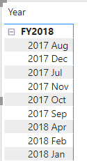
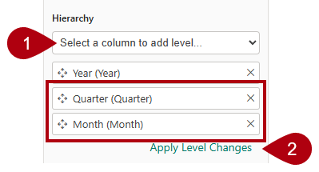
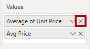

---
lab:
  title: 在语义模型中创建 DAX 计算
  module: Create DAX calculations in semantic models
---

# 在语义模型中创建 DAX 计算

## 实验室场景

在本实验室中，你将使用 Data Analysis Expressions (DAX) 创建计算表、计算列和简单度量值。

在此实验室中，你将了解如何完成以下操作：

- 创建计算表。
- 创建计算列。
- 创建度量值。

**此实验室应该大约需要 45 分钟。**

## 开始使用

若要完成本练习，请先打开 Web 浏览器并输入以下 URL 以下载 zip 文件：

`https://github.com/MicrosoftLearning/PL-300-Microsoft-Power-BI-Data-Analyst/raw/Main/Allfiles/Labs/04-create-dax-calculations\04-dax-calculations.zip`

将文件解压缩到 C:\Users\Student\Downloads\04-dax-calculations**** 文件夹。

打开 04-Starter-Sales Analysis.pbix**** 文件。

> _注意****：文件加载时，可能会看到登录对话框。选择“取消”以关闭登录对话框。**** 关闭所有其他信息窗口。如果系统提示应用更改，请选择“稍后应用”****。_

## 创建销售员计算表

在本任务中，创建`Salesperson` 计算表（该表与`Sales` 表之间有之间关系）。

计算表的创建方式为，先输入表名称，后面依次跟等于号 (=) 和返回表的 DAX 公式。 表名称不能是数据模型中已有的。

在“公式栏”中输入一个有效的 DAX 公式__。 公式栏包括自动完成、Intellisense 和颜色编码等功能，让你能够快速、准确地输入公式。

1. 在 Power BI Desktop 中，在“报表”视图的“建模”功能区上，选择“计算”组中的“新建表”****************。

    

1. 在公式栏中（在创建或编辑计算时会在功能区的正下方打开）中键入“`Salesperson =`”，按 Shift+Enter****，键入“`'Salesperson (Performance)'`”，然后按 Enter****。

    > _注意****：为方便起见，本实验室中的所有 DAX 定义都可以从位于 04-dax-calculations\Snippets.txt 文件中的片段文件中复制。****_

    

    > 此表定义创建`Salesperson (Performance)` 表的副本。__ 它仅复制数据，但是不复制模型属性（如可见性、格式设置等）。

1. 在“数据”窗格中，请注意，新表的图标前面还有一个计算器图标（表示计算表）。****

    

    > _注意****：计算表是使用返回表的 DAX 公式来定义的。请务必了解，计算表会增加数据模型的大小，因为它们会具体化和存储值。另外，每当刷新公式依赖项时，都会对其进行重新计算，就像在此数据模型中将新（未来）日期值加载到表中时一样。_
    >
    > 与基于 Power Query 的表不同，计算表不能用于从外部数据源加载数据。__ 它们只能根据已加载到数据模型中的内容来转换数据。

1. 切换到“模型”视图，并注意`Salesperson` 表不可用。****

1. 创建从`Salesperson | EmployeeKey` 列到`Sales | EmployeeKey` 列的关系。

    > _实验室使用速记表示法引用字段。它将如下所示：`Salesperson | EmployeeKey`。在此示例中，`Salesperson` 是表名，`EmployeeKey` 是字段名。_

1. 右键单击`Salesperson (Performance)` 和`Sales` 表之间的非活动关系，然后选择“删除”****。 当看到确认删除的提示时，选择**是**。

1. 在`Salesperson` 表中，选择以下列，然后将其隐藏（将“隐藏”**** 属性设置为“是”__）：

    - `EmployeeID`
    - `EmployeeKey`
    - `UPN`

1. 在模型图中，选择`Salesperson` 表。

1. 在“属性”**** 窗格的“说明”**** 框中，输入：与销售额相关的销售员****

    > 回想一下，每当用户将光标悬停在表或字段上时，描述将显示为“数据”窗格中的工具提示。_****_

1. 对于`Salesperson (Performance)` 表，将说明设置为：销售人员与一个或多个区域相关__

> 数据模型现在会在分析销售人员时提供两种替代方案。__`Salesperson` 表可便于分析销售人员的销售额，而`Salesperson (Performance)` 表则可便于分析分配给销售人员的一个或多个销售区域中的销售额。

## 创建“Date”表

在此任务中，你将创建`Date` 表。

1. 切换到“表”视图。**** 在“主页”功能区选项卡上，选择“计算”组中的“新建表”。

    

1. 在公式栏中，输入以下 DAX：

    ```dax
    Date =  
    CALENDARAUTO(6)
    ```

    

    > `CALENDARAUTO` 函数返回一个由日期值组成的单列表。_“自动”行为扫描所有数据模型日期列，以确定存储在数据模型中的最旧和最新日期值。_ 然后，它为此范围内的每个日期都创建一行，并在两个方向上扩展此范围，以确保存储全年的数据。
    >
    > 此函数可以采用一个可选参数，该参数表示一年的最后一个月。_如果省略，则值为“12”，表示 12 月是一年的最后一个月。_ 在此示例中，输入“6”，表示 6 月是一年的最后一个月。

1. 请注意日期值列，该列可能使用美国区域设置（即月/日/年）进行格式设置。

    

1. 在左下角的状态栏中，我们注意到表统计信息确认生成了 1826 行数据，这代表五个全年的数据。

    

## 创建计算列

在此任务中，添加其他列，以支持按不同时间段进行筛选和分组。 你还将创建一个计算列来控制其他列的排序顺序。

> _注意****：为方便起见，本实验室中所有 DAX 定义都可以从 Snippets.txt 文件中复制。****_

1. 在“表工具”关联功能区上，选择“计算”组中的“新建列”。

    > 计算列的创建方式为：先输入列名，后面依次是等号 (=) 和返回单值结果的 DAX 公式。该列名不能已存在于表中。

    

1. 在公式栏中键入以下内容（或从代码片段文件中复制），然后按 Enter：

    > 此公式使用日期的年份值，但如果月份是在 6 月后，则会在年份值上加 1。__ 这就是 Adventure Works 会计年度的计算方式。

   ```dax
   Year =
   "FY" & YEAR('Date'[Date]) + IF(MONTH('Date'[Date]) > 6, 1)
   ```

1. 使用代码片段文件定义为`Date` 表创建以下两个计算列：

    - `Quarter`
    - `Month`

1. 验证是否已添加新列。

    

1. 若要验证计算，请切换到“报表”视图。****

1. 若要创建新的报表页，请选择“第 1 页”旁边的加号图标****。

    

1. 若要将矩阵视觉对象添加到新的报表页，请在“可视化效果”窗格中选择矩阵视觉对象类型。

    > _提示：_ 可以将光标悬停在每个图标上，以查看描述视觉对象类型的工具提示。

    

1. 在“数据”窗格中，从`Date` 表内，将`Year` 字段拖入“行”井中********。

    

1. 将“`Month`”字段拖到“行”**** 井中“`Year`”字段的正下方。

1. 在矩阵视觉对象的右上角（或底部，取决于视觉对象的位置），选择“叉状双箭头”图标（可将所有年份向下展开一个级别）。

    

1. 我们注意到，年份展开到月份，月份是按字母顺序排序，而不是按时间顺序排序。

    

    > _默认情况下，文本值按字母顺序排序，数字按从小到大的顺序排序，日期按从早到晚的顺序排序。_

1. 若要自定义`Month` 字段排序顺序，请切换到“表”视图。****

1. 将`MonthKey` 列添加到`Date` 表中。

    ```dax
    MonthKey =
    (YEAR('Date'[Date]) * 100) + MONTH('Date'[Date])
    ```

    > _此公式会为每个年份/月份组合计算一个数值。_

1. 在“表”视图中，验证新列是否包含数值（例如，201707 表示 2017 年 7 月等）。****

    

1. 切换回“报表”视图。****

1. 在“数据”窗格中**** 选择`Month` 字段。

1. 在“列工具”关联功能区上，选择“排序”组中的“按列排序”，然后选择“MonthKey”。

    

1. 在矩阵视觉对象中，我们注意到，月份现在按时间顺序排序。

    

## 完成“Date”表

在此任务中，你将通过隐藏列和创建层次结构来完成`Date` 表的设计。 然后，你将创建与“`Sales`”和“`Targets`”表的关系。

1. 切换到“模型”视图。

1. 在`Date` 表中，隐藏`MonthKey` 列（将“隐藏”设置为“是”）****__。

1. 在“数据”窗格中，选择“`Date`”表，右键选择“`Year`”列，然后选择“创建层次结构”********。

    

1. 在“属性”**** 窗格中的“名称”**** 框中，将值替换为“Fiscal”__。

    

1. 向层次结构添加级别的方法是，在“层次结构”下拉列表中选择“Quarter”，再依次选择“Month”和“应用级别更改”****************。

    

1. 创建以下两个模型关系：

    - `Date | Date` 至`Sales | OrderDate`
    - `Date | Date` 至`Targets | TargetMonth`

1. 隐藏以下两列：

    - `Sales | OrderDate`
    - `Targets | TargetMonth`

## 标记日期表

在此任务中，你将把“`Date`”表标记为日期表。

1. 切换到“报表”视图。

1. 在“数据”**** 窗格中，选择“`Date`”表（不是“`Date`”字段）。

1. 在**表工具**上下文功能区上，从**日历**组中选择**标记为日期表**。

    

1. 在“标记为日期表”**** 窗口中，将“标记为日期表”**** 属性滑动到“是”__。

1. 在“选择日期列”下拉列表中，选择“日期”********。

    

1. 选择“保存”。

1. 保存 Power BI Desktop 文件。

> Power BI Desktop 现在知道此表定义的是日期（时间）__。
>
> 当数据源中没有日期表时，这种日期表设计方法适用。__ 如果你有数据仓库，则应该从其日期维度表（而不是数据模型中的“重新定义”日期逻辑）中加载日期数据。

## 创建简单的度量值

在此任务中，你将创建简单的度量值。 简单的度量值聚合单个列中的值或对表中的行进行计数。

1. 在“报表”视图“第 2 页”上的“数据”窗格中，将“`Sales | Unit Price`”字段拖到矩阵视觉对象************。

    

1. 请注意，在视觉对象字段窗格（位于“可视化效果”窗格之下）的“值”井中，“`Unit Price`”字段已配置为“Average of Unit Price”************。

    

1. 选择“Average of Unit Price”**** 的向下箭头，然后注意可用的菜单选项。

    > 借助可见的数值列，报表作者可以在设计报表时确定汇总（或不汇总）列值的方式。__ 但是，这可能会生成不当的报表。
    >
    > 某些数据建模人员不喜欢碰运气，他们选择隐藏这些列，而不是公开度量值中定义的聚合逻辑。__ 这就是你将要在本实验室中采用的方法。

1. 若要创建度量值，请在“数据”**** 窗格中右键单击“`Sales`”表，然后选择“新建度量值”****。

1. 在编辑栏中，添加以下度量值定义：

    ```DAX
    Avg Price =  
    AVERAGE(Sales[Unit Price])
    ```

1. 将`Avg Price` 度量值添加到矩阵视觉对象中，注意它生成的结果与`Unit Price` 列相同（但格式不同）。

1. 在“值”井中，打开`Avg Price` 字段的上下文菜单，可以注意到无法更改聚合技术****。

    

    > 无法修改度量值的聚合行为。__

1. 使用代码片段文件定义为`Sales` 表创建以下五个度量值：

    - `Median Price`
    - `Min Price`
    - `Max Price`
    - `Orders`
    - `Order Lines`

    > “`Orders`”度量值中使用的`DISTINCTCOUNT` 函数只会对订单进行一次计数（忽略重复项）。__“`Order Lines`”度量值中使用的`COUNTROWS` 函数对表执行运算。
    >
    > 在此示例中，订单数是通过统计非重复“`SalesOrderNumber`”列值来计算的，而订单行数则就是表行数（每行都是一个订单行）。__

1. 切换到“模型”视图，然后选择四个价格度量值：`Avg Price`、`Max Price`、`Median Price` 和`Min Price`。****

1. 对于选择的多个度量值，配置以下要求：

    - 将格式设置为两位小数。
    - 分配给名为“Pricing”的显示文件夹__（使用“属性”窗格中的“显示文件夹”属性********）。

    

1. 隐藏`Unit Price` 列。

    > 报表作者现在无法使用“`Unit Price`”列。他们必须使用你添加到模型中的定价度量值。这种设计方法可确保报表作者不会以不当的方式对价格进行聚合（例如，通过对价格进行求和）。__

1. 同时选择“`Order Lines`”和“`Orders`”度量值并配置以下要求：

    - 设置使用千位分隔符的格式。
    - 分配到名为“Counts”__ 的显示文件夹。

    

1. 在“报表”视图中，在矩阵视觉对象的“值”井中，选择“Average of Unit Price”的“X”将其移除。****************

    

1. 增加矩阵视觉对象的大小，以占满报表页的宽度和高度。

1. 在“矩阵”视觉对象中添加以下五个新度量值：

    - `Median Price`
    - `Min Price`
    - `Max Price`
    - `Orders`
    - `Order Lines`

1. 验证结果是否合理，以及格式是否正确。

    

## 创建其他度量值

在此任务中，创建使用更复杂表达式的其他度量值。

1. 在“报表”视图中，选择“第 1 页”并查看销售人员的表视觉对象（位于右侧），注意“Sum of Target”列的总计************。

    

1. 选择表视觉对象，然后在“可视化效果”窗格中，删除“Sum of Target”********。

1. 将`Targets | Target` 重命名为 TargetAmount__。

    > _提示：有多种方法可以在“报表”视图中重命名列：**** 在“数据”窗格中，可以右键单击相应的列，然后选择“重命名”；或双击相应的列；或按 F2。************_

1. 在“`Targets`”表上创建以下度量值：

    ```dax
    Target =
    IF(
        HASONEVALUE('Salesperson (Performance)'[Salesperson]),
        SUM(Targets[TargetAmount])
    )
    ```

    > `HASONEVALUE` 函数测试是否在“`Salesperson`”列中筛选出单个值。如果为 true，则表达式返回目标额总和（仅针对此销售人员）。如果为 false，返回`BLANK`。__

1. 将“`Target`”度量值的格式设置为没有小数位。

    > _提示：_ 可以使用“度量值工具”上下文功能区。

1. 隐藏`TargetAmount` 列。

    > 提示：在“数据”窗格中，可以右键单击该列，然后选择“隐藏”__。

1. 我们注意到，“`Targets`”表现在显示在列表的最上面。

    

    > _只包含可见度量值的表会自动在列表的最上面列出。_

1. 将“`Target`”度量值添加到表视觉对象。

1. 我们注意到，“Target”**** 列总计现在为`BLANK`。

    

1. 使用代码片段文件定义为“`Targets`”表创建以下两个度量值：

    - `Variance`
    - `Variance Margin`

1. 将“`Variance`”度量值的格式设置为没有小数位。

1. 将“`Variance Margin`”度量值的格式设置为带有两个小数位数的百分比。

1. 向表视觉对象添加“`Variance`”和“`Variance Margin`”度量值。

1. 重设表视觉对象的大小，以便查看所有列和行。

    

    > 虽然看上去所有销售员都未达到目标，但请记住，尚未按特定时间段对表视觉对象进行筛选。__“在 Power BI Desktop 中设计报表”实验室中将按用户所选的时间段进行筛选，来生成销售绩效报表****。

1. 保存 Power BI Desktop 文件。

## 实验已完成

可以选择保存 Power BI 报表，尽管此实验室不需要这样做。 在下一个练习中，你将使用预先制作的初学者文件。

1. 导航到左上角的“文件”菜单，然后选择“另存为”。******** 
1. 选择“浏览此设备”。
1. 选择要在其中保存文件的文件夹，并为其指定描述性名称。 
1. 选择“保存”按钮，将报表另存为 .pbix 文件。**** 
1. 如果出现一个对话框，提示你应用挂起的查询更改，请选择“应用”。****
1. 关闭 Power BI Desktop。