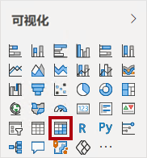
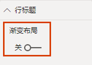
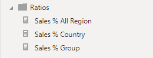
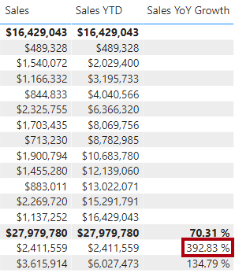

---
lab:
  title: 在 Power BI Desktop 中创建高级 DAX 计算
  module: Create Model Calculations using DAX in Power BI
---

# 在 Power BI Desktop 中创建高级 DAX 计算

## **实验室场景**

在本实验室中，使用涉及筛选器上下文操作的 DAX 表达式来创建度量值。

本实验室介绍如何完成以下操作：

- 使用 CALCULATE() 函数控制筛选器上下文
- 使用时间智能函数

**此实验室应该大约需要 45 分钟。**

## 开始使用

若要完成本练习，请先打开 Web 浏览器并输入以下 URL 以下载 zip 文件夹：


`https://github.com/MicrosoftLearning/PL-300-Microsoft-Power-BI-Data-Analyst/raw/Main/Allfiles/Labs/05-create-dax-calculations-in-power-bi-desktop-advanced/05-advanced-dax.zip`

将文件夹解压缩到 C:\Users\Student\Downloads\05-advanced-dax **** 文件夹。

打开 05-Starter-Sales Analysis.pbix **** 文件。

> ***备注**：可以通过选择“取消”**** 来取消登录。 关闭所有其他信息窗口。 如果系统提示应用更改，请选择“稍后应用”****。*

## 创建矩阵视觉对象

在此任务中，创建一个矩阵视觉对象来支持测试新的度量值。

1. 在 Power BI Desktop 的“报表”视图**** 中，新建一个报表页。

1. 在“第 3 页”上，添加一个矩阵视觉对象。

    

1. 调整矩阵视觉对象的大小，以占满整个报表页。

1. 若要配置矩阵视觉对象字段，请将“Region \| Regions”层次结构从“数据”窗格中拖放到视觉对象中 。

    > 实验室使用速记表示法引用字段或层次结构。*它将如下所示：Region \| Regions。在此示例中，Region 是表名称，Regions 是层次结构名称。 *

1. 将“Sales \| Sales”**** 字段也添加到“值”中。

1. 若要展开整个层次结构，请选择矩阵视觉对象右上角的分叉双箭头图标两次。

    

1. 若要设置矩阵视觉对象的格式，请选择“可视化”窗格下的“格式”窗格。

    

1. 在“搜索”**** 框中，输入“布局”****。

1. 将“布局”**** 属性设置为“表格”****。

    

1. 验证矩阵视觉对象是否有 4 个列标题。

    

    > 在 Adventure Works 中，销售区域分为组、国家/地区和区域。*除美国之外的其他所有国家/地区都只有一个区域（以国家/地区命名）。* 由于美国的销售区域非常大，该国分为五个销售区域。

在此练习中，你将创建多个度量值，然后通过将它们添加到矩阵视觉对象来测试它们。

## 控制筛选器上下文

在此任务中，通过 DAX 表达式来创建多个度量值，这些表达式使用 CALCULATE() 函数来操作筛选器上下文。

> CALCULATE() 函数是一种功能强大的函数，用于控制筛选器上下文。*第一个参数接受表达式或度量值（度量值就是命名表达式）。* 后续参数可便于修改筛选器上下文。

1. 基于以下表达式向“Sales”表添加一个度量值：

    > **备注**：为方便起见，本实验室中的所有 DAX 定义都可以从 C:\Users\Student\Downloads\05-advanced-dax\Snippets.txt **** 文件中复制。**

    ```DAX
    Sales All Region =

    CALCULATE(SUM(Sales[Sales]), REMOVEFILTERS(Region))
    ```

    >
    > REMOVEFILTERS() 函数用于删除活动筛选器。它可以不接受任何参数，也可以接受一个表、一列或多列作为它的参数。
    >
    > 在此公式中，度量值计算修改后的筛选器上下文中“Sales”列的总和，这将删除应用到“Region”表的任何筛选器。* *

1. 将“Sales All Region”度量值添加到矩阵视觉对象。

    

1. 我们注意到，“Sales All Region”度量值计算每个区域、国家/地区（小计）和组（小计）的所有区域销售总额。

    此新度量值尚未生成有用的结果。将某个组、国家/地区或区域的销售额除以该值，便会得出一个有用的比率，称为“占总计的百分比”。

1. 务必选中“数据”窗格中的“Sales All Region”度量值（选中后呈现深灰色背景），然后将公式栏中的度量值名称和公式替换为以下公式：

    提示：要替换现有公式，请先复制代码片段。然后，在编辑栏中单击，并按 Ctrl+A 选择所有文本。然后，按 Ctrl+V 粘贴代码片段，以覆盖所选文本。然后，按 Enter。

    ```DAX
    Sales % All Region =  
    DIVIDE(  
     SUM(Sales[Sales]),  
     CALCULATE(  
     SUM(Sales[Sales]),  
     REMOVEFILTERS(Region)  
     )  
    )
    ```

    此度量值已重命名，以准确反映更新后的公式。*DIVIDE() 函数将“Sales”度量值（未经筛选器上下文修改）除以修改后的上下文中的“Sales”度量值（即删除了应用于“Region”表的任何筛选器）。  *

1. 在矩阵视觉对象中，我们注意到，此度量值已重命名，现在每个组、国家/地区和区域的显示值都不同。

1. 将“Sales % All Region”度量值的格式设置为，有两位小数的百分比。

1. 在矩阵视觉对象中，审阅“Sales % All Region”度量值的值。

    

1. 根据以下表达式，向“Sales”表添加另一个度量值，并将格式设置为百分比：

    ```DAX
    Sales % Country =  
    DIVIDE(  
     SUM(Sales[Sales]),  
     CALCULATE(  
     SUM(Sales[Sales]),  
     REMOVEFILTERS(Region[Region])  
     )  
    )
    ```

1. 我们注意到，“Sales % Country”度量值公式与“Sales % All Region”度量值公式略有不同。

    不同之处在于，分母修改筛选器上下文的方法是，删除“Region”表的“Region”列上的筛选器，而不是删除“Region”表的所有列上的筛选器。也就是说，应用于组或国家/地区列的所有筛选器都会保留。它获得的结果表示销售额在国家/地区中所占的百分比。

1. 将“Sales % Country”度量值添加到矩阵视觉对象。

1. 我们注意到，只有美国的区域生成的值不是 100%。

    

    > 回想一下，只有美国有多个区域。所有其他国家/地区都只有一个区域，这就解释了为什么它们对应的值都是 100%。

1. 若要提高此度量值在矩阵视觉对象中的可读性，请使用以下改进的公式来覆盖“Sales % Country”度量值。

    ```DAX
    Sales % Country =  
    IF(  
     ISINSCOPE(Region[Region]),  
     DIVIDE(  
     SUM(Sales[Sales]),  
     CALCULATE(  
     SUM(Sales[Sales]),  
     REMOVEFILTERS(Region[Region])  
     )  
     )  
    )
    ```

    > IF() 函数使用 ISINSCOPE() 函数测试区域列是否为级别层次结构中的级别。如果为 true，则计算 DIVIDE() 函数。如果为 false，则返回空白值，因为区域列不在范围内。

1. 我们注意到，“Sales % Country”度量值现在只在区域处于范围内时才返回值。

    

1. 根据以下表达式，向“Sales”表添加另一个度量值，并将格式设置为百分比：

    ```DAX
    Sales % Group =  
    DIVIDE(  
     SUM(Sales[Sales]),  
     CALCULATE(  
     SUM(Sales[Sales]),  
     REMOVEFILTERS(  
     Region[Region],  
     Region[Country]  
     )  
     )  
    )
    ```

    > *为了取得表示销售额在组中所占百分比的结果，可以应用两个筛选器来有效地删除两列上的筛选器。*

1. 将“Sales % Group”度量值添加到矩阵视觉对象。

1. 若要提高此度量值在矩阵视觉对象中的可读性，请使用以下改进的公式来覆盖“Sales % Group”度量值。

    ```DAX
    Sales % Group =  
    IF(  
     ISINSCOPE(Region[Region])  
     || ISINSCOPE(Region[Country]),  
     DIVIDE(  
     SUM(Sales[Sales]),  
     CALCULATE(  
     SUM(Sales[Sales]),  
     REMOVEFILTERS(  
     Region[Region],  
     Region[Country]  
     )  
     )  
     )  
    )
    ```

1. 我们注意到，“Sales % Group”度量值现在只在区域或国家/地区处于范围内时才返回值。

1. 在“模型”视图中，将这三个新度量值放入名为“Ratios”的显示文件夹中。

    

1. 保存 Power BI Desktop 文件。

添加到“Sales”表中的度量值修改了筛选器上下文来实现分层导航。*我们注意到，用于计算小计的模式需要从筛选器上下文中删除一些列，而为了计算总计，则必须删除所有列。*

## 创建 YTD 度量值

在此任务中，你将使用时间智能函数创建一个年初至今 (YTD) 的销售额度量值。

1. 在“报表”视图中的“第 2 页”上，注意矩阵视觉对象显示了多个度量值，并在行上对年份和月份进行了分组。

2. 根据以下表达式，向“Sales”表添加一个度量值，并将格式设置为没有小数位：

    ```DAX
    Sales YTD =  
    TOTALYTD(SUM(Sales[Sales]), 'Date'[Date], "6-30")
    ```

    > *TOTALYTD() 函数对给定日期列计算表达式（在本例中为对**销售额**列求和）。日期列必须属于标记为日期表的日期表。*
    >
    > 此函数还可以接受第三个可选参数，即表示一年中的最后一天。*如果没有此日期，则表示 12 月 31 日是一年中的最后一天。* 对于 Adventure Works，6 月是一年中的最后一个月，因此使用的是“6-30”。

3. 向矩阵视觉对象添加“Sales”字段和“Sales YTD”度量值。

4. 注意一年内销售额的累计。

    

TOTALYTD() 函数执行筛选器控制，特别是时间筛选器控制。*例如，若要计算 2017 年 9 月（会计年度的第三个月）的 YTD 销售额，则会删除“Date”表上的所有筛选器，取而代之的是新筛选器，此筛选器筛选出从年初（2017 年 7 月 1 日）一直到上下文内日期期限的最后一天（2017 年 9 月 30 日）的所有日期。*

*DAX 中提供了许多时间智能函数来支持常见的时间筛选器控制。*

## 创建 YoY 增长率度量值

在此任务中，你将使用变量创建一个销售额同比增长的度量值。

> 变量可帮助简化公式，如果在公式中多次使用该逻辑，效率会更高。变量使用唯一名称声明，然后必须在 RETURN **** 关键字后输出度量值表达式。与其他一些编码语言变量不同，DAX 变量只能在单个公式中使用。**

1. 基于以下表达式向“Sales”表添加其他度量值：

    ```DAX
    Sales YoY Growth =  
    VAR SalesPriorYear =  
     CALCULATE(  
     SUM(Sales[Sales]),  
     PARALLELPERIOD(  
     'Date'[Date],  
     -12,  
     MONTH  
     )  
     )  
    RETURN  
     SalesPriorYear
    ```

    > “SalesPriorYear”变量分配给在修改后的上下文中对“Sales”列进行求和的表达式，修改后的上下文使用 PARALLELPERIOD() 函数从筛选器上下文中的每个日期往回移动 12 个月。

1. 将“Sales YoY Growth”度量值添加到矩阵视觉对象。

1. 请注意，新的度量值对前 12 个月返回 BLANK（2017 会计年度之前没有任何销售额记录）。

1. 请注意，2018 年 7 月的“Sales YoY Growth”度量值的值是 2017 年 1 月的“Sales”值。

    

    > 至此，公式的“困难部分”已经过测试，可以用计算增长率结果的最终公式来覆盖此度量值了。

1. 若要完成此度量值，请使用以下公式来覆盖“Sales YoY Growth”度量值，并将格式设置为有两位小数的百分比：

    ```DAX
    Sales YoY Growth =  
    VAR SalesPriorYear =  
     CALCULATE(  
     SUM(Sales[Sales]),  
     PARALLELPERIOD(  
     'Date'[Date],  
     -12,  
     MONTH  
     )  
     )  
    RETURN  
     DIVIDE(  
     (SUM(Sales[Sales]) - SalesPriorYear),  
     SalesPriorYear  
     )
    ```

1. 在公式的“RETURN”子句中，我们注意到，变量被引用了两次。

1. 验证 2018 年 7 月的 YoY 增长率是否为“392.83%”。

    

    > YoY Growth 度量值表明，销售额比去年同期增长了近 400%（或 4 倍）。

1. 在“模型”视图中，将这两个新度量值放入名为“Time Intelligence”的显示文件夹中。

    

## 实验已完成
