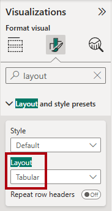
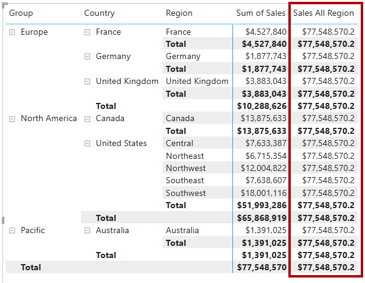

---
lab:
  title: 在 Power BI 中修改 DAX 筛选器上下文
  module: Modify DAX filter context in Power BI
---

# 在 Power BI 中修改 DAX 筛选器上下文

## 实验室场景

在本实验室中，你将使用涉及筛选器上下文操作的 DAX 表达式来创建度量值。

学习如何：

 - 使用`CALCULATE` 函数控制筛选器上下文。

**此实验室应该大约需要 30 分钟。**

## 开始使用

若要完成本练习，请先打开 Web 浏览器并输入以下 URL 以下载 zip 文件：

`https://github.com/MicrosoftLearning/PL-300-Microsoft-Power-BI-Data-Analyst/raw/Main/Allfiles/Labs/05-modify-dax-filter-context/05-modify-dax-filter-context.zip`

将文件解压缩到 C:\Users\Student\Downloads\05-modify-dax-filter-context**** 文件夹。

打开 05-Starter-Sales Analysis.pbix**** 文件。

> _注意****：文件加载时，可能会看到登录对话框。选择“取消”以关闭登录对话框。**** 关闭所有其他信息窗口。如果系统提示应用更改，请选择“稍后应用”****。_

## 创建矩阵视觉对象

在此任务中，创建一个矩阵视觉对象来支持测试新的度量值。

1. 在 Power BI Desktop 中创建新报表页。

1. 在“第 3 页”上，添加一个矩阵视觉对象。

    

1. 调整矩阵视觉对象的大小，以占满整个报表页。

1. 若要配置矩阵视觉对象字段，请将“`Region | Regions`”层次结构从“数据”窗格拖放到视觉对象中****。

    > 实验室使用速记表示法引用字段或层次结构。 该 URL 如下所示：`Region | Regions`。 在此示例中，`Region` 是表名，`Regions` 是层次结构名称。

1. 向“值”井添加“`Sales | Sales`”字段****。

1. 若要展开整个层次结构，请选择矩阵视觉对象右上角的分叉双箭头图标两次。

    

1. 若要设置矩阵视觉对象的格式，请选择“可视化”窗格下的“格式”窗格。

    

1. 在“搜索”**** 框中，输入“布局”__。

1. 将“布局”**** 属性设置为“表格”__。

    

1. 验证矩阵视觉对象是否有 4 个列标题。

    

    > 在 Adventure Works 中，销售区域分为组、国家/地区和区域。_除美国之外的其他所有国家/地区都只有一个区域（以国家/地区命名）。由于美国的销售区域非常大，该国分为五个销售区域。_

在此练习中，你将创建许多度量值，然后通过将它们添加到矩阵视觉对象来测试它们。

## 控制筛选器上下文

在此任务中，通过 DAX 表达式来创建多个度量值，这些表达式使用`CALCULATE` 函数来操作筛选器上下文。

> _`CALCULATE` 函数是一种功能强大的函数，用于控制筛选器上下文。第一个参数接受表达式或度量值（度量值就是命名表达式）。_ 后续参数可便于修改筛选器上下文。

1. 基于以下表达式向“`Sales`”表添加一个度量值：

    > _注意****：为方便起见，本实验室中的所有 DAX 定义都可以从 C:\Users\Student\Downloads\05-modify-dax-filter-context\Snippets.txt 文件中复制****_。

    ```dax
    Sales All Region =
    CALCULATE(
        SUM(Sales[Sales]),
        REMOVEFILTERS(Region)
    )
    ```

    > _`REMOVEFILTERS` 函数用于删除活动筛选器。_ 它可以不接受任何参数，也可以接受一个表、一列或多列作为它的参数。
    >
    > 在此公式中，度量值计算修改后的筛选器上下文中“`Sales`”列的总和，这将删除应用到“`Region`”表的任何筛选器。__

1. 将“`Sales All Region`”度量值添加到矩阵视觉对象。

    

1. 我们注意到，该度量值计算每个区域、国家/地区（小计）和组（小计）的所有区域销售总额。

    > 此新度量值尚未生成有用的结果。__ 将某个组、国家/地区或区域的销售额除以该值，便会得出一个有用的比率，称为“占总计的百分比”。

1. 务必选中“数据”窗格中的“`Sales All Region`”度量值（选中后呈现深灰色背景），然后将公式栏中的度量值名称和公式替换为以下公式：****

    > 提示：要替换现有公式，请先复制代码片段。然后，在编辑栏中单击，并按 Ctrl+A 选择所有文本。然后，按 Ctrl+V 粘贴代码片段，以覆盖所选文本。然后，按 Enter。

    ```dax
    Sales % All Region =
    DIVIDE(
        SUM(Sales[Sales]),
        CALCULATE(
            SUM(Sales[Sales]),
            REMOVEFILTERS(Region)
        )
    )
    ```

    > 此度量值已重命名，以准确反映更新后的公式。__`DIVIDE` 函数将“`Sales`”列的和（未经筛选器上下文修改）除以修改后的上下文中的“`Sales`”列的和（即删除了应用于“`Region`”表的任何筛选器）。

1. 在矩阵视觉对象中，我们注意到，此度量值已重命名，现在每个组、国家/地区和区域的显示值都不同。

1. 将“`Sales % All Region`”度量值的格式设置为带有两个小数位数的百分比。

1. 在矩阵视觉对象中，查看“`Sales % All Region`”度量值的值。

    

1. 根据以下表达式，向“`Sales`”表添加另一个度量值，并将格式设置为百分比：

    ```dax
    Sales % Country =
    DIVIDE(
        SUM(Sales[Sales]),
        CALCULATE(
            SUM(Sales[Sales]),
            REMOVEFILTERS(Region[Region])
        )
    )
    ```

1. 请注意，“`Sales % Country`”度量值公式与“`Sales % All Region`”度量值公式略有不同。

    > 不同之处在于，分母修改筛选器上下文的方法是，删除“`Region`”表的“`Region`”列上的筛选器，而不是删除“`Region`”表的所有列上的筛选器。也就是说，应用于组或国家/地区列的所有筛选器都会保留。它获得的结果表示销售额在国家/地区中所占的百分比。__

1. 将“`Sales % Country`”度量值添加到矩阵视觉对象。

1. 我们注意到，只有美国的区域生成的值不是 100%。

    

    > 回想一下，只有美国有多个区域。__ 所有其他国家/地区都只有一个区域，这就解释了为什么它们对应的值都是 100%。

1. 若要提高此度量值在视觉对象中的可读性，请使用以下改进的公式来覆盖“`Sales % Country`”度量值。

    ```dax
    Sales % Country =
    IF(
        ISINSCOPE(Region[Region]),
        DIVIDE(
            SUM(Sales[Sales]),
            CALCULATE(
                SUM(Sales[Sales]),
                REMOVEFILTERS(Region[Region])
            )
        )
    )
    ```

    > `IF` 函数使用`ISINSCOPE` 函数测试区域列是否为级别层次结构中的级别。如果为 true，则计算`DIVIDE` 函数。如果为 false, 则返回`BLANK`，因为区域列不在范围内。__

1. 我们注意到，“`Sales % Country`”度量值现在只在区域处于范围内时才返回值。

    

1. 根据以下表达式，向“`Sales`”表添加另一个度量值，并将格式设置为百分比：

    ```dax
    Sales % Group =
    DIVIDE(
        SUM(Sales[Sales]),
        CALCULATE(
            SUM(Sales[Sales]),
            REMOVEFILTERS(
                Region[Region],
                Region[Country]
            )
        )
    )
    ```

    > _为了取得表示销售额在组中所占百分比的结果，可以应用两个筛选器来有效地删除两列上的筛选器。_

1. 将“`Sales % Group`”度量值添加到矩阵视觉对象。

1. 若要提高此度量值在视觉对象中的可读性，请使用以下公式来覆盖“`Sales % Group`”度量值。

    ```dax
    Sales % Group =
    IF(
        ISINSCOPE(Region[Region])
            || ISINSCOPE(Region[Country]),
        DIVIDE(
            SUM(Sales[Sales]),
            CALCULATE(
                SUM(Sales[Sales]),
                REMOVEFILTERS(
                    Region[Region],
                    Region[Country]
                )
            )
        )
    )
    ```

1. 注意，“`Sales % Group`”度量值现在只在区域或国家/地区在范围内时才返回值。

1. 在“模型”视图中，将这三个新度量值放入名为“Ratios”的显示文件夹中。****__

    

1. 保存 Power BI Desktop 文件。

> _添加到“`Sales`”表中的度量值修改了筛选器上下文来实现分层导航。我们注意到，用于计算小计的模式需要从筛选器上下文中删除一些列，而为了计算总计，则必须删除所有列。_

## 实验已完成

可以选择保存 Power BI 报表，尽管此实验室不需要这样做。 在下一个练习中，你将使用预先制作的初学者文件。

1. 导航到左上角的“文件”菜单，然后选择“另存为”。******** 
1. 选择“浏览此设备”。
1. 选择要在其中保存文件的文件夹，并为其指定描述性名称。 
1. 选择“保存”按钮，将报表另存为 .pbix 文件。**** 
1. 如果出现一个对话框，提示你应用挂起的查询更改，请选择“应用”。****
1. 关闭 Power BI Desktop。