---
lab:
  title: 在 Power BI Desktop 中设计报表
  module: Create Reports in Power BI Desktop
---

# 在 Power BI Desktop 中设计报表

## 实验室场景

在此实验室中，你将创建一个三页的报表。 然后，你要将它发布到 Power BI，接着打开报表并与之进行交互。

本实验室介绍如何完成以下操作：

- 设计报表
- 配置视觉对象字段和格式属性

**此实验室应该大约需要 45 分钟。**

## 开始使用

若要完成本练习，请先打开 Web 浏览器并输入以下 URL 以下载 zip 文件夹：

`https://github.com/MicrosoftLearning/PL-300-Microsoft-Power-BI-Data-Analyst/raw/Main/Allfiles/Labs/06-design-report-in-power-bi-desktop/06-design-report.zip`

将文件夹解压缩到 C:\Users\Student\Downloads\06-design-report**** 文件夹。

打开 06-Starter-Sales Analysis.pbix**** 文件。

> ***备注**：可以通过选择“取消”**** 来取消登录。 关闭所有其他信息窗口。 如果系统提示应用更改，请选择“稍后应用”****。*

## 设计页面 1

在此练习中，你将设计报表的第一页。 完成设计后，该页面将如下所示：

1. 在 Power BI Desktop 中，若要重命名该页，请在左下角右键单击“第 1 页”，然后将该页重命名为“Overview”  。

    > *提示：* 还可以双击页面名称以进行重命名。

1. 若要添加图像，请在“插入”功能区选项卡上的“元素”组中，选择“图像”。

    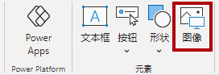

1. 在“打开”**** 窗口中，导航到 C:\Users\Student\Downloads\06-design-report**** 文件夹。

1. 选择 AdventureWorksLogo.jpg 文件，然后选择“打开”。

1. 将图像拖放到左上角，并拖动参考线标记以调整其大小。

     

1. 若要添加切片器，请先通过单击报表页的空白区域来取消选择图像，然后在“可视化效果”窗格中选择“切片器” 。

     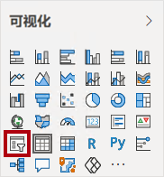

1. 在“数据”窗格中，将“Date \| Year”字段（而不是层次结构的“Year”级别）拖到“可视化效果”窗格中的切片器“字段”中   。

    > *实验室使用速记表示法引用字段。它将如下所示：Date \| Year。* 在此示例中，Date 是表名称，Year 是字段名称。

1. 要将切片器从列表转换为下拉列表，请导航到“可视化效果”>“设置视觉对象的格式”>“视觉对象”>“切片器设置”>“样式”，然后从下拉菜单中选择“下拉列表” 。

    

1. 调整切片器的大小和放置，使其位于图像下方，并且宽度与图像相同。

     

1. 在“Year”切片器中，打开下拉列表，选择“FY2020”，然后折叠下拉列表。
    > 报表页现在按年份“FY2020”进行筛选。**

     

1. 通过单击报表页的空白区域取消选择该切片器。

1. 基于“Region \| Region”字段（不是层次结构的“区域”级别）创建第二个切片器 。

1. 将切片器保留为列表，然后调整切片器的大小，并将其放置在“年份”切片器下。

     

1. 通过单击报表页的空白区域取消选择该切片器。

1. 若要将图表添加到页面，请在“可视化效果”窗格中，选择“折线和堆积柱形图”视觉对象类型。

     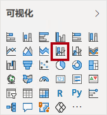

1. 调整视觉对象的大小和位置，使其位于徽标右侧，填充与报表页面相同的宽度。

     

1. 将以下字段拖放到视觉对象中：

     - Date \| Month****
     - Sales \| Sales****

1. 请注意，在视觉对象字段窗格（位于“可视化效果”窗格下方）中，这些字段已分配给“X 轴”和“Y 轴列”井/区域。

    > 通过将字段拖到视觉对象中即可将其添加到默认井/区域中。为了精确起见，可直接将字段拖到井/区域中，接下来你将执行此操作。

     

1. 将“Sales \| Profit Margin”字段从“数据”窗格拖动到“Y 轴行”井中  。

     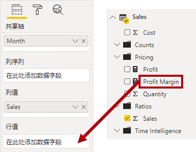

1. 请注意，视觉对象只有 11 个月。

    > 当年的最后一个月（即 2020 June）没有任何销售额（尚未发布）。默认情况下，视觉对象已删除销售额为“BLANK”的月份。现在可将视觉对象配置为显示所有月份。

1. 在视觉对象字段窗格中的“X 轴”井/区域中，对于“Month”字段，选择向下箭头，然后选择“显示没有数据的项”  。

    > 可以看到现在显示了月份“2020 June”。**

     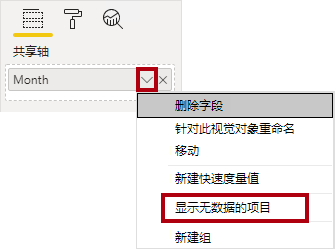

1. 通过单击报表页的空白区域取消选择该图表。

1. 要将图表添加到页面，请在“可视化效果”窗格中，选择“堆积柱形图”视觉对象类型 。

     

1. 调整该视觉对象的大小和位置，使其位于柱形图/折线图的下方，填充上方图表一半的宽度。

     

1. 将以下字段添加到视觉对象井/区域中：

     - X-轴：Region \| Country
     - Y 轴：Sales \| Sales
     - 图例：Product \| Category

1. 通过单击报表页的空白区域取消选择该图表。

1. 若要将图表添加到页面，请在“可视化效果”窗格中，单击“堆积条形图”视觉对象类型。

     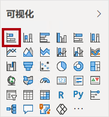

1. 调整该视觉对象的大小和位置，使其填充剩余的报表页面空间。

     

1. 将以下字段添加到视觉对象井/区域中：

     - Y-轴：Product \| Category
     - X-轴：Sales \| Quantity

1. 若要设置视觉对象的格式，请打开“格式”窗格。

     

1. 依次展开“条形图”、“颜色”组，然后将“默认颜色”属性设置为合适的颜色（以补充柱形图/折线图）  。

1. 将“数据标签”属性设置为“启用”。

     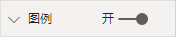

1. 保存 Power BI Desktop 文件。

*第一页的设计现已完成。*

## 设计页面 2

在此练习中，你将设计报表的第二页。 完成设计后，该页面将如下所示：

 

> ***重要说明**：在实验室中提供详细说明后，实验室步骤将提供更简洁的说明。 如果需要详细说明，可以回顾此实验室中的其他任务。*

1. 要创建新页，请选择左下角的加号图标，并将新页重命名为“Profit”。

1. 基于“Region \| Region”字段添加切片器。

1. 使用“格式”**** 窗格启用“全选”选项（在“切片器设置”>“选择”**** 组中） 。

1. 调整该切片器的大小和位置，使其位于报表页面左侧，高度约为页面高度的一半。

     

1. 添加矩阵视觉对象，并调整其大小和位置，使其填充剩余的报表页面空间

     

1. 向矩阵“行”井/区域添加“日期 \| 财务”层次结构 。

     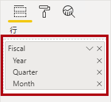

1. 将以下五个“Sales”表字段添加到“值”井/区域：

     - 订单****（来自“计数”**** 文件夹）
     - **销售**
     - **成本**
     - 利润****（来自“定价”**** 文件夹）
     - 利润率****（来自“定价”**** 文件夹）

     

1. 在“筛选器”窗格（位于“可视化效果”窗格左侧）中，请注意“此页面上的筛选器”井/区域（可能需要向下滚动才可看到）。

     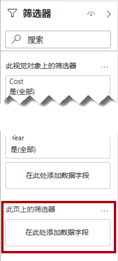

1. 将“Product \| Category”字段从“数据”窗格拖动到“筛选此页”井/区域中  。

    > 添加到“筛选器”窗格中的字段可以实现与切片器相同的结果。*区别之一是它们不占用报告页面上的空间。* 另一个区别是，可以通过配置它们来满足更加复杂的筛选要求。

1. 在筛选器卡中，选择右上角的箭头以折叠此卡。

1. 将以下每个“Product”表字段添加到“此页面上的筛选器”井/区域，并将其直接折叠在“类别”卡片下：

     - **Subcategory**
     - **Product**
     - **颜色**

     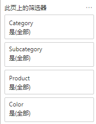

1. 保存 Power BI Desktop 文件。

*第二页的设计现已完成。*

## 设计页面 3

在此练习中，你将设计报表的第三页，也是最后一页。 完成设计后，该页面将如下所示：

 

1. 创建一个新的页面，然后将其重命名为“我的绩效”。

1. 要模拟行级安全筛选器的性能，请将“Salesperson (Performance) \| Salesperson”字段拖动到筛选器窗格中的页面级筛选器。

     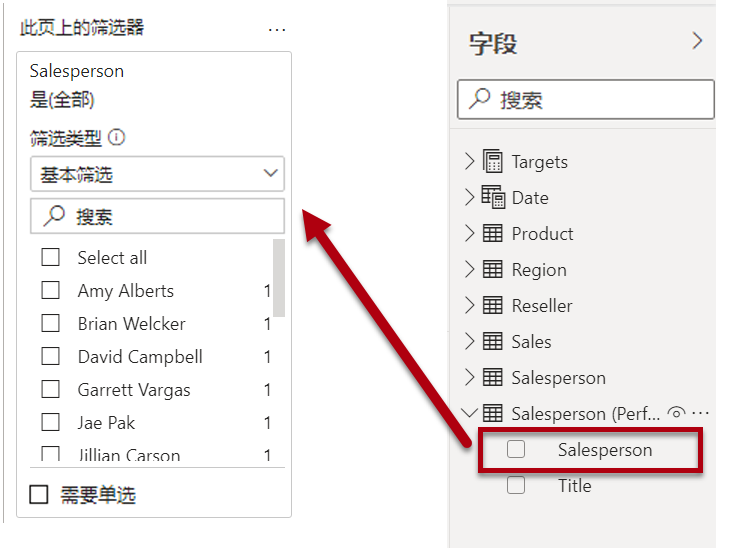

1. 选择“Michael Blythe”。 “My Performance”报表页面上的数据现将进行筛选，仅显示 Michael Blythe 的数据。

1. 基于“Date \| Year”字段添加下拉切片器，然后重设大小并重新定位，使其位于页面的左上角。

     

1. 在切片器中，将页面设置为按“FY2019”进行筛选。

     

1. 添加“多行卡”视觉对象，然后重设大小并重新定位，使其位于切片器的右侧，并填充页面的剩余宽度。

     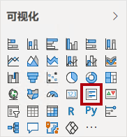

     

1. 向视觉对象添加以下四个字段：

     - Sales \| Sales****
     - 目标 \| 目标****
     - 目标 \| 差异****
     - 目标 \| 差异幅度****

1. 设置视觉对象的格式：

     - 在“标注值”组中，将“文本大小”属性增加到“28pt”

     - 在“常规”>“效果”>“背景”组中，将“颜色”设置为浅灰色（如“白色，深 20%”）以提供对比度

         

1. 添加一个“簇状条形图”视觉对象，然后调整其大小和位置，使其位于多行卡片视觉对象的下方，填充剩余的页面高度，并且宽度为多行卡片视觉对象宽度的一半。

     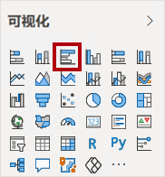

     

1. 将以下字段添加到视觉对象井/区域中：

     - Y-轴：Date \| Month
     - X 轴：Sales \| Sales 和 Targets \| Targets

         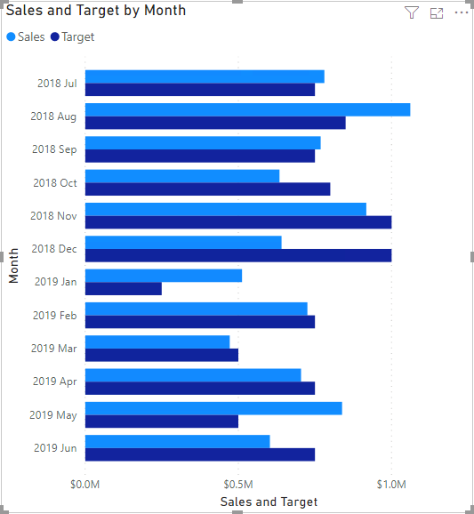

1. 若要创建视觉对象的副本，请按 Ctrl+C，然后按 Ctrl+V。

1. 将新的视觉对象放置在原始视觉对象的右侧。

     

1. 若要修改可视化效果类型，请在“可视化效果”窗格中选择“簇状柱形图”。

     > 现在可以看到用两种不同的可视化类型表示的相同数据**。

     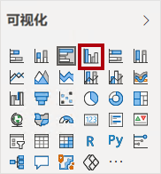

 最后一页的设计现已完成。**

## 发布和浏览报表

在本练习中，将报表发布到 Power BI 服务并浏览已发布的报表行为。

> **备注**：即使无法访问联机 Power BI 服务以直接执行任务，你也可以查看练习的其余部分。

1. 选择“概述”页，然后保存 Power BI Desktop 文件。

1. 在“主页”功能区选项卡上，选择“共享”组中的“发布”。

    > 如果尚未登录到 Power BI Desktop，需要先登录才能发布。

     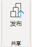

1. 请注意，在“发布到 Power BI”窗口中，已选择“我的工作区”。

    > 本实验室不会详细介绍 Power BI 服务中的不同项。

1. 要发布报表，请选择“选择”。 这可能需要一小段时间。

1. 发布成功后，选择“知道了”。

1. 打开 Microsoft Edge 浏览器，然后在  登录。

1. 在 Microsoft Edge 浏览器窗口，在 Power BI 服务的“导航”窗格（位于左侧，可能处于折叠状态）中，展开“我的工作区” 。

    

1. 查看工作区内容。

    - 工作区中可以有四种类型的项，我们将讨论“报表”**** 和“语义模型”****。

    - 如果语义模型不可见，可能需要刷新 Microsoft Edge 浏览器。

    - 当你发布了 Power BI Desktop 文件后，数据模型即发布为语义模型。

1. 要浏览报表，请选择 Sales Analysis 报表。

1. 在左侧的“页面”窗格中，选择“概述”页面。

1. 在“区域”切片器中，按住 Ctrl 键的同时选择多个区域。

1. 在柱形图/折线图中，选择任意月份列以交叉筛选页面。

1. 在按住 Ctrl 键的同时选择其他月份。

     > 注意：默认情况下，交叉筛选将筛选页面上的所有其他视觉对象。

1. 可以看到，已对条形图进行筛选并突出显示，其中粗体部分表示所筛选的月份。

1. 将光标悬停在条形图视觉对象上，然后在右上方将光标悬停在筛选器图标上。

    > *通过“筛选器”图标可了解应用于视觉对象的所有筛选器，包括来自其他视觉对象的切片器和交叉筛选器。*

1. 将光标悬停在条形图上，可以看到工具提示信息。

1. 若要撤消交叉筛选，请在柱形图/折线图中选择视觉对象的空白区域。

1. 将光标悬停在堆积柱形图视觉对象上，然后选择右上角的“焦点模式”图标。

    > *焦点模式会将视觉对象缩放至整页大小。*

     

1. 将光标悬停在条形图的不同段上，以显示工具提示。

1. 若要返回到“报表”页，请在左上方选择“返回报表”。

     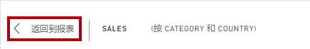

1. 再次将光标悬停在其中一个视觉对象上，然后选择右上角的省略号 (…)，查看显示的菜单选项。 试用每个选项，“**共享**”中的选项除外。

     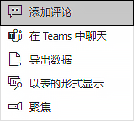

1. 在左侧的“页数”窗格，选择“Profit”页。

     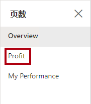

1. 请注意，“区域”切片器与“概述”页面上“区域”切片器中的所选内容并不相同  。

    > 切片器未同步。可在“在 Power BI Desktop 中增强报表”实验室中修改报表设计，以确保切片器在各个页之间同步。

1. 在“筛选器”窗格（位于右侧）中，展开筛选器卡，并应用一些筛选器。

    > 通过“筛选器”窗格，可以定义超出切片器页面范围的筛选器。**

1. 在矩阵视觉对象中，使用加号 (+) 按钮钻取“财务”层次结构。

1. 选择“我的绩效”页。

     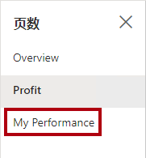

1. 在菜单栏的右上方，选择“查看”，然后选择“全屏”。

     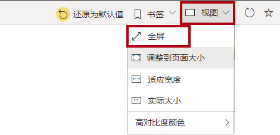

1. 通过修改切片器并交叉筛选页面来与页面进行交互。

1. 窗口底部显示用于更改页面、在页面之间向后或向前导航或退出全屏模式的命令。

1. 选择右侧图标退出全屏模式。

     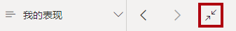

## 实验已完成
