---
lab:
  title: 在 Power BI Desktop 中增强报表
  module: Create Reports in Power BI desktop
---

# 在 Power BI Desktop 中增强报表

## 实验室场景

在此实验室中，通过高级设计功能增强“Sales Analysis”报表。

本实验室介绍如何完成以下操作：

- 同步切片器
- 创建钻取页
- 应用条件格式
- 创建并使用书签和按钮

**此实验室应该大约需要 45 分钟。**

## 开始使用

若要完成本练习，请先打开 Web 浏览器并输入以下 URL 以下载 zip 文件夹：

`https://github.com/MicrosoftLearning/PL-300-Microsoft-Power-BI-Data-Analyst/raw/Main/Allfiles/Labs/07-design-report-in-power-bi-desktop-enhanced/07-enhanced-report.zip`

将文件夹解压缩到 C:\Users\Student\Downloads\07-enhanced-report **** 文件夹。

打开 07-Starter-Sales Analysis.pbix **** 文件。

> ***备注**：可以通过选择“取消”**** 来取消登录。 关闭所有其他信息窗口。 如果系统提示应用更改，请选择“稍后应用”****。*

## 同步切片器

在此任务中，同步 Year 和 Region 切片器，继续开发在“在 Power BI Desktop 中设计报表”实验室中创建的报表 。

1. 在 Power BI Desktop 的“概述”页上，将“年份”切片器设置为“FY2018”。

1. 转到“我的绩效”页，然后注意“年份”切片器是另一个值。

    > 如果切片器不同步，可能会导致呈现出错误的数据，让报表用户受挫。现在同步报表切片器。

1. 返回到“概述”页，然后选择“年份”切片器。

1. 在“视图”功能区选项卡上的“显示窗格”组中，选择“同步切片器”。

     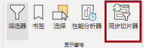

1. 在（“可视化效果”窗格左侧的）“同步切片器”窗格中的第二列（代表同步），选中“Overview”和“My Performance”页的复选框。

     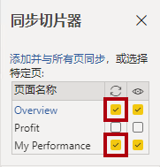

1. 在“概述”页上，选择“区域”切片器。

1. 将切片器与“概述”和“利润”页同步。

     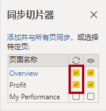

1. 可以这样测试同步切片器功能：选择不同的筛选器选项，然后验证所同步的切片器是否以相同的选项为依据进行筛选。

1. 若要关闭**同步切片器**页，请选择位于**视图**功能区选项卡上的**同步切片器**选项。

## 配置钻取页

在本练习中，创建一个新页，并将其配置为钻取页。 完成设计后，该页面将如下所示：

1. 添加名为“产品详细信息”的新报表页。

1. 右键单击“产品详细信息”页面选项卡，然后选择“隐藏页”。

    > 报表用户无法直接进入钻取页。*他们需要从其他页面的视觉对象进行访问。* 你将在本实验室的最后一个练习中了解如何钻取到页面。

1. 在“可视化效果”窗格下的“钻取”部分中，将“Product \| Category”字段添加到“在此处添加钻取字段”框   。

    > *实验室使用速记表示法引用字段。它将如下所示：Product \| Category。在此示例中，Product 是表名称，Category 是字段名称 。*

     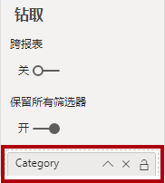

1. 若要测试钻取页，请在钻取筛选器卡中选择“自行车”。

     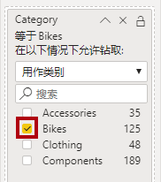

1. 在报表页的左上角，注意箭头按钮。

    > 将字段添加到钻取井/区域时，系统会自动添加一个按钮。报表用户可以通过该按钮导航回到其钻取起始页面。

1. 向页面添加“卡片”视觉对象，然后调整其大小和位置，使其位于按钮右侧，并填充剩余的页面宽度。

    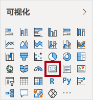

    

1. 将“Product \| Category”字段拖到卡片视觉对象。

1. 为视觉对象配置格式选项，然后将“类别标签”属性设置为“关闭”。

     

1. 将“效果”>“背景”颜色属性设置为浅灰色，如“白色，深 20%”。

     

1. 向页面添加“表”视觉对象，然后调整其大小和位置，使其位于卡片视觉对象下方，填充页面上的剩余空间。

     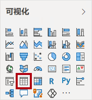

     

1. 向视觉对象添加以下字段：

     - “产品 \| 子类别”****
     - “产品 \| 颜色”****
     - Sales \| Quantity****
     - Sales \| Sales****
     - Sales \| Profit Margin****

1. 为视觉对象配置格式选项，并在**值**和**列**部分将**文本大小**属性设置为 **20pt**。

钻取页的设计即将完成。你将在下一个练习中使用条件格式来优化页面。

## 添加条件格式

在本练习中，使用条件格式增强钻取页。 完成设计后，该页面将如下所示：

1. 选择表视觉对象。 在“可视化效果”窗格中，选择“Profit Margin”值上的向下箭头，然后选择“条件格式”\|图标” 。

    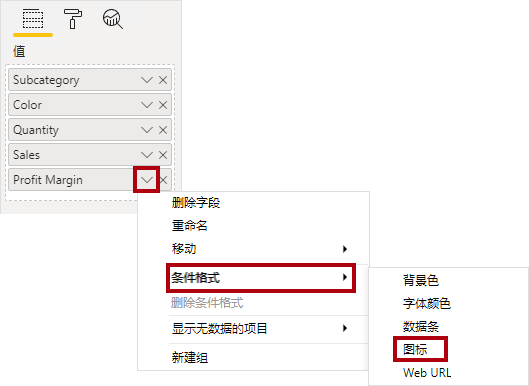

1. 在“图标 - 利润率”窗口中，在“图标布局”下拉列表中选择“数据右侧”。

    

1. 若要删除中间规则，请在黄色三角形的右侧选择“X”。

    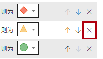

1. 如下所示配置第一条规则（红色菱形）：

    - 在第二个控件中，删除值
    - 在第三个控件中，选择“数字”
    - 在第五个控件中，输入 0
    - 在第六个控件中，选择“数字”

1. 按照如下所示配置第二条规则（绿色圆圈），然后选择“确定”：

    > *规则总结如下：如果利润率值小于 0，则显示红色菱形；如果该值大于或等于 0，则显示绿色圆圈。*

    - 在第二个控件中，输入 0
    - 在第三个控件中，选择“数字”
    - 在第五个控件中，删除值
    - 在第六个控件中，选择“数字”

    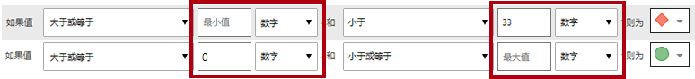

1. 在表格视觉对象中，验证是否显示了正确的图标。

    

1. 为“颜色”字段配置背景色条件格式。

1. 在“背景色 - 颜色”窗口中的“格式样式”下拉列表中，选择“字段值”  。

1. 在“应将此基于哪个字段?”下拉列表中，选择“Product”\|“格式设置”\|“背景色格式”，然后选择“确定”  。

    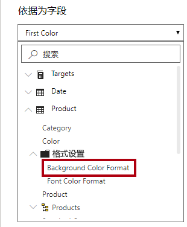

1. 重复前面的步骤，使用“产品 \| 格式设置 \| 字体颜色格式”字段为“颜色”字段配置字体颜色条件格式

回想一下，背景和字体颜色源自“在 Power BI Desktop 中准备数据”实验室中的“ColorFormats.csv”文件，然后与“在 Power BI Desktop 中加载数据”实验室中的“产品”查询集成。*   *

## 添加书签和按钮

在本练习中，通过按钮增强“My Performance”页，让报表用户能够选择要显示的视觉对象类型。 完成设计后，该页面将如下所示：

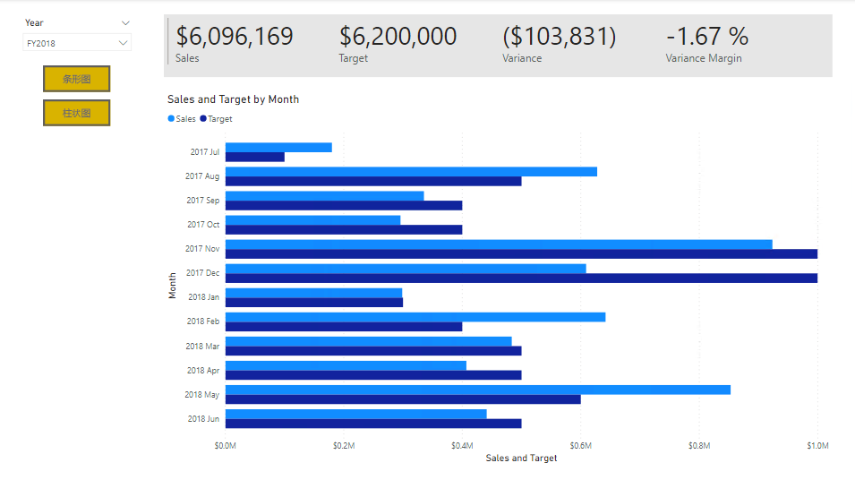

1. 转到“我的绩效”页。 在“视图”功能区选项卡上的“显示窗格”组中，选择“书签”。

    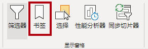

1. 在“视图”功能区选项卡上的“显示窗格”组中，选择“选择”。

1. 若要隐藏视觉对象，请在“选择”窗格中的任一“每月销售额和目标”项旁边选择眼睛图标。

    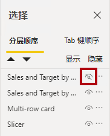

1. 在“书签”窗格中选择“添加”。

    > *若要重命名书签，请双击该书签。*

    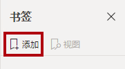

1. 如果可见图表是条形图，请将书签重命名为“打开条形图”，否则将书签重命名为“打开柱形图”。

1. 若要编辑书签，请在“书签”窗格中将光标悬停在相应书签的上方，选择省略号，然后选择“数据” 。

    > 如果禁用“数据”选项，意味着书签将不使用当前筛选器状态。*这一点很重要，否则书签会永远锁定在“年份”切片器当前应用的筛选器中。*

     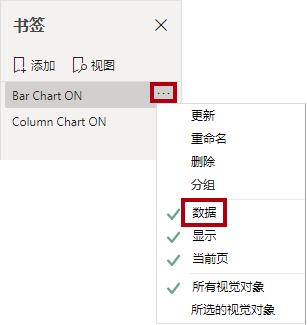

1. 若要更新书签，请再次选择省略号，然后选择“更新”。

    > *在下面的步骤中，你将创建并配置第二个书签，以显示第二个视觉对象。*

1. 在“选择”窗格中，交换两个“每月销售额和目标”项的可见性。

    > *换句话说，即隐藏当前可见的视觉对象，并显示当前隐藏的视觉。*

     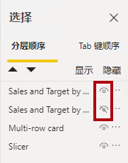

1. 创建第二个书签，并对其进行相应的命名（“打开柱形图”或“打开条形图”）。

     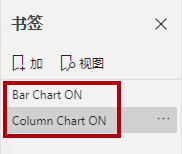

1. 将第二个书签配置为忽略筛选器（禁用“数据”选项），并更新书签。

1. 要使这两个视觉对象都可见，只需在“选择”窗格中显示隐藏的视觉对象即可。

1. 重设两个视觉对象的大小并重新定位，使其填充多卡视觉对象下方的页面，并完全相互重叠。

    若要选择被覆盖的视觉对象，请在“选择”窗格中选择它。

    

1. 在“书签”窗格中，选择每个书签，并注意仅其中一个视觉对象可见。

*设计的下一个阶段是向页面添加两个按钮，让报表用户可以选择书签。*

1. 在“插入”功能区上的“元素”组中选择“按钮”，然后选择“空白”。

     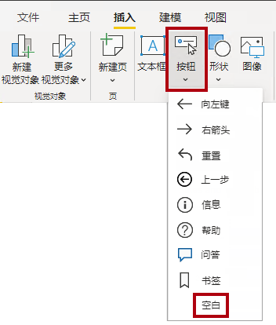

1. 将按钮直接置于“年份”切片器下。

1. 选择按钮，然后在“格式化按钮”窗格中选择“按钮”，展开“样式”部分并将“文本”属性设置为“开”    。

     

1. 展开“文本”部分，然后在“文本”框中输入“条形图”  。

1. 展开“填充”部分，然后使用补色设置填充色。

1. 选择“按钮”，然后将“操作”属性设置为“开”  。

    

1. 展开“操作”部分，然后将“类型”下拉列表设置为“书签”。

1. 在“书签”下拉列表中，选择“打开条形图”。

    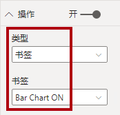

1. 使用复制和粘贴创建按钮的副本，然后配置新按钮，如下所示：

    *提示：复制和粘贴的快捷方式命令是，先按 Ctrl+C 然后按 Ctrl+V。 *

    - 将“按钮文本”属性设置为“柱形图”
    - 在“操作”部分，将“书签”下拉列表设置为“打开柱形图”

*现在，已经完成了“销售分析”报表的设计。*

## 发布和浏览报表

在本练习中，将报表发布到 Power BI 服务并浏览已发布的报表行为。

> **备注**：即使无法访问联机 Power BI 服务以直接执行任务，你也可以查看练习的其余部分。

1. 选择“概述”页。

1. 在“年份”切片器中，选择“FY2020”。

1. 在“区域”切片器中，选择“全选”。

1. 保存 Power BI Desktop 文件。

1. 在“主页”功能区选项卡上，选择“共享”组中的“发布”。

    > 如果尚未登录到 Power BI Desktop，需要先登录才能发布。

     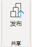

1. 请注意，在“发布到 Power BI”窗口中，已选择“我的工作区”。

1. 要发布报表，请选择“选择”。
    1. 如果系统提示替换语义模型，请选择“替换”。****
    1. 发布成功后，选择“知道了”。

1. 关闭 Power BI Desktop。

1. 在 Microsoft Edge 浏览器窗口中，导航到“Power BI 服务”>“我的工作区”，然后选择“Sales Analysis”报表 。

1. 若要测试钻取功能，请导航到“概述”页 >“Quantity by Category”视觉对象 。 然后右键单击“Clothing”栏并选择“钻取”\|“Product Details” 。

     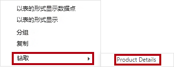

1. 请注意，“产品详细信息”页针对“服装”。

1. 若要返回源页面，请选择页面左上角的箭头按钮。

1. 选择“我的绩效”页。

     > *选择每个按钮，然后注意是否显示了其他视觉对象。*

## 实验已完成
