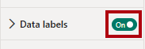
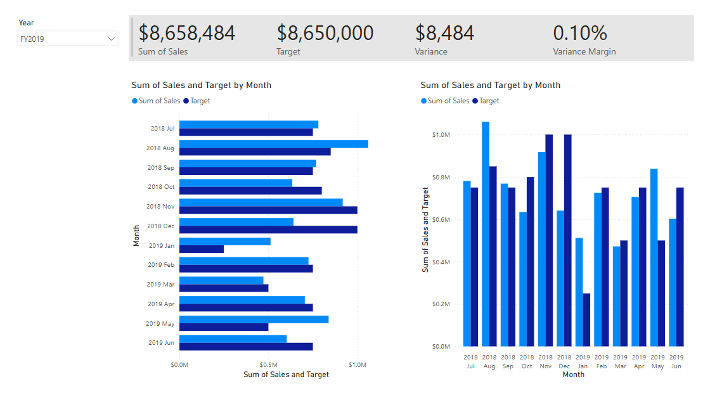
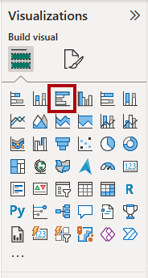
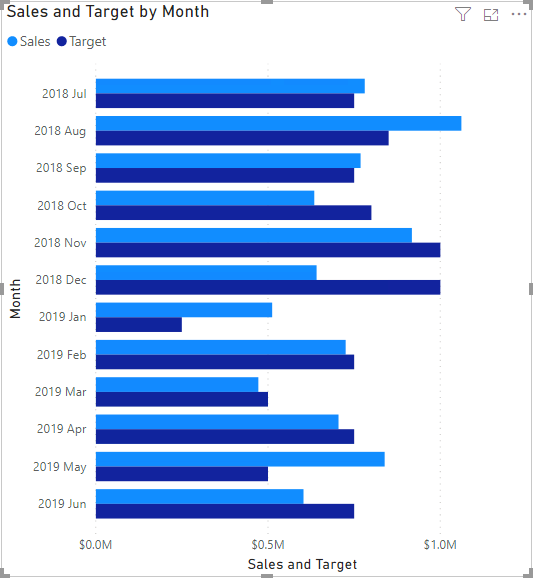

---
lab:
  title: 设计 Power BI 报表
  module: Design Power BI reports
---

# 设计 Power BI 报表

## 实验室场景

在此实验室中，你将创建一个三页的报表。 然后，你要将它发布到 Power BI 服务，接着打开报表并与之进行交互。

在此实验室中，你将了解如何完成以下操作：

- 设计报表。
- 配置视觉对象字段和格式属性。
- 同步切片器。
- 将报表发布到 Power BI 服务。
- 与报表及其视觉对象交互。

**此实验室应该大约需要 45 分钟。**

## 开始使用

若要完成本练习，请先打开 Web 浏览器并输入以下 URL 以下载 zip 文件夹：

`https://github.com/MicrosoftLearning/PL-300-Microsoft-Power-BI-Data-Analyst/raw/Main/Allfiles/Labs/08-design-power-bi-reports/08-design-report.zip`

将文件解压缩到 C:\Users\Student\Downloads\08-design-report 文件夹****。

打开 08-Starter-Sales Analysis.pbix**** 文件。

> _注意****：文件加载时，可能会看到登录对话框。选择“取消”以关闭登录对话框。**** 关闭所有其他信息窗口。如果系统提示应用更改，请选择“稍后应用”****。_

## 设计页面 1

在此任务中，设计报表的第一页。 完成设计后，页面将如下所示：

1. 在 Power BI Desktop 中，要重命名页面，请在左下角右键单击“第 1 页”，然后选择“重命名”********。 将页面重命名为“概述”__。

    > _提示：_ 还可以双击页面名称以进行重命名。

1. 若要添加图像，请在“插入”功能区选项卡上的“元素”组中，选择“图像”。

    

1. 在“打开”窗口中，导航到 C:\Users\Student\Downloads\08-design-report 文件夹********。

1. 选择 AdventureWorksLogo.jpg 文件，然后选择“打开”。

1. 将图像拖放到左上角，并拖动参考线标记以调整其大小。

    

1. 若要添加切片器，请先通过选择报表页的空白区域来取消选择图像，然后在“可视化效果”窗格中选择“切片器”********。

    

1. 在“数据”窗格中，将“`Date | Year`”字段（而不是层次结构的“`Year`”级别）拖到“可视化效果”窗格中的切片器“字段”井中************。

    > _实验室使用速记表示法引用字段。它将如下所示：`Date | Year`。在此示例中，`Date` 是表名称，`Year` 是字段名称。_

    

1. 若要将切片器从列表转化为下拉列表，请在“可视化效果”窗格中选择“设置视觉对象格式”********。 展开“切片器设置”，然后将“样式”下拉列表设置为“下拉列表”************。

    

1. 调整切片器的大小和放置，使其位于图像下方，并且宽度与图像相同。

    

1. 在“Year”切片器中，打开下拉列表，选择“FY2020”，然后折叠下拉列表。

    > 报表页现在按年份“FY2020”进行筛选。__

    

1. 通过选择报表页的空白区域取消选择该切片器。

1. 基于`Region | Region` 字段（而不是层次结构的`Region` 级别）创建第二个切片器。

1. 将切片器保留为列表，然后调整切片器的大小，并将其放置在“年份”切片器下。

    

1. 通过选择报表页的空白区域取消选择该切片器。

1. 若要将图表添加到页面，请在“可视化效果”窗格中，选择“折线和堆积柱形图”视觉对象类型。

    

1. 调整视觉对象的大小和位置，使其位于徽标右侧，填充与报表页面相同的宽度。

    

1. 将以下字段拖放到视觉对象中：

     - `Date | Month`
     - `Sales | Sales`

1. 请注意，在视觉对象字段窗格（位于“可视化效果”窗格）中，这些字段已分配给“X 轴”和“Y 轴列”井************。

    > 通过将字段拖动到视觉对象中，可将其添加到默认井。__ 为精确起见，可以直接将字段拖动到井中，接下来你就要这样操作。

    

1. 从“数据”窗格中，将“`Sales | Profit Margin`”字段拖到“线条 y 轴”井中********。

    

1. 请注意，视觉对象只有 11 个月。

    > _该年的最后一个月（2020 年 6 月）尚未有任何销售额。默认情况下，视觉对象已删除销售额为`BLANK` 的月份。现在可将视觉对象配置为显示所有月份。_

1. 在视觉对象字段窗格中的“X 轴”井中，对于“Month”字段，选择向下箭头，然后选择“显示没有数据的项”************。

    

    > 可以看到现在显示了月份“2020 June”。__

1. 通过选择报表页的空白区域取消选择该图表。

1. 要将图表添加到页面，请在“可视化效果”窗格中，选择“堆积柱形图”视觉对象类型 。

    

1. 调整该视觉对象的大小和位置，使其位于柱形图/折线图的下方，填充上方图表一半的宽度。

    

1. 向“视觉对象”井添加以下字段：

     - X 轴：`Region | Group`
     - Y 轴：`Sales | Sales`
     - 图例：`Product | Category`

1. 通过选择报表页的空白区域取消选择该图表。

1. 若要将图表添加到页面，请在“可视化效果”窗格中，选择“堆积条形图”视觉对象类型********。

    

1. 调整该视觉对象的大小和位置，使其填充剩余的报表页面空间。

    

1. 向“视觉对象”井添加以下字段：

     - Y 轴：`Product | Category`
     - X 轴：`Sales | Quantity`

1. 若要设置视觉对象的格式，请打开“格式”窗格。

    

1. 展开“条形图”部分，然后在“颜色”组中，将“颜色”属性设置为合适的颜色（以补充柱形图/折线图）************。

1. 将“数据标签”部分设置为“开”********。

    

1. 保存 Power BI Desktop 文件。

    > _第一页的设计现已完成。_

## 设计页面 2

在此任务中，设计报表的第二页。 完成设计后，页面将如下所示：

> 重要说明：_**** 在实验室中提供了详细说明后，实验室步骤将提供更简洁的说明。_ 如果需要详细说明，可以回顾此实验室中的其他任务。

1. 若要创建新页，请选择左下角的加号图标。 添加页面后，将其重命名为“利润”__。

1. 基于`Region | Region` 字段添加切片器。

1. 使用“格式”窗格显示“全选”选项（位于“切片器设置”>“选择”部分）****__****。

1. 调整该切片器的大小和位置，使其位于报表页面左侧，高度约为页面高度的一半。

    

1. 添加矩阵视觉对象，并调整其大小和位置，使其填充剩余的报表页面空间

    

1. 将`Date | Fiscal` 层次结构添加到“矩阵”视觉对象的“行”井****。

    

1. 将以下五个`Sales` 表字段添加到“值”井****：

     - `Orders`（来自`Counts` 文件夹）
     - `Sales`
     - `Cost`
     - `Profit`（来自`Pricing` 文件夹）
     - `Profit Margin`（来自`Pricing` 文件夹）

    

1. 在“筛选器”窗格（位于“可视化效果”窗格左侧）中，请注意“此页上的筛选器”部分（可能需要展开窗格并向下滚动）************。

    

1. 从“数据”窗格中，将`Product | Category` 字段拖到“此页上的筛选器”井中********。

    > 添加到“筛选器”窗格中的字段可以实现与切片器相同的结果。_**** 区别之一是它们不占用报表页上的空间。_ 另一个区别是，可以通过配置它们来满足更加复杂的筛选要求。

1. 在筛选器卡中，选择右上角的箭头以折叠此卡。

1. 将以下每个`Product` 表字段添加到“此页上的筛选器”井中，并折叠在`Category` 字段正下方****：

     - `Subcategory`
     - `Product`
     - `Color`

    

1. 保存 Power BI Desktop 文件。

    > _第二页的设计现已完成。_

## 设计页面 3

在此任务中，设计报表的第三页，也是最后一页。 完成设计后，页面将如下所示：

1. 创建一个新的页面，然后将其重命名为“我的绩效”__。

1. 要模拟行级安全筛选器的性能，请将`Salesperson (Performance) | Salesperson` 字段拖动到筛选器窗格中的页面级筛选器。

    

1. 在筛选卡中，选择“Michael Blythe”****。

    > 报表页面上的数据现将进行筛选，仅显示 Michael Blythe 的数据。__

1. 基于`Date | Year` 字段添加下拉切片器，然后重设大小并重新定位，使其位于页面的左上角。

    

1. 在切片器中，将页面设置为按“FY2019”进行筛选。

    

1. 将“多行卡”视觉对象添加到页面，然后重设大小并重新定位，使其位于切片器的右侧，并填充页面的剩余宽度****。

    

    

1. 向视觉对象添加以下四个字段：

     - `Sales | Sales`
     - `Targets | Target`
     - `Targets | Variance`
     - `Targets | Variance Margin`

1. 设置视觉对象的格式：

     - 在“标注值”部分中，将“字号”属性增加到“28pt”********。
     - 在“常规”选项卡的“效果”部分中，将背景色属性设置为浅灰色（例如白色，10% 深色）以提供对比度********__。

        

1. 将“簇状条形图”视觉对象添加到页面，然后调整其大小和位置，使其位于多行卡片视觉对象的下方，填充剩余的页面高度，并且宽度为多行卡片视觉对象宽度的一半****。

    

    

1. 向“视觉对象”井添加以下字段：

     - Y 轴：`Date | Month`
     - X 轴：`Sales | Sales` 和`Targets | Target`

        

1. 若要创建视觉对象的副本，请按 Ctrl+C，然后按 Ctrl+V。

1. 将新的视觉对象放置在原始视觉对象的右侧。

    

1. 若要修改可视化效果类型，请在“可视化效果”窗格中选择“簇状柱形图”。

    

     > 现在可以看到用两种不同的可视化效果类型表示的相同数据。__ 最终页面的设计已完成。

## 同步切片器

在此任务中，你将同步“年份”和“区域”切片器____。

1. 在“概述”页上，将“年份”切片器设置为“FY2018”____****。

1. 转到“我的绩效”页，然后注意“年份”切片器是另一个值____。

    > 当切片器不同步时，可能会导致呈现出错误的数据，让报表用户受挫。__ 现在同步报表切片器。

1. 返回到“概述”页，然后选择“年份”切片器。

1. 在“视图”功能区选项卡上的“显示窗格”组中，选择“同步切片器”。

    

1. 在（“可视化效果”窗格左侧的）“同步切片器”窗格中的第二列（代表同步），选中“Overview”和“My Performance”页的复选框。

    

1. 在“概述”页上，选择“区域”切片器。

1. 将切片器与“概述”和“利润”页同步。

    

1. 可以这样测试同步切片器功能：选择不同的筛选器选项，然后验证所同步的切片器是否以相同的选项为依据进行筛选。

1. 若要关闭“同步切片器”窗格，请选择位于“视图”功能区选项卡上的“同步切片器”选项************。

## 发布和浏览报表

在此任务中，将报表发布到 Power BI 服务。 然后，浏览已发布的报表行为。

> _注意****：发布报表至少需要 Power BI 免费许可证****。打开 Microsoft Edge 浏览器并导航到`https://app.powerbi.com`__。 使用授权实验室托管者 (ALH) 提供的 Microsoft 365 租户的凭据登录。系统要求解决难题或启动 Fabric 免费试用版时，可以跳过此步骤并关闭浏览器。_

> _注意****：即使无法访问 Power BI 服务以直接执行任务，也可以查看练习的其余部分。_

1. 选择“概述”页，然后保存 Power BI Desktop 文件。

1. 在“主页”功能区选项卡上，选择“共享”组中的“发布”。

    > 如果尚未登录到 Power BI Desktop，则需要先登录才能发布报表__。

    

1. 在“发布到 Power BI”窗口中，注意到已选择“我的工作区”****__。

    > 本实验室不会详细介绍 Power BI 服务中的不同项。__

1. 要发布报表，请选择“选择”。 等待发布完成。

1. 发布成功后，选择“知道了”****。

1. 打开 Microsoft Edge 浏览器，然后导航到`https://app.powerbi.com`。

1. 在浏览器窗口，在 Power BI 服务的“导航”窗格（位于左侧，可能处于折叠状态）中，展开“我的工作区”********。

    

1. 查看工作区内容。

    - 工作区中可以存在不同类型的项，但与本实验室相关的项是语义模型和报表。
    - 如果语义模型不可见，可能需要刷新浏览器。
    - 发布报表时，数据模型发布为语义模型。

1. 要浏览报表，请选择 08-Starter-Sales Analysis 报表__。

1. 在左侧的“页面”窗格中，请注意“概述”页已被选中********。

1. 在“区域”切片器中，按住 Ctrl 键的同时选择多个区域__****。

1. 在柱形图/折线图中，选择任意月份列以交叉筛选页面。

1. 在按住 Ctrl 键的同时选择其他月份。

     > 默认情况下，交叉筛选将筛选页面上的所有其他视觉对象。__

1. 可以看到，已对条形图进行筛选并突出显示，其中粗体部分表示所筛选的月份。

1. 将光标悬停在条形图视觉对象上，然后在右上方将光标悬停在“筛选器”图标上****。

    

    > 通过“筛选器”图标，用户可了解应用于视觉对象的所有筛选器，包括来自其他视觉对象的切片器和交叉筛选器。__

1. 将光标悬停在条形图上，可以看到工具提示信息。

1. 若要撤消交叉筛选，请在柱形图/折线图中选择视觉对象的空白区域。

1. 将光标悬停在堆积柱形图视觉对象上，然后选择右上角的“焦点模式”图标****。

    > _焦点模式会将视觉对象缩放至整页大小。_

    

1. 将光标悬停在条形图的不同段上，以显示工具提示。

1. 若要返回到“报表”页，请在左上方选择“返回报表”。

    

1. 再次将光标悬停在其中一个视觉对象上，然后选择右上角的省略号 (…)，查看显示的菜单选项。 试用每个选项，“**共享**”中的选项除外。

    

1. 在左侧的“页数”窗格，选择“Profit”页。

    

1. 请注意，由于切片器已同步，“区域”切片器的选择与“概述”页上的相同____。

1. 在“筛选器”窗格（位于右侧）中，展开筛选器卡，并应用一些筛选器。

    > 通过“筛选器”窗格，可以定义超出切片器页面范围的筛选器。__

1. 在矩阵视觉对象中，使用加号 (+) 按钮钻取`Fiscal` 层次结构。

1. 选择“我的绩效”页。

    

1. 在菜单栏的右上方，选择“查看”，然后选择“全屏”********。

    

1. 通过修改切片器并交叉筛选页面来与页面进行交互。

1. 窗口底部显示用于更改页面、在页面之间向后或向前导航或退出全屏模式的命令。

1. 选择右侧图标退出全屏模式。

    

## 实验已完成

1. 关闭 Microsoft Edge 浏览器。
1. 关闭 Power BI Desktop。