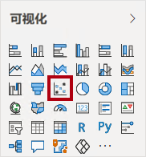
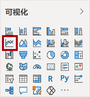
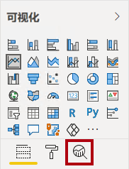
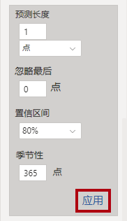

---
lab:
  title: 使用 AI 视觉对象执行高级分析
  module: Perform Data Analysis in Power BI
---

# **在 Power BI 中执行数据分析**

## **实验室场景**

在本实验室中，你将创建“销售探索”报表。

本实验室介绍如何完成以下操作：

- 创建动画散点图
- 使用视觉对象预测值

**此实验室应该大约需要 30 分钟。**

## **开始 - 登录**

在此任务中，通过登录到 Power BI 来设置实验室的环境。

注意：如果已登录到 Power BI，请跳到下一个任务。

1. 若要打开 Microsoft Edge，请在任务栏上，选择 Microsoft Edge 程序快捷方式。

     

1. 在 Microsoft Edge 浏览器窗口中，导航到 **https://app.powerbi.com**。

    *提示：还可以使用 Microsoft Edge 收藏夹栏上收藏的 Power BI 服务。*

1. 使用组织或提供的凭据完成登录过程。 如果 Microsoft Edge 提示是否保持登录状态，请选择“是”。

1. 在 Microsoft Edge 浏览器窗口的 Power BI 服务中，在“导航”窗格中展开“我的工作区”。 使 Microsoft Edge 浏览器窗口保持打开状态。

     

## **入门 - 创建语义模型**

在此任务中，通过创建语义模型来设置实验室的环境。 如果已发布语义模型，请转到下一个任务。**

1. 在 Microsoft Edge 浏览器窗口的 Power BI 服务中，导航到“我的工作区”。

1. 选择“上传”>“浏览”。

1. 导航到 D:\PL300\Labs\08-perform-data-analysis-in-power-bi-desktop\Starter 文件夹。

1. 选择 Sales Analysis.pbix 文件，然后选择“打开”。

    如果系统提示替换语义模型，请选择“替换”****。**

此方法可创建报表和数据集。在本练习中，仅使用语义模型创建新报表。可以使用其他报表的现有语义模型完成相同的过程，而不是上传新语义模型。此外，如果不使用报表，最佳做法是从工作区删除不必要的文件。**

## **创建报表**

在此任务中，你将创建与在上一个任务中创建的 Power BI 语义模型的实时连接，然后创建新的“销售探索**** 报表。

1. 打开 Power BI Desktop。

    

    *重要说明：* 如果你已（从之前的实验室）打开 Power BI Desktop，则关闭该实例。

    提示：默认情况下，“入门”对话框在 Power BI Desktop 前面打开。可以选择登录，然后关闭弹出窗口。

1. 从“主页”功能区中，选择“获取数据”>“Power BI 语义模型”****。

1. 在“数据中心”**** 窗口中，选择“我的工作区”**** 中的“销售分析”**** 语义模型，然后通过“连接”**** 或双击加载语义模型。

1. 导航到“文件”>“保存”，将文件名命名为“Sales Exploration”并保存到 D:\PL300\MySolution 文件夹  。

现在，你将创建两个报表页面，在每个页面上，你将使用不同的视觉对象来分析和浏览数据。

## **创建动画散点图**

在此任务中，你将创建一个可进行动画处理的散点图。

1. 将“第 1 页”重命名为“散点图”。

1. 将“散点图”视觉对象添加到报表页面，然后调整其位置和大小，使其填满整个页面。
    
    将字段添加到“播放轴”井/区域时，可以对图表进行动画处理。**

     

     

1. 将以下字段添加到视觉对象井/区域中：
    
    实验室使用速记表示法引用字段。如下所示：Reseller \| Business Type。在此示例中，Reseller 是表名，Business Type 是字段名    。

     - X 轴：Sales \| Sales
     - Y 轴：Sales \| Profit Margin
     - 图例：Reseller \| Business Type
     - 大小：Sales \| Quantity
     - 播放轴：Date \| Quarter

1. 在“筛选器”窗格中，将“Product \| Category”字段添加到“此页上的筛选器”井/区域中  。

1. 在筛选器卡中，按“自行车”进行筛选。

1. 若要对图表进行动画处理，请选择左下角的“播放”。

    

1. 观看从“2018 财年第一季度”到“2020 财年第四季度”的整个动画周期。
    
    通过散点图可以同时了解多个度量值：本例中为订单数量、销售收入和利润率。
    
    每个气泡表示一种经销商业务类型。*气泡大小的变化反映了订单数量的增加或减少。* 水平移动表示销售收入的增加/减少，垂直移动表示盈利率的增加/减少。

1. 动画效果停止时，选择某个气泡以显示其随时间变化的轨迹。

1. 将光标悬停在任意气泡上方以显示工具提示，该工具提示描述了经销商类型在该时间点的度量值。

1. 在“筛选器”窗格中，仅按“衣服”进行筛选，请注意，它会产生截然不同的结果。

1. 保存 Power BI Desktop 文件。

## **创建预测**

在此任务中，创建一个预测来确定未来可能的销售收入。

1. 添加一个新页面，然后将该页面重命名为“预测”。

1. 向报表页面添加一个“折线图”视觉对象，然后调整其位置和大小，使其填满整个页面。

     

     

1. 将以下字段添加到视觉对象井/区域中：

     - X 轴：Date \| Date
     - Y 轴：Sales \| Sales

1. 在“筛选器”窗格中，将“Date \| Year”字段添加到“此页上的筛选器”井/区域中  。

1. 在筛选器卡中，按两个年份进行筛选：2019 财年和 2020 财年。
    
    按时间线进行预测时，需要至少两个周期（年）的数据才能生成准确稳定的预测。

1. 将“Product \| Category”字段也添加到“此页上的筛选器”井/区域中，并按“自行车”进行筛选  。

1. 若要添加预测，请在“可视化效果”窗格下选择“分析”窗格。

     

8. 展开“预测”部分。
    
    如果“预测”部分不可用，可能是因为未正确配置该视觉对象。仅当满足以下两个条件时，才能进行预测：轴有一个日期类型的字段，并且只有一个值字段。**

1. 将“预测”选项设置为“启用” 。

1. 配置以下预测属性，然后选择“应用”：

    - 单位：月
    - 预测时长：1 个月
    - 季节性：365
    - 置信区间：80%

    

1. 在该折线图视觉对象中，你会发现预测在历史数据的基础上延长了一个月。
    
    灰色区域表示置信度。置信度越广，预测可能越不稳定，因此准确性就越差。
    
    当你知道周期的长度（本例中为每年）时，应输入季节性点。有时可能是每周 (7) 或每月 (30)。

1. 在“筛选器”窗格中，仅按“衣服”进行筛选，请注意，它会产生不同的结果。

### **完成**

在此任务中，在 Power BI Desktop 中完成实验室。

1. 选择“散点图”页。

1. 保存 Power BI Desktop 文件。

1. 要将文件发布到“我的工作区”，请在“开始”功能区选项卡上的“共享”组中，选择“发布”，然后选择“选择”进行发布    。

    

1. 关闭 Power BI Desktop。
