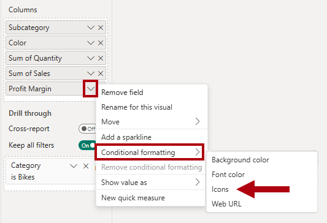
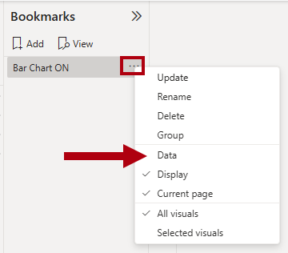

---
lab:
  title: 增强 Power BI 报表设计
  module: Enhance Power BI report designs for the user experience
---

# 增强 Power BI 报表设计

## 实验室场景

在此实验室中，你将通过高级设计功能增强 Sales Analysis 报表__。

在此实验室中，你将了解如何完成以下操作：

- 创建钻取页。
- 应用条件格式。
- 创建并使用书签和按钮。

**此实验室应该大约需要 45 分钟。**

## 开始使用

若要完成本练习，请先打开 Web 浏览器并输入以下 URL 以下载 zip 文件：

`https://github.com/MicrosoftLearning/PL-300-Microsoft-Power-BI-Data-Analyst/raw/Main/Allfiles/Labs/09-enhance-power-bi-reports/09-enhanced-report.zip`

将文件解压缩到 C:\Users\Student\Downloads\09-enhanced-report 文件夹****。

打开 09-Starter-Sales Analysis.pbix 文件****。

> _注意****：可以通过选择“取消”来取消登录****。关闭所有其他信息窗口。如果系统提示应用更改，请选择“稍后应用”****。_

## 配置钻取页

在本练习中，你将创建一个新页，并将其配置为钻取页。 完成设计后，页面将如下所示：

1. 创建新页面并将其重命名为“产品详细信息”__。

1. 右键单击“产品详细信息”页面选项卡，然后选择“隐藏页”。

    > _报表用户无法直接进入钻取页，而是需要从其他页面上的视觉对象来访问该页面。你将在本实验室的最后一个练习中了解如何钻取到页面。_

1. 在“可视化效果”窗格下的“钻取”部分中，将“`Product | Category`”字段添加到“在此处添加钻取字段”框************。

    > _实验室使用速记表示法引用字段。它将如下所示：`Product | Category`。在此示例中，`Product` 是表名称，`Category` 是字段名称。_

    

1. 若要测试钻取页，请在钻取筛选器卡中选择“自行车”。

    

1. 在报表页的左上角，注意箭头按钮。

    > 将字段添加到钻取井时，报表设计器会自动添加箭头按钮。__ 报表用户可以通过该按钮后退到到其起始页面。

1. 向页面添加“卡片”视觉对象，然后调整其大小和位置，使其位于按钮右侧，并填充剩余的页面宽度。

    

    

1. 将 `Product | Category` 字段拖到卡片视觉对象中。

1. 为视觉对象配置格式选项，将“类别标签”属性设置为“关”********。

    

1. 在“常规”选项卡的“效果”部分中，将背景色属性设置为浅灰色（例如白色，10% 深色）以提供对比度********__。

    

1. 向页面添加“表”视觉对象，然后调整其大小和位置，使其位于卡片视觉对象下方，填充页面上的剩余空间。

    

    

1. 向视觉对象添加以下字段：

    - `Product | Subcategory`
    - `Product | Color`
    - `Sales | Quantity`
    - `Sales | Sales`
    - `Sales | Profit Margin`

1. 若要为视觉对象配置格式选项，请在“网格”部分，将“全局字号”属性设置为“20pt”************。

    > 钻取页的设计即将完成。__ 你将在下一个练习中使用条件格式来优化页面。

## 添加条件格式

在本练习中，你将使用条件格式增强钻取页。 完成设计后，页面将如下所示：

1. 选择表视觉对象。 在“列”井中，选择“利润率”字段上的向下箭头，然后选择“条件格式”>“图标”************。

    

1. 在“图标 – 利润率”窗口的“应用于”下拉列表中，选择“值和总计”************。

    

1. 在“图标 - 利润率”窗口中，在“图标布局”下拉列表中选择“数据右侧”。

    

1. 若要删除中间规则，请在黄色三角形的右侧选择“X”。

    

1. 如下所示配置第一条规则（红色菱形）：

    - 在第二个控件中，删除值
    - 在第三个控件中，选择“数字”
    - 在第五个控件中，输入 0
    - 在第六个控件中，选择“数字”

1. 如下所示配置第二条规则（绿色圆圈）：

    - 在第二个控件中，输入 0
    - 在第三个控件中，选择“数字”
    - 在第五个控件中，删除值
    - 在第六个控件中，选择“数字”

    

    > _规则总结如下：如果利润率值小于 0，则显示红色菱形；如果该值大于或等于 0，则显示绿色圆圈。_

1. 选择“确定”****。

1. 在表格视觉对象中，验证是否显示了正确的图标。

    

1. 为“颜色”字段配置背景色条件格式。

1. 在“背景色 - 颜色”窗口中的“格式样式”下拉列表中，选择“字段值”  。

    

1. 在“应将此基于哪个字段?”下拉列表的“所有数据”组中，选择“`Product | Formatting | Background Color Format`”字段****__。

    

1. 重复前面的步骤，使用“`Product | Formatting | Font Color Format`”字段为“颜色”字段配置字体颜色条件格式****。

 > 回想一下，背景和字体颜色源自“在 Power BI Desktop 中准备数据”实验室中的 ColorFormats.csv 文件，然后与“在 Power BI Desktop 中加载数据”实验室中的“产品”查询集成_****************_。

## 添加书签和按钮

在本练习中，你将通过按钮增强“My Performance”页，让报表用户能够选择要显示的视觉对象类型__。 完成设计后，页面将如下所示：

1. 转到“我的绩效”页。

1. 在“视图”功能区选项卡上的“显示窗格”组中，选择“书签”。

    

1. 在“视图”功能区选项卡上的“显示窗格”组中，选择“选择”************。

    

1. 若要隐藏视觉对象，请在“选择”窗格中的任一“每月销售额和目标”项旁边选择眼睛图标。

    

1. 在“书签”窗格中选择“添加”。

    

    > _提示：若要重命名书签，请双击该书签。_

1. 如果可见图表是条形图，请将书签重命名为“打开条形图”，否则将书签重命名为“打开柱形图”。

1. 若要编辑书签，请在“书签”窗格中将光标悬停在相应书签的上方，选择省略号，然后选择“数据” 。

    > 如果禁用“数据”选项，意味着书签将不使用当前筛选器状态。_****_ 这一点很重要，否则书签会永远锁定在“年份”切片器当前应用的筛选器中。

    

1. 若要更新书签，请再次选择省略号，然后选择“更新”。

    > 在下面的步骤中，你将创建并配置第二个书签，以显示第二个视觉对象。__

1. 在“选择”窗格中，交换两个“每月销售额和目标”项的可见性。

    > _换句话说，即隐藏当前可见的视觉对象，并显示当前隐藏的视觉。_

    

1. 创建第二个书签，并对其进行相应的命名（“打开柱形图”或“打开条形图”）____。

    

1. 将第二个书签配置为忽略筛选器（禁用“数据”选项），并更新书签。

1. 要使这两个视觉对象都可见，只需在“选择”窗格中显示隐藏的视觉对象即可。

1. 重设两个视觉对象的大小并重新定位，使其填充多卡视觉对象下方的页面，并完全相互重叠。

    > 若要选择被覆盖的视觉对象，请在“选择”窗格中选择它。

    

1. 在“书签”窗格中，选择每个书签，并注意仅其中一个视觉对象可见。

    > 下一阶段的设计是向页面添加两个按钮。__ 通过这些按钮，报表用户可以选择书签。

1. 在“插入”功能区上的“元素”组中选择“按钮”，然后选择“空白”。

    

1. 将按钮直接置于“年份”切片器下。

1. 选择该按钮，然后在“格式按钮”窗格中，展开“样式”部分，将“文本”部分设置为“开”****************。

    

1. 在“文本”部分的“文本”框中，输入“条形图”********__。

1. 将“填充”部分设置为“开”，然后使用补色设置颜色********。

1. 将“操作”部分设置为“开”，然后将“类型”属性设置为“书签”****************。

1. 选择“按钮”，然后将“操作”属性设置为“开”  。

1. 展开“操作”部分，然后将“类型”下拉列表设置为“书签”。

1. 在“书签”下拉列表中，选择“打开条形图”。

    

1. 使用复制和粘贴创建按钮的副本，然后配置新按钮，如下所示：

    > _提示：复制和粘贴的快捷方式命令是，先按 Ctrl+C 然后按 Ctrl+V。 _

    - 将按钮文本设置为“柱形图”__。
    - 将操作书签设置为“打开柱形图”****。

    > _现在，已经完成了“销售分析”报表的设计。_

## 发布和浏览报表

在本练习中，将报表发布到 Power BI 服务并浏览已发布的报表行为。

> _注意****：即使无法访问 Power BI 服务以直接执行任务，也可以查看练习的其余部分。_

1. 选择“概述”页。

1. 在“年份”切片器中，选择“FY2020”。

1. 在“区域”切片器中，确保未选择任何区域__。

1. 保存 Power BI Desktop 文件。

1. 在“主页”功能区选项卡上，选择“共享”组中的“发布”。

    > 如果尚未登录到 Power BI Desktop，则需要先登录才能发布报表__。

    

1. 在“发布到 Power BI”窗口中，注意到已选择“我的工作区”****__。

1. 要发布报表，请选择“选择”。 等待发布完成。

1. 发布成功后，选择“知道了”****。

1. 关闭 Power BI Desktop。

1. 打开 Microsoft Edge 浏览器，然后登录 `https://app.powerbi.com`（或使用现有的浏览器会议）。

1. 在浏览器窗口，在 Power BI 服务的“导航”窗格（位于左侧，可能处于折叠状态）中，选择“我的工作区”********。

1. 要浏览报表，请选择 07-Starter-Sales Analysis 报表__。

1. 若要测试钻取功能，请在“概述”页的“各类别的数量总和”视觉对象中右键单击“服装”栏，然后选择“钻取”>“产品详细信息”______****。

    

1. 请注意，“产品详细信息”页筛选“服装”的视觉对象____。

1. 若要返回源页面，请选择页面左上角的箭头按钮。

1. 转到“我的绩效”页。

1. 选择每个按钮，然后注意是否显示了其他视觉对象。

## 实验已完成
