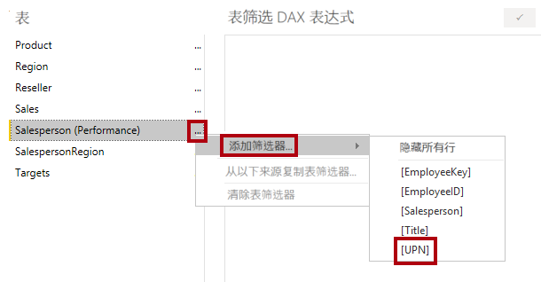
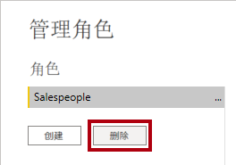

---
lab:
  course: PL-300
  title: 强制执行行级别安全性
  module: Enforce Row-Level Security
---

# 强制执行行级别安全性

## **实验室场景**

在本实验室中，强制执行行级别安全性，确保销售人员只能分析向其分配的区域的销售数据。

本实验室介绍如何完成以下操作：

- 强制执行行级别安全性
- 在动态和静态方法之间进行选择

**此实验室应该大约需要 20 分钟。**

## **入门**

在此任务中，设置实验室的环境。

重要说明：如果你是从上一个实验继续（并且已经成功完成该实验室），请不要完成此任务，而是从下一个任务开始继续操作。

1. 打开 Power BI Desktop。

    

    提示：默认情况下，“入门”对话框在 Power BI Desktop 前面打开。请登录，然后关闭弹出窗口。

1. 要打开 Power BI Desktop 入门文件，请选择“文件”>“打开报表”>“浏览报表”。

1. 在“打开”窗口中，导航到 D:\Allfiles\Labs\10-row-level-security\Starter 文件夹，打开“Sales Analysis”文件。************

1. 关闭任何可能打开的信息窗口。

1. 请注意功能区下方的警告消息。 此消息提醒你查询尚未应用于加载为模型表这一事实。稍后将在此实验室中应用查询。
    
    若要关闭该警告消息，请在警告消息的右侧选择“X”。******

1. 若要创建文件的副本，请转到“文件”>“另存为”，并保存到 D:\Allfiles\MySolution 文件夹。********

1. 如果系统提示应用更改，请选择“稍后应用”。

## **强制执行行级别安全性**

在此任务中，强制执行行级别安全性，确保销售人员只能看到向其分配的区域中的销售额。

1. 切换到“数据”视图。

   

1. 在“数据”窗格中，选择“Salesperson (Performance)”表 。

1. 查看数据，会发现 Michael Blythe（EmployeeKey 为 281）的 UPN 值为 **michael-blythe@adventureworks.com**
    
    回想一下，Michael Blythe 被分配到三个销售区域：美国东北部、美国中部和美国东南部。

1. 在“建模”功能区选项卡上，从“安全组”中选择“管理角色”  。

    

1. 在“管理角色”窗口中，选择“创建”。

1. 在方框中，用角色名称替换选定的文本：“Salespeople”的名称，然后按 Enter。

   

1. 要分配筛选器，请在 Salesperson (Performance) 表中选择省略号 (…) 字符，然后选择“添加筛选器”\|“[UPN]” 。

   

1. 在“表筛选器 DAX 表达式”框中，通过将“Value”替换为 USERPRINCIPALNAME() 来修改表达式，然后选择“保存”   。
    
    USERPRINCIPALNAME () 是一种数据分析表达式 (DAX) 函数，它返回已经过身份验证的用户的名称。*这意味着，“Salesperson (Performance)”表将按查询模型的用户的用户主体名称 (UPN) 进行筛选。*

   

1. 若要测试安全角色，请在“建模”功能区选项卡上的“安全”组中，选择“查看者身份”。

   

1. 在“以角色身份查看”窗口中，勾选“其他用户”项，然后在相应的框中输入：** michael-blythe@adventureworks.com**

1. 选中“Salespeople”角色，然后选择“确定” 。
    
    完成此配置后，系统将使用“Salespeople”角色，并使用 Michael Blythe 的姓名扮演该用户。**

   

1. 请注意报表页上面的黄色横幅，其中说明了测试安全性上下文。

   

1. 在表视觉对象中，请注意，仅列出了销售人员 Michael Blythe。

   

1. 若要停止测试，请在黄色横幅的右侧，选择“停止查看”。

   

1. 要删除“Salespeople”角色，请在“建模”功能区选项卡上，从“安全”组中选择“管理角色”   。

   

1. 在“管理角色”窗口中，选择“删除”。 当看到确认删除的提示时，选择“是，删除”。

   

### **完成**

在此任务中，你将完成此实验室。

1. 选择“保存”，然后保存 Power BI Desktop 文件，结束实验室。

注意：Power BI Desktop 文件发布到 Power BI 服务后，需要完成发布后的任务，以将安全主体映射到“Salespeople”角色。在本实验室中不执行此操作**。
