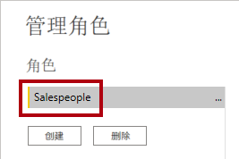
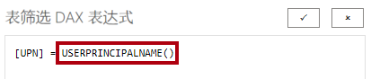
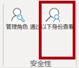
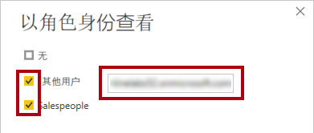
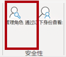

---
lab:
  title: 强制执行行级别安全性
  module: Enforce Row-Level Security
---

# 强制执行行级别安全性

## 实验室场景

在本实验室中，强制执行行级别安全性，确保销售人员只能分析向其分配的区域的销售数据。

本实验室介绍如何完成以下操作：

- 强制执行行级别安全性
- 在动态和静态方法之间进行选择

**此实验室应该大约需要 20 分钟。**

## 开始使用

若要完成本练习，请先打开 Web 浏览器并输入以下 URL 以下载 zip 文件夹：

`https://github.com/MicrosoftLearning/PL-300-Microsoft-Power-BI-Data-Analyst/raw/Main/Allfiles/Labs/10-row-level-security/10-row-level-security.zip`

将文件夹解压缩到 C:\Users\Student\Downloads\10-row-level-security **** 文件夹。

打开 10-Starter-Sales Analysis.pbix**** 文件。

> ***备注**：可以通过选择“取消”**** 来取消登录。 关闭所有其他信息窗口。 如果系统提示应用更改，请选择“稍后应用”****。*

## 强制执行行级别安全性

在此任务中，强制执行行级别安全性，确保销售人员只能看到向其分配的区域中的销售额。

1. 切换到表视图。

   

1. 在“数据”窗格中，选择“Salesperson (Performance)”表 。

1. 查看数据，会发现 Michael Blythe（EmployeeKey 为 281）的 UPN 值为 **`michael-blythe@adventureworks.com`**
    
    > 回想一下，Michael Blythe 被分配到三个销售区域：美国东北部、美国中部和美国东南部。

1. 从“主页”**** 功能区选项卡上的“安全”**** 组中选择“管理角色”****。

    

1. 在“管理安全角色”**** 窗口中的“角色”**** 部分中，选择“新建”****。

1. 在方框中，用角色名称替换选定的文本：“Salespeople”的名称，然后按 Enter。

   

1. 要分配筛选器，请选择“销售人员（绩效）”**** 表，然后选择“筛选器数据”**** 部分中的“切换到 DAX 编辑器”****。

   

1. 在“DAX 编辑器”框中，输入以下表达式：

    ```DAX
    [UPN] = USERPRINCIPALNAME()
    ```

   

    > USERPRINCIPALNAME () 是一种数据分析表达式 (DAX) 函数，它返回已经过身份验证的用户的名称。*这意味着，“Salesperson (Performance)”表将按查询模型的用户的用户主体名称 (UPN) 进行筛选。*

1. 选择“保存”和“关闭” 。

1. 要测试安全角色，请从“主页”**** 功能区选项卡的“安全”**** 组中，选择“查看者身份”****。

   

1. 在“以角色身份查看”窗口中，勾选“其他用户”项，然后在相应的框中输入：** `michael-blythe@adventureworks.com`**

1. 选中“Salespeople”角色，然后选择“确定” 。
    
    > 完成此配置后，系统将使用“Salespeople”角色，并使用 Michael Blythe 的姓名扮演该用户。**

   

1. 请注意报表页上面的黄色横幅，其中说明了测试安全性上下文。

   

1. 在表视觉对象中，请注意，仅列出了销售人员 Michael Blythe。

   

1. 若要停止测试，请在黄色横幅的右侧，选择“停止查看”。

   

1. 要删除 **Salespeople** 角色，请在**主页**功能区选项卡上，从**安全**组中选择**管理角色**。

   

1. 在**管理安全角色**窗口中，选择 **Salespeople** 角色上的省略号（...），然后选择“删除”****。 当看到确认删除的提示时，选择“是，删除”。

   

*备注：Power BI Desktop 文件发布到 Power BI 服务后，需要完成发布后的任务，以将安全主体映射到**销售员**角色。在本实验室中不执行此操作。*

## 实验已完成
