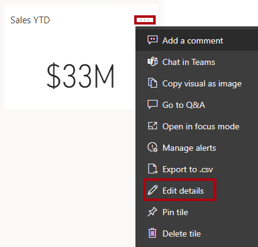
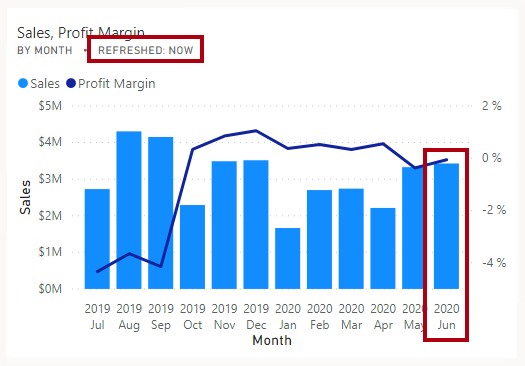

---
lab:
  title: 在 Power BI 中创建仪表板
  module: Create dashboards in Power BI
---

# 在 Power BI 中创建仪表板

## 实验室场景

在本实验室中，你将使用现有报表在Power BI 服务中创建“销售监视”仪表板。

在此实验室中，你将了解如何完成以下操作：

- 将视觉对象固定到仪表板。
- 使用问答功能创建仪表板磁贴。

**此实验室应该大约需要 30 分钟。**

## 开始使用

若要完成本练习，请先打开 Web 浏览器并输入以下 URL 以下载 zip 文件夹：

`https://github.com/MicrosoftLearning/PL-300-Microsoft-Power-BI-Data-Analyst/raw/Main/Allfiles/Labs/12-create-power-bi-dashboard/12-create-dashboard.zip`

将文件夹提取到 C:\Users\Student\Downloads\12-create-dashboard 文件夹****。

## **发布报表**

在此任务中，通过创建语义模型来设置实验室的环境。

1. 在 Microsoft Edge 浏览器窗口的 Power BI 服务中，导航到“我的工作区”。

1. 选择**导入 > 报表或分页报表 > 从此计算机**。

1. 导航到 C:\Users\Student\Downloads\12-create-dashboard 文件夹****。

1. 选择 12-Starter-Sales Analysis.pbix 文件，然后选择“打开”********。

    > 如果系统提示替换语义模型，请选择“替换”****。**

## **创建仪表板**

在此任务中，创建 Sales Monitoring 仪表板。 你将从报表固定一个视觉对象，并根据图像数据 URI 添加一个磁贴，然后使用问答功能来创建一个磁贴。

1. 在 Power BI 服务中，打开 12-Starter-Sales Analysis 报表****。

1. 在“概述”页中，将“Year”切片器设置为“FY2020”。

    

1. 将“区域”切片器设置为“全选”。

    > 固定的视觉对象是在固定时使用筛选器上下文设置的。如果基础视觉对象发生更改，则还需要更新仪表板磁贴。对于基于时间的筛选器，最好使用相对日期切片器（或使用基于相对时间的问题进行问答）。

1. 要创建仪表板并固定视觉对象，请将光标悬停在“Sales and Profit Margin by Month”（列/行）视觉对象上，然后选择图钉。

    

1. 在“固定到仪表板”窗口中的“仪表板名称”框内输入 Sales Monitoring，然后选择“固定”   。

    

1. 打开“我的工作区”，然后打开“Sales Monitoring”仪表板 。

1. 注意仪表板只有一个磁贴。

    

1. 要根据问题添加磁贴，请在仪表板左上角选择“询问数据相关问题”。 

    可以使用问答功能提出问题，Power BI 会通过视觉对象进行答复。**

    

1. 在问答框下选择任一推荐问题，然后查看回应。

1. 删除问答框中的所有文本，然后输入 Sales YTD

1. 请注意，答复为“(空)”。

    > *你可能还记得在**在 Power BI Desktop 中创建高级 DAX 计算**实验室中添加了 **Sales YTD** 度量值。此度量值是时间智能表达式，它需要对**日期**表进行筛选以生成结果。*

    

1. 在问题中加入“FY2020 年”。

1. 请注意，答复现在为“3300 万美元”。

    

1. 若要将回复固定到仪表板，请选择右上角的“固定视觉对象”。

    

1. 当系统提示将磁贴固定到“销售监控”**** 仪表板时，选择“固定”****。

1. 要返回到该仪表板，请选择左上角的“退出问答”。

1. 若要添加公司徽标，请在菜单栏上选择“编辑”，然后选择“添加磁贴” 。
    
    > 通过此技术添加仪表板磁贴可让你使用媒体增强仪表板，这些媒体包括 Web 内容、图像、格式丰富的文本框和视频（使用 YouTube 或 Vimeo 链接）。

1. 在“添加磁贴”窗格（位于右侧）中，选择“图像”磁贴，然后选择“下一步”  。

1. 导航到 C:\Users\Student\Downloads\12-create-dashboard 文件夹并打开 AdventureWorksLogo_DataURL.txt 文件********。 

2. 在“添加图像磁贴”窗格的“URL”框中，粘贴文本文件中的 URL，然后选择“应用”************。
    
    > *可以使用图像的 URL 嵌入图像，也可以使用数据 URL 嵌入内联内容。*

1. 要调整徽标磁贴的大小，请拖动右下角，并将磁贴大小调整为一个单位宽，一个单位高。
    
    > 磁贴大小限制为矩形。

1. 整理磁贴，使徽标显示在左上方，使“年初至今的销售额”磁贴显示在徽标下方，并使“销售额和利润率”磁贴显示在右侧。

    

## **编辑磁贴详细信息**

在此任务中，编辑两个磁贴的详细信息。

1. 将光标悬停在“年初至今的销售额”磁贴上，选择磁贴右上角的省略号，然后选择“编辑详细信息”。

    

1. 在“磁贴详细信息”窗格（位于右侧）的“副标题”框中输入“FY2020”，然后选择“应用”   。

1. 请注意，“年初至今的销售额”磁贴显示了副标题。

    

1. 编辑“销售额和利润率”磁贴的磁贴详细信息。

1. 在“磁贴详细信息”窗格的“功能”部分中，选中“显示上次刷新时间”，然后选择“应用”   。

    

1. 请注意，该磁贴会显示上次刷新时间（在 Power BI Desktop 中加载数据模型时执行刷新）。

你将在下一个练习中刷新语义模型。根据数据和报表，可以随时执行临时数据刷新或设置计划。但是，计划刷新需要无法为此实验室配置的网关。因此，在 Power BI Desktop 中执行手动数据刷新，然后将文件上传到工作区。**

## 刷新语义模型****

在此练习中，请先将 2020 年 6 月的销售订单数据加载到“AdventureWorksDW2020”数据库中。 然后打开 Power BI Desktop 文件，执行数据刷新，再将该文件上传到工作区。

> *注意****：如果无法连接到数据库，可以使用 12-Solution-Sales-Analysis.pbix 文件****。 不要更新数据库并刷新语义模型，而是将解决方案文件上传到“我的工作区”****，并查看以下任务中引用的更改。*

## **更新实验室数据库**

在此任务中，你将运行 PowerShell 脚本来更新“AdventureWorksDW2020”数据库中的数据。

1. 在文件资源管理器的 C:\Users\Student\Downloads\12-create-dashboard 文件夹中，右键单击 UpdateDatabase-2-AddSales.ps1 文件，然后选择“使用 PowerShell 运行”************。

    

1. 如果系统提示更改执行策略，请按“A”。

1. 当系统提示按任意键关闭时，请再次按 Enter。

AdventureWorksDW2020 数据库现在包含 2020 年 6 月的销售订单。**

## **刷新 Power BI Desktop 文件**

在此任务中，你将打开 12-Starter-Sales Analysis Power BI Desktop 文件，执行数据刷新，然后将该文件上传到“销售分析”工作区********。

1. 在 Power BI Desktop 文件的“数据”窗格中，右键单击“销售额”表，然后选择“刷新数据”  。

    

1. 完成刷新后，保存 Power BI Desktop 文件。

1. 要将文件发布到工作区，请在“开始”功能区选项卡上的“共享”组中，选择“发布”，然后选择“选择”进行发布   。

    

1. 在系统提示替换语义模型时，请选择“替换”。****

1. 关闭 Power BI Desktop。

Power BI 服务中的语义模型现已包含 2020 年 6 月的销售数据。**

### **查看仪表板**

在此任务中，在仪表板中查看更新后的销售额。

1. 在 Microsoft Edge 浏览器窗口中，打开 Power BI 服务，然后在“我的工作区”中查看“Sales Monitoring”仪表板 。

2. 在“Sales, Profit Margin”磁贴中的副标题部分，可以看到数据刷新时间为“刚刚刷新” 。

3. 还可以看到，其中包含“2020 Jun”列。

    > 如果没有看到 2020 年 6 月的数据，可能需要按 F5 重新加载 Web 浏览器。**

    

## 实验已完成
